<div align="center">

# NexoraAI Environment

**A local-first, agent-powered AI development environment for the desktop.**

Build complete web projects by chatting with a GGUF model that runs entirely on your own machine — no cloud, no API keys, no subscription, no data ever leaving your computer.


</div>

---

## Table of Contents

1. [What is NexoraAI?](#what-is-nexoraai)
2. [Why does it exist?](#why-does-it-exist)
3. [Feature Overview](#feature-overview)
4. [Screenshots](#screenshots)
5. [Getting Started](#getting-started)
6. [Usage Guide](#usage-guide)
7. [Software Architecture](#software-architecture)
8. [Key Engineering Decisions](#key-engineering-decisions)
9. [Development Chronicle](#development-chronicle)
10. [Large-Model Verification](#large-model-verification)
11. [Project Structure](#project-structure)
12. [Tech Stack](#tech-stack)
13. [Roadmap](#roadmap)
14. [License](#license)

---

## What is NexoraAI?

**In plain words:** NexoraAI is a desktop app where you type *"build me a modern portfolio website"* and an AI model — running on **your own computer** — writes the project, shows you every file it creates, runs it on localhost in your browser, and lets you refine it by chatting ("make the About section longer", "add framer-motion", "download the Outfit font"). When you're happy, one click exports a complete, professional, ready-to-run project folder.

**In technical words:** NexoraAI is an Electron desktop application that hosts GGUF-format LLMs via `node-llama-cpp` in an isolated Node.js worker process, orchestrates them with model-size-adaptive system prompts, parses their streamed output into a virtual file workspace, applies Aider-style `SEARCH/REPLACE` surgical edits on iteration, exposes real side-effect tools to the model (shell, HTTP fetch, Google Fonts, npm, Vite dev server), and deterministically scaffolds the generated files into a complete Vite + React + TypeScript + Tailwind project on export.

Everything — inference, file generation, package installation, the dev server — happens locally. The status bar says it honestly: *"tüm işlemler cihazınızda local olarak gerçekleşir"* (all operations run locally on your device).

## Why does it exist?

Cloud AI builders (Bolt, Lovable, v0) are excellent, but they have three structural costs:

| Concern | Cloud builders | NexoraAI |
|---|---|---|
| **Privacy** | Your ideas and code live on someone's server | Nothing leaves your machine |
| **Cost** | Metered, subscription, rate limits | Free and unlimited once a model is downloaded |
| **Control** | One fixed model, one fixed pipeline | Any GGUF you want — swap models like cartridges |

NexoraAI is **model-agnostic by design**: on a modest laptop it drives a 3B/7B model with a strategy tuned for small models; plug a 32B+ model on a workstation and the *same app* automatically switches to full professional multi-file project generation. The tool's value grows every time the open-model ecosystem improves, with zero code changes.

## Feature Overview

- 🧠 **Local GGUF inference** — load any `.gguf` model (Qwen, Gemma, Llama…); CPU by default, GPU offload optional with automatic CPU fallback.
- 🛰️ **Crash-proof inference worker** — the model runs in a separate Node.js process; if inference dies, the app survives and tells you why.
- 📊 **Live progress in chat** — Bolt-style per-file progress cards (✓ created / ⟳ generating / ✎ updated) so you never have to leave the conversation.
- 🔪 **Surgical iteration** — changes are applied as `SEARCH/REPLACE` edit blocks: asking for a tweak edits *only* that section, in seconds, without risking the rest of the file.
- 🤖 **Real agent actions** — the model can (only when your request calls for it): add npm packages, download Google Fonts (woff2, wired into CSS), fetch any file from the internet into the project, run shell commands inside the project folder, and start the dev server.
- ▶️ **One-click Run** — syncs the workspace to disk, `npm install`s, boots Vite, and opens your browser at localhost. What you see is the real project, not a simulation.
- 👁️ **Reference images & chat with images** — attach a screenshot or design mock; a small local vision model (Qwen2.5-VL, auto-downloaded on first use) extracts the design system (colors, typography, sections, component styles) and feeds it to your coding model — *"make me a site like this"* actually works. Attach an image with a question and the vision model answers directly in chat. Runs through llama.cpp's official multimodal server, fully local.
- 🩺 **Say "düzelt" and it fixes itself** — after Run, the app compiles the project in the background; any build error is captured with its code frame, enriched with a *suspicious-line scan* (e.g. unclosed-quote detection), and posted to the chat. You type just **"düzelt"** — or **"fix"**, **"repair"**, "arregla", "répare", "behebe", "napraw", "исправь"… any common fix-word in ~10 languages — the full diagnosis is attached to the model automatically, the resulting edit is applied, the build is re-verified, and the app auto-retries up to two more rounds if needed. No technical bug reports required from the user.
- 📦 **Professional export** — one click produces `<your-folder>/<project-name>/` with every missing standard file scaffolded (package.json with auto-detected dependencies, `index.html`, `src/main.tsx`, `vite.config.ts`, `tsconfig.json`, Tailwind/PostCSS configs, `.gitignore`, `README.md`) so `npm install && npm run dev` just works.
- 🎚️ **Model-size-adaptive prompting** — reads the model's true parameter count from GGUF metadata: <13B gets a compact single-file strategy it can actually execute; ≥13B gets the full professional multi-file architecture prompt.
- 🈲 **CJK drift protection** — Qwen-family models love sliding into Chinese mid-generation; NexoraAI scans the vocabulary at load time and bans ~30k CJK tokens from sampling (automatically lifted if *you* write in a CJK language).
- 🔎 **HuggingFace model browser** — search, download (with progress), and load GGUF models without leaving the app.

### The assistant around the model *(new — v0.9 series)*

- 🩻 **Hardware Advisor** — at launch the app measures your CPU, RAM and GPU and shows which models will run *ultra fast / fast / slow* on **your** machine, across six model families (Qwen, DeepSeek, Mistral, Microsoft, Google, Meta — every download link verified). One click downloads, loads and drops you into chat. MoE models are graded by their *active* parameters, so DeepSeek-V2-Lite is honestly labeled "fast" despite its 10 GB size.
- 🗺️ **Plan-first mode** — flip *"Önce Plan"* and the model writes a short numbered plan (in your language) before touching code; you approve with one click, then generation starts. Cheap to produce, dramatically better structure from small models.
- ✨ **Prompt enhancement** — flip *"Prompt Güçlendir"* and casual descriptions (*"kafem için basit bir site olsun işte, menü falan"*) are first rewritten by the model into a professional design brief — sections, palette, typography — then that brief flows into planning and generation. Built for non-technical users; on by default.
- 🧭 **Smart context** — iterations no longer send the whole project into the model's tiny window: a deterministic selector ranks files by `@mentions` > filename-in-request > keyword hits > recency, sends only what fits a token budget (files are never truncated — that would break surgical edits) and tells the model which other files *exist* so it never recreates them. Type `@` in the input for filename autocomplete.
- 🔍 **Diff approval** — before accepting a generation you can open a line-level diff of every pending change: red strikethrough for removed lines, green for added, unchanged runs folded. You finally *see* what you're accepting.
- ✂️ **No-rewrite iteration, enforced** — a streaming watchdog watches the model as it types: if it starts copying a whole section into a `SEARCH` block (i.e. rewriting instead of editing), generation is cut mid-stream, the model gets one corrective retry, and a second violation hard-stops the turn. Full-file rewrites of existing files are *never* applied. After every iteration a chat report says exactly which file got how many point-fixes.
- 💾 **Persistent sessions** — every chat (messages + project files) is auto-saved to `~/NexoraAI/Sessions/` and listed in the sidebar; close the app, come back tomorrow, click, continue. "New Chat" opens a genuinely clean page.
- ⏪ **Undo / Redo timeline** — step back and forth through the last 20 generation states of your workspace, far beyond the single accept/reject.
- 🔐 **Permission system** — before the model's `[RUN]` shell commands or `[FETCH]` downloads execute, a prompt lists exactly what wants to run; allow once, always for this project, or deny (safe actions still proceed).
- 📐 **Project rules** — write persistent preferences once (*"always dark theme, Turkish comments, primary #7c3aed"*) into a per-project `KURALLAR.md` (editable in-app or with any editor); they're attached to every request automatically.
- ⚡ **Custom quick commands** — save your frequent prompts as labeled buttons that appear next to the built-in template pills.
- 🎨 **Deterministic post-processing** — every generated/edited file is formatted with Prettier after generation (broken files are left untouched rather than corrupted), and references to *non-existent* local images (`/assets/hero.jpg`…) are automatically rewritten to seeded placeholder URLs — [FETCH]-downloaded and real files are respected.
- 🧹 **Context compaction** — when the model's context window passes 75 %, the session is silently refreshed with a summary note instead of degrading into overflow garbage.
- 🌗 **Dark & light themes** — a soft, VS Code-grade dark (not pitch black) and a clean light theme, switchable with one click, applied before first paint (no flash), with the entire palette running through CSS variables. Turkish / English UI, custom system prompt, and the user's own logo throughout — icons, splash screen and launcher included, all assets local (embedded Inter font, no CDN).

## Screenshots

Every screen ships in both themes — a soft, VS Code-grade dark and a clean light — switchable with one click.

**Chat & templates**

| Dark | Light |
|---|---|
|  | 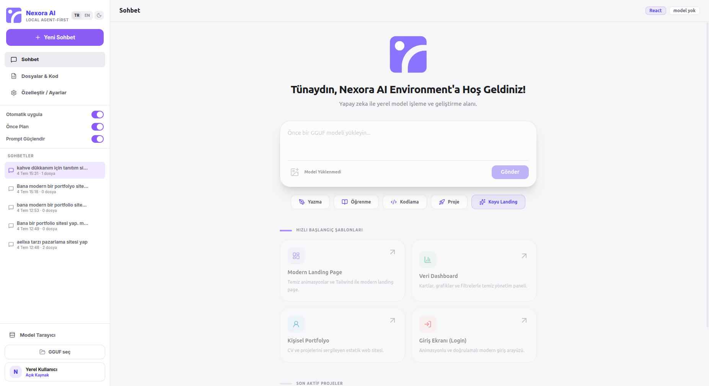 |

**Hardware Advisor — your device, measured; models graded for *your* machine**

| Dark | Light |
|---|---|
| 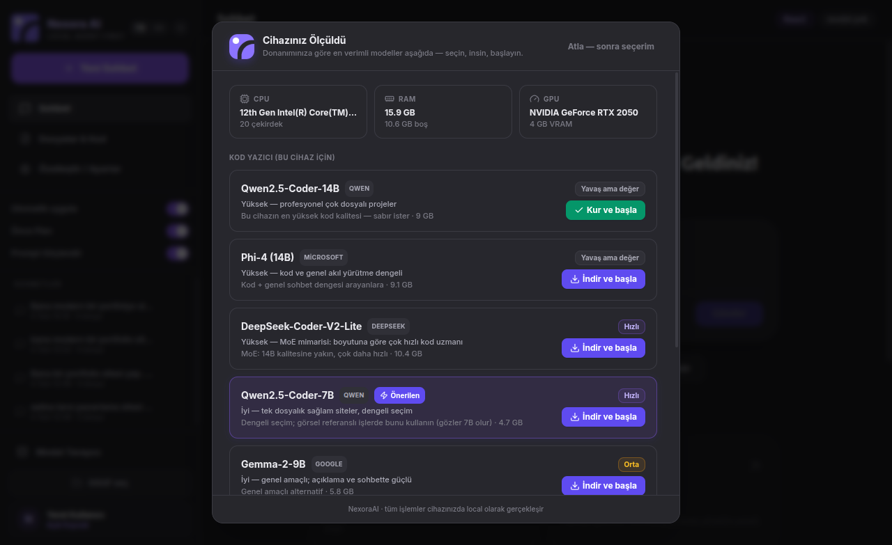 | 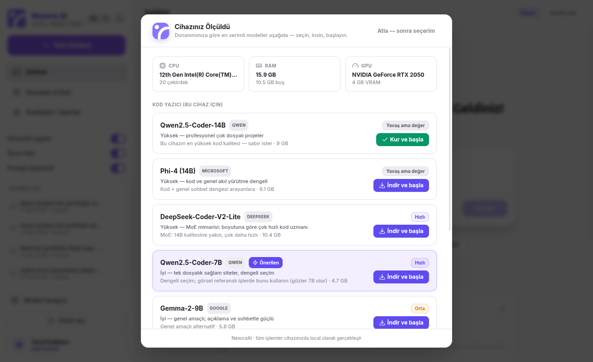 |

**Code workspace — file tree, CodeMirror editor, undo/redo timeline**

| Dark | Light |
|---|---|
|  | 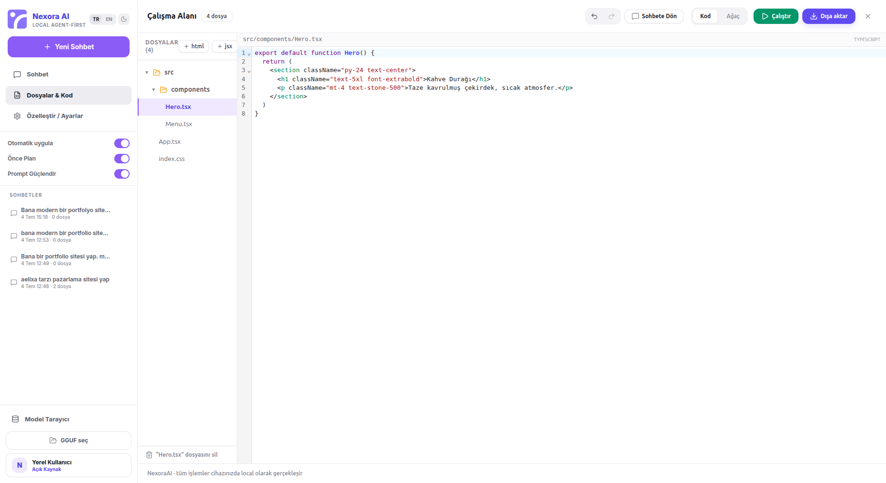 |

**Plan-first mode — approve a numbered plan before any code is written**

| Dark | Light |
|---|---|
| 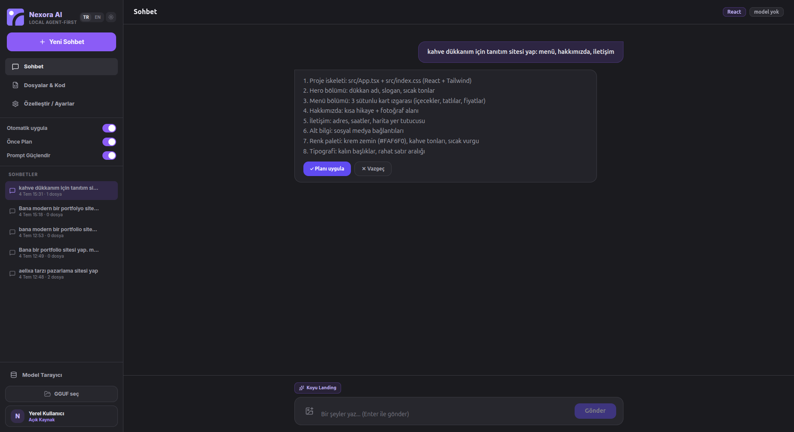 | 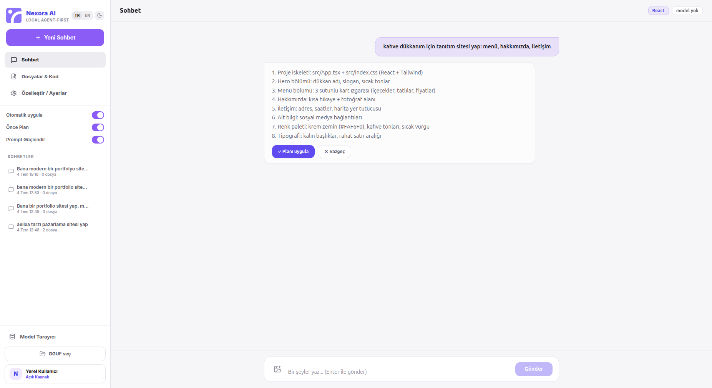 |

**Diff approval — see exactly what you accept, line by line**

| Dark | Light |
|---|---|
| 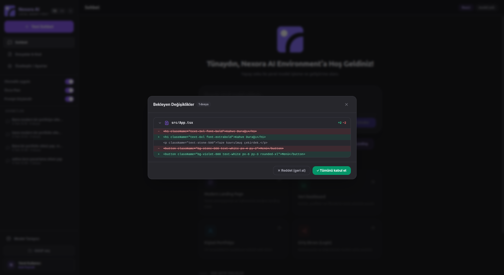 | 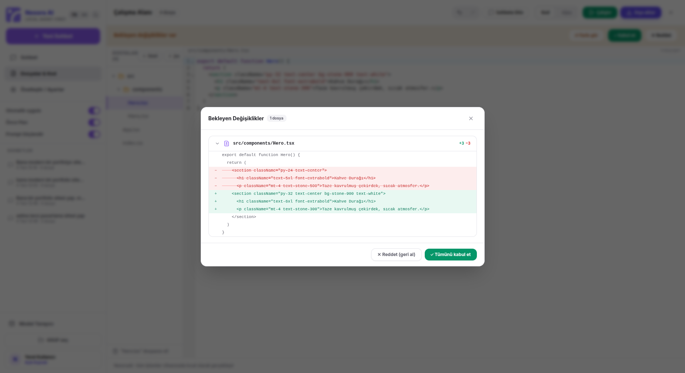 |

**Permission prompt — agent actions ask before they run**

| Dark | Light |
|---|---|
| 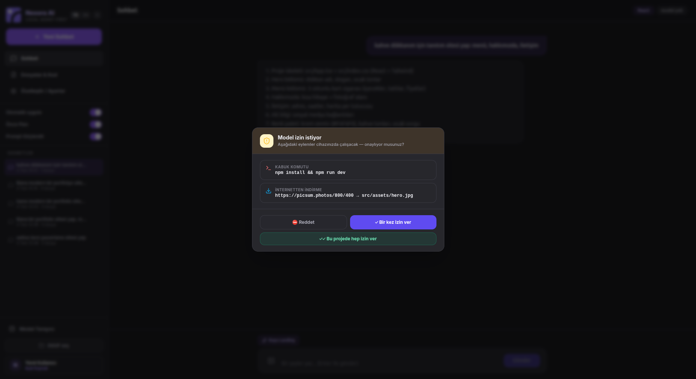 | 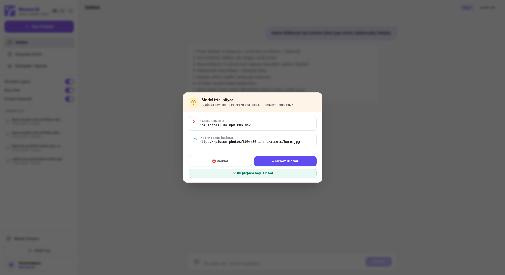 |

**Settings — project rules (KURALLAR.md) & custom quick commands**

| Dark | Light |
|---|---|
|  | 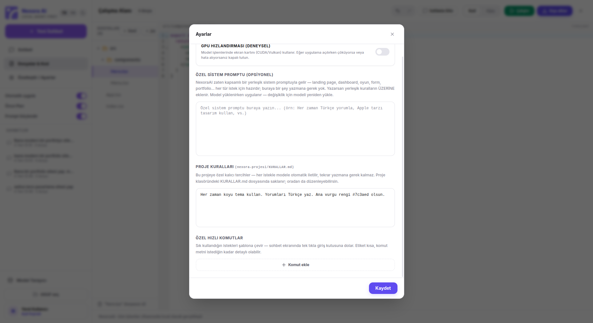 |

**Model browser — HuggingFace search + local GGUF library**

| Dark | Light |
|---|---|
|  | 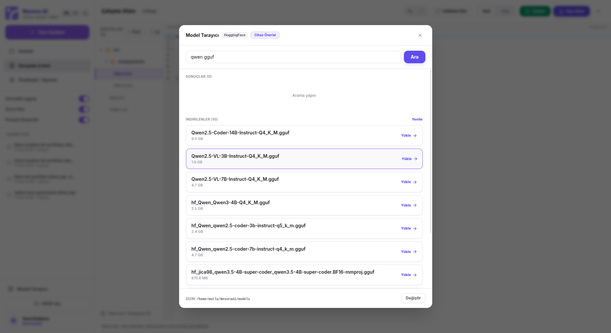 |

**Example output** — a complete restaurant site (17-file professional structure: section components, `ui/` primitives, a typed data layer, 9 priced menu items, 6 starred customer reviews) generated by a **real Qwen2.5-Coder-14B** running locally through NexoraAI from a detailed client-style brief, then refined through the app's own surgical-edit iteration loop — exactly as rendered:


And the same app on lighter hardware — a portfolio generated by a **7B** model with the compact single-file strategy:


Same application, two hardware classes — the prompt strategy adapts to the model automatically.

## Getting Started

### Platform Support

| Platform | How | Status |
|---|---|---|
| Ubuntu / Debian / Mint / Pop!_OS | install the `.deb` | ✅ fully supported |
| Any other Linux (Fedora, Arch…) | run from source (`npm run dev`) | ✅ fully supported — verified with a fresh clone |
| macOS | run from source | ✅ expected to work (POSIX shell, PATH node) |
| Windows | run from source | ⚙️ core + agent run via `cmd.exe` shell; not yet CI-tested |

Running from source gives the complete experience — inference worker, agent actions, dev server, export — because in dev mode the worker uses the Node.js already on your PATH (no bundled runtime needed).

### Requirements

- Linux x64 for the `.deb` (built and tested on Ubuntu)
- ~8 GB RAM minimum (16 GB recommended for 7B models)
- Node.js 20+ and npm (for the Run/dev-server feature; the app ships its own Node runtime for inference)
- A GGUF model file — good starters:
  - `Qwen2.5-Coder-7B-Instruct` Q4_K_M (~4.7 GB) — best quality/speed balance on 16 GB RAM
  - `Qwen2.5-Coder-3B-Instruct` Q5_K_M (~2.4 GB) — for lighter machines

### Install from the .deb (Debian / Ubuntu / Mint / Pop!_OS)

Download the latest `.deb` from the [**Releases page**](https://github.com/mutlukurt/NexoraAIEnvironment/releases/latest), then:

```bash
sudo dpkg -i nexora-ai_0.9.15_amd64.deb
```

Or as a single copy-paste:

```bash
wget https://github.com/mutlukurt/NexoraAIEnvironment/releases/latest/download/nexora-ai_0.9.15_amd64.deb
sudo dpkg -i nexora-ai_0.9.15_amd64.deb
```

### Build from source

```bash
git clone https://github.com/mutlukurt/NexoraAIEnvironment.git
cd NexoraAIEnvironment
npm install

# development
npm run dev

# production build + .deb package (place a Node binary for the bundled worker runtime first)
mkdir -p vendor/node-bin && cp "$(command -v node)" vendor/node-bin/node
npm run dist
```

> The packaged app bundles a standalone Node.js binary (`resources/node-bin/node`) used to run the inference worker outside Electron's V8 — see [Key Engineering Decisions](#key-engineering-decisions) for why this is not optional.

## Usage Guide

1. **Let the Hardware Advisor pick your model** — every launch opens with *"Cihazınız Ölçüldü"*: your CPU/RAM/GPU, and a catalog of models across six families with honest speed grades *for your machine*. One click downloads + loads + starts. (Skip it and use *GGUF seç* / *Model Tarayıcı* if you know what you want.)
2. **Describe your project** — e.g. *"Bana modern bir portfolio sitesi yap"*, or with **Prompt Güçlendir** on, describe it however you naturally speak — the model first turns it into a professional brief. With **Önce Plan** on, you get a numbered plan to approve before any code is written. Watch per-file progress right in the chat.
3. **Iterate** — *"Hakkımda kısmını daha detaylı yaz"*, *"@Hero.tsx başlığı büyüt"* (type `@` for filename autocomplete). Small requests become surgical edits; a 🔧 report in the chat tells you exactly which file got how many point-fixes, **⇄ Farkı gör** opens a line-level diff before you accept, and ↶/↷ in the workspace steps through the last 20 generation states.
4. **Run it** — the green **Çalıştır** button installs dependencies and opens the real site at `localhost` in your browser. Press again to stop.

   **When something breaks — the exact timeline:**
   - The *Accept/Reject* buttons after a generation are **not** a correctness check — they only decide whether the changes stay in your workspace (Reject rolls everything back instantly).
   - Error detection happens at **Run**: while Vite opens your browser, NexoraAI silently runs a *full* compile of the project in the background. (This matters because Vite compiles lazily — a broken project can still "start".)
   - If the compile fails, the error lands **in the chat** — with file, line, code frame, an error-class hint, and a *suspicious-line scan* (e.g. the app itself finds the line with an unclosed quote).
   - You type **"düzelt"** — nothing more. The diagnosis is attached to the model automatically; its edit is applied through a copy-tolerant matcher; the app **re-compiles to verify**; if the error persists it retries by itself (up to 2 extra rounds with escalating hints) before asking you for help. Success is announced in the chat: *"✅ Derleme hatası giderildi."*
   - **Scope note:** this catches *build/compile* errors (syntax, broken imports, unclosed quotes — the vast majority). Purely runtime glitches (e.g. a section rendering empty) are things you *see* on localhost and report in plain words — that's the normal iteration flow.
5. **Use agent powers** (optional) — phrases like these trigger real actions, logged live in the chat:

   | You say | The agent does |
   |---|---|
   | "framer-motion kullan" | adds the package to `package.json` |
   | "Outfit fontunu ekle" | downloads the woff2 files from Google Fonts and wires them into the CSS |
   | "şu görseli indir …" | fetches any URL into the project tree |
   | "şu komutu çalıştır …" | runs it in the project folder (sandboxed cwd, denylist, 5-min timeout) |
   | "projeyi çalıştır" | full Run flow, browser opens automatically |

6. **Use a reference image** — click the 🖼 button next to the input, pick a screenshot/mock, and describe what you want (*"buna benzer bir site yap"*). NexoraAI's local vision model analyzes the design (first use downloads it, ~2.8 GB) and passes a structured design brief to your coding model. Attach an image with a plain question instead, and the vision model answers it directly. *Honest expectations:* this pipeline captures a design's **spirit** (palette, sections, component styles) — not a pixel-perfect clone; analysis quality scales with the vision model size, and your explicit instructions always override the analysis. **Upgrading the eyes:** drop a bigger VL pair (e.g. `Qwen2.5-VL-7B-Instruct-Q4_K_M.gguf` + its `mmproj-…Q8_0.gguf` from the ggml-org HF repo) into `~/NexoraAI/models/` — the app automatically uses the best vision model that fits your free RAM at analysis time, and tells you which one it picked.
7. **Export** — **Dışa aktar** asks for a target directory and writes a complete professional project folder named after your project.

## Software Architecture

```
┌───────────────────────────── Electron ─────────────────────────────┐
│                                                                    │
│  Renderer (React 18 + TypeScript + Tailwind + Zustand)             │
│  ├── ChatPanel        streaming chat, per-file cards, plan/enhance │
│  │                    approval, @mention autocomplete              │
│  ├── ArtifactsPanel   file tree + CodeMirror editor, undo/redo     │
│  ├── ModelBrowser     HuggingFace search + downloads               │
│  ├── WelcomeSetup     hardware advisor (launch screen)             │
│  ├── DiffModal / PermissionModal / SettingsModal                   │
│  ├── stores           appStore / artifactsStore / settings / hf    │
│  └── lib              parseCode, contextSelect, diff, assetFix,    │
│                       formatCode (Prettier), agentActions          │
│           │  contextBridge (typed, contextIsolation: true)         │
│  Main process                                                      │
│  ├── llamaService     worker lifecycle, IPC-RPC, prompt assembly   │
│  ├── agentService     workspace sync, shell, fetch, fonts,         │
│  │                    Vite dev server, scaffolding, export         │
│  ├── sessionsService  persistent chats (~/NexoraAI/Sessions)       │
│  ├── rulesService     per-project KURALLAR.md                      │
│  ├── advisorService   CPU/RAM/GPU detection for the advisor        │
│  └── hfService        HuggingFace API + GGUF downloads             │
└───────────────┬────────────────────────────────────────────────────┘
                │ child_process IPC (JSON messages)
┌───────────────▼───────────────┐      ┌──────────────────────────────┐
│  Inference worker             │      │  ~/NexoraAI/Projects/<slug>/ │
│  plain Node.js (bundled)      │      │  real on-disk workspace:     │
│  └── node-llama-cpp           │      │  npm install • vite dev      │
│      llama.cpp (CPU/GPU)      │      │  fonts • fetched assets      │
└───────────────────────────────┘      └──────────────────────────────┘
┌───────────────────────────────┐
│  Vision sidecar (on demand)   │  ← attached images: llama.cpp's
│  official llama-server+libmtmd│    llama-server + Qwen2.5-VL analyzes;
│  auto-downloaded on first use │    analysis feeds the coding model
└───────────────────────────────┘
```

**Data flow of one generation:** user prompt → main process assembles the system prompt (profile-matched, size-adaptive) and the update-mode wrapper → worker streams tokens back over IPC → renderer parses the stream *live* (`parseStreaming`) into prose + fenced file blocks → complete files land in the artifacts store (visible immediately in the tree/editor); edit blocks are applied through `applySearchReplace`; agent directives (`[PKG]`, `[FONT]`, `[FETCH]`, `[RUN]`, `[DEV]`) execute sequentially after generation with a live action log in the chat.

## Key Engineering Decisions

Each decision below was forced by a real failure — see the [Development Chronicle](#development-chronicle) for the war stories.

### 1. Inference lives in a separate plain-Node process
Electron compiles V8 with the *memory cage* (pointer compression): any GGUF larger than 4 GB crashes the process with an uncatchable `SIGILL` — on every Electron version we tested (31 → 43). The same file loads in 1.7 s under plain Node. So NexoraAI ships its own Node binary and runs `node-llama-cpp` in a child process, talking to it over structured IPC. Bonus: a dying model can no longer take the app down with it.

*Plain-language version:* the AI engine runs in its own little program next to the app. Big models stopped crashing, and even if the engine chokes, the app keeps running and tells you what happened.

### 2. Context size is chosen by available RAM, never by the model's maximum
Modern models advertise 32k–131k token context windows. Actually allocating that KV cache on a 16 GB laptop sends the machine into swap and looks exactly like "the app froze forever". NexoraAI picks 16k/8k/4k based on free memory and steps down automatically if allocation fails.

### 3. Prompts adapt to the model's real size (from GGUF metadata)
Small models (<13B parameters) drown in long rule lists: they duplicate files, invent imports, echo instruction templates back as code. They get a compact, example-driven, **single-file** strategy. Models ≥13B get the full professional multi-file architecture prompt. The parameter count is read from GGUF metadata (`general.parameter_count` / `size_label`), not guessed from file size.

*Plain-language version:* we ask small brains for one great file and big brains for a whole professional project — and the app tells them apart automatically.

### 4. The professional structure is deterministic, not model-generated
`scaffoldProject()` completes whatever the model produced into a runnable project: entry HTML, `main.tsx`, Vite/TS/Tailwind configs, a `package.json` whose dependencies are *detected from the actual imports* in the code. Program logic — not a language model — guarantees `npm install && npm run dev` works.

### 5. Iteration = surgical `SEARCH/REPLACE` edits
Rewriting a whole file to change one paragraph is slow and risky. NexoraAI teaches the model Aider-style edit blocks; the applier requires an exact match (with a whitespace-tolerant fallback) and **never touches the file if the match fails**. Verified live: a 7B model changed one `<p>` in a 5 KB component, everything else byte-identical.

### 6. Model quirks are patched at the sampler, not with polite requests
Qwen models drift into Chinese mid-output. Asking nicely in the prompt doesn't stop it. Banning all ~31k CJK-containing vocabulary tokens via `TokenBias` at load time (~200 ms, once) *does* — mathematically. The ban lifts automatically for users who actually write in Chinese/Japanese/Korean.

### 7. Viewing = the real thing, not a sandbox
An earlier in-app preview (Babel-in-iframe) fought endless battles: TypeScript type-import syntax, CSP inheritance, sandboxed-frame process deaths under memory pressure, liveness false alarms. The verdict: **run the real project**. The Run button writes the workspace to disk, installs, boots Vite and opens the browser — pixel-perfect by definition.

### 8. Agent instructions are injected only when needed
Keeping tool-use instructions permanently in the system prompt made small models copy the templates verbatim into their output ("`[FETCH] <url> -> <relative/path>`" as a file!). The agent hint is now appended per-message, only when intent-detection sees words like *install / font / indir / çalıştır*, and uses real example values. Placeholder-looking values are refused at execution time as a second line of defense.

### 9. Iteration rules are enforced, not requested
Telling a 7B model "prefer small edit blocks" produced a 17-minute turn where it copied an entire component into one giant `SEARCH` block — a full rewrite in disguise. Prompts alone don't govern small models. Now a **streaming watchdog** counts the lines of every open `SEARCH` section as tokens arrive: past 20 lines, generation is aborted mid-stream, completed small blocks are kept, and the model gets exactly one automatic corrective retry; a second violation hard-stops the turn. Full-file output for an existing path is never applied at all.

*Plain-language version:* the model isn't trusted to follow the "only fix the broken spot" rule — the app physically stops it the moment it starts rewriting.

### 10. The context window is a budget, not a suggestion
An 8k-token window dies fast when every iteration re-sends every file. Three layers keep it alive: a deterministic **file selector** sends only request-relevant files (mention > filename > keyword > recency) with a hard char budget and a "these other files exist, don't recreate them" manifest; the **worker compacts** its own history when the window passes 75 % (fresh session + summary note); and files are **never truncated** — a half-file would silently break `SEARCH/REPLACE` matching, so a file either ships whole or ships as a name.

### 11. Determinism after the model, every time
Whatever the model produces gets post-processed by plain code: Prettier formats every touched file (parse failures leave the file untouched — formatting can never destroy work), broken references to non-existent local images are rewritten to seeded placeholders (while `[FETCH]`-downloaded assets are respected), and both steps run only after generation fully completes — running them mid-stream would corrupt the very text the model's next edit block needs to match.

### 12. The UI theme is a variable set, not two codebases
The redesign (from the owner's Stitch mock) runs every surface color through CSS custom properties exposed as Tailwind tokens (`ink-bg/panel/card/hi/line/text/mut/dim` as `rgb(var(--…) / <alpha-value>)`, so opacity modifiers keep working), with accent colors as `dark:` dual classes. Soft dark (#1b1b1f, VS Code-grade — deliberately not pitch black) and light are ~40 lines of variables apart; the theme applies in `<head>` before first paint, so there is no flash, and even the pre-React splash screen respects it. Everything ships local: the Inter font is embedded (latin + latin-ext for Turkish), no CDN anywhere.

## Development Chronicle

An honest, chronological log of how this project actually happened — including the dead ends.

**Phase 1 — Foundation (v0.1.0 → v0.3.8).** Electron + React scaffold; chat UI with streaming; GGUF loading via node-llama-cpp in the main process; profile-matched system prompts (React SPA / Next.js / static HTML / FastAPI / Electron / Tauri / React Native); Bolt-style live file parsing with an in-app preview sandbox; HuggingFace browser; `.deb` packaging.

**Phase 2 — "The model won't load" (v0.4.0).** Two root causes found and fixed in one day: (1) default context allocation tried to fit the model's full 32k–131k training window into laptop RAM → swap death that looked like an infinite spinner — fixed with RAM-aware context sizing; (2) GGUFs > 4 GB hard-crashed Electron with `SIGILL` at the exact 4 GiB boundary (`r14 = 0x100000000`) — diagnosed as V8's memory cage, unfixable in-process even on Electron 43, solved by moving inference to a bundled plain-Node worker. Also added: load-progress events, GPU→CPU auto-fallback, chat-visible per-file progress, no more forced tab switching.

**Phase 3 — "It opens… doesn't it?" (v0.4.1).** After the Electron 43 upgrade the packaged app launched but never showed a window: legacy `use-gl=swiftshader + disable-software-rasterizer` switches (originally added to stop in-process Vulkan crashes — now obsolete) prevented the first paint on Wayland, and `ready-to-show` never fired. Removed the switches; added a 2.5 s fallback `win.show()` so the window can never silently stay hidden again.

**Phase 4 — Parser forensics (v0.4.2 → v0.4.3).** Small models put file paths *next to* fences, not on them — the parser turned those into empty files plus `App8.tsx`-style junk names; fixed by letting a bare-path line name the following fence. Then the preview engine: `import { clsx, type ClassValue }` generated syntactically invalid JS that killed the *entire* preview script — the infamous uniform-gray screen. Fixed type-import filtering, `export { X } / export * / export interface` handling, `@/` alias resolution, functional stubs for clsx/tailwind-merge/framer-motion, per-module script isolation.

**Phase 5 — The agent layer (v0.5.0).** Real workspace on disk (`~/NexoraAI/Projects/<slug>`), shell execution with denylist + timeout, internet fetch, Google Fonts pipeline (woff2 download + CSS rewrite), Vite dev-server orchestration with URL detection, professional export with dependency-detecting scaffold. All directive-driven from model output, with a live action log in chat.

**Phase 6 — Prompt archaeology (v0.5.1 → v0.5.4).** The always-on agent instructions made small models regurgitate template lines as files → made the hint conditional and placeholder-proof. "Professional multi-file tree" prompts made 3B/7B models duplicate files and import ghosts → introduced the compact single-file strategy (verified: a 3B produced exactly 2 valid files). Dev server: stale `node_modules` skipped installs of newly-added deps (`Failed to resolve import "lucide-react"`) → always reconcile installs; scaffold ordering bug left `index.css` unimported → all project CSS is now wired into `main.tsx`.

**Phase 7 — Killing the preview (v0.5.5 → v0.6.0).** The in-app preview intermittently rendered as a solid gray rectangle that survived every reproduction attempt (the exact same files rendered perfectly when injected via CDP into the very same installed app). A liveness beacon + self-healing iframe reduced the pain; a beacon placed at document-end then *caused* false "dead frame" alarms on slow machines (moved to document-head). Final call, made by the product owner: **delete the preview, view through the real dev server.** Same release brought surgical `SEARCH/REPLACE` iteration — tested against the owner's real project file and real request: one edit block, applied cleanly, rest of the file untouched.

**Phase 8 — Polish for everyone (v0.6.1 → v0.6.3).** CJK sampler ban (31k tokens, ~200 ms scan) ended Qwen's random Chinese; made conditional per-message so CJK-speaking users still get native answers; small/full prompt selection upgraded from file-size heuristic to true parameter count from GGUF metadata — a tightly-quantized 14B now correctly gets the professional multi-file treatment.

**Phase 9 — Going public, cross-platform (v0.6.4).** Published to GitHub with this README, screenshots and `.deb` Releases; verified the full run-from-source experience with a fresh clone; replaced hardcoded `bash` with platform shells (`/bin/sh` / `cmd.exe`) and fixed `file://` URLs for Windows paths; declared the Node ≥20 engine requirement so old runtimes fail loudly instead of weirdly.

**Phase 10 — The real large-model campaign (v0.6.5 → v0.6.6).** Downloaded Qwen2.5-Coder-14B (9 GB) and ran it on the development laptop itself — metadata-based size detection picked the professional prompt live, and a detailed client-style brief yielded a 17-file restaurant site. Every real mistake the model made became product: `package.json` sanitization (CRA relics), dependency-free `cn()` injection, a project-wide export map that auto-imports forgotten components *and* data exports, and a Turkish-apostrophe string repair (whose own first version corrupted key-value pairs — caught and hardened with a negative guard). Remaining slip-ups (a missing quote, lazy `// Add items here` stubs, an `Array(4.5)` crash) were fixed by the model itself through the surgical-edit iteration loop.

**Phase 11 — The self-fixing app (v0.7.0 → v0.7.1).** Build errors from **Run** are now captured automatically (background full compile, code frame, error-class hints, suspicious-line scan) and posted to the chat; the user types one word — *"düzelt"* — and the app attaches the diagnosis, applies the model's edit through a new quote-insensitive matcher, re-verifies the build, and auto-retries up to two rounds. Engineered against real 14B failures (three consecutive misdiagnoses without the pinpoint scan; models auto-correcting broken code inside `SEARCH` blocks) and finally verified end-to-end: broken project → one word → clean build. v0.7.1 made the trigger multilingual — *fix, repair, onar, çöz, arregla, répare, behebe, napraw, исправь…*

**Phase 12 — Eyes for the agent (v0.8.0 → v0.8.2).** node-llama-cpp has no multimodal API, so vision runs through llama.cpp's official `llama-server` (libmtmd) as an on-demand sidecar: a small Qwen2.5-VL model (auto-downloaded with the platform server binary on first use) analyzes attached images. *"Make me a site like this"* extracts a structured design system and pipes it to the coding model; a plain question gets answered directly. Feasibility was proven live on the CPU-only dev laptop (35 s per analysis) — after two real lessons: large screenshots overflow the vision context (fixed with automatic 1024 px downscaling + 8 k context), and the first intent classifier mistook the Turkish question *"ne YAPıyor?"* for a build command because of the embedded stem *yap* (fixed with a noun+verb combination rule, verified by a 19-case battery). v0.8.2 added explicit-override priority: the user's *"…but make the hero fonts red"* always beats the extracted analysis.

**Phase 13 — Reality check: cloning a real design (v0.8.3 → v0.8.4).** The owner attached a sophisticated agency design (cream page inside a mustard frame, black hero card, stat badges) and asked the 14B to clone it — the result was a flat yellow page. The post-mortem exposed the whole chain: the coding model is *blind* (it only reads the vision model's text description), the 3B eyes had collapsed a layered design into "yellow background", the generic extraction prompt let it, and the agent log showed two real bugs (the model invented `https://example.com/logo.svg` → 404, and ran `npm run build` before any install → `vite: not found`). Every link got fixed: placeholder domains are rejected at execution, npm/vite commands auto-install dependencies first, the extraction prompt now demands region-by-region measurable detail, and v0.8.4 made the eyes upgradeable — the app automatically uses the best VL pair in the models folder that fits current free RAM. Verified live: 7B eyes produce frame/section/component breakdowns (162 s) where 3B saw one color (35 s).

**Phase 14 — The Hardware Advisor (v0.8.5 → v0.8.6).** "Which model should *I* download?" is the first question every non-technical user asks — so the app now answers it before they can ask. At launch, CPU/RAM/GPU are measured and a catalog is rendered with honest speed grades (*ultra fast / fast / medium / slow-but-worth-it*) computed for *that* machine; one click downloads, loads and starts chatting. v0.8.6 grew the catalog from Qwen-only to six families — DeepSeek-Coder-V2-Lite (MoE, speed-graded by its 2.4B *active* params, not its 10 GB file), Codestral-22B, Phi-4, Gemma-2-9B, Llama-3.1/3.2 — with every HuggingFace download URL live-verified before shipping, and honest notes ("general-purpose — not as strong at code as Qwen-Coder") instead of marketing.

**Phase 15 — Enforcing surgical edits (v0.8.7 → v0.8.9).** A live experiment (reference-image → site → "fix these 5 things") exposed an ugly truth: told to make surgical edits, the real 7B copied an *entire component* into one giant `SEARCH` block — a 17-minute full rewrite wearing an edit block's clothes. The owner's verdict was categorical: *in iteration, the model may only write the broken spot — never rewrite.* Three releases made that law: example-driven prompt rules (small models follow examples, not rules), a **streaming watchdog** that aborts generation the moment an open `SEARCH` passes 20 lines (one corrective auto-retry, then hard stop), an absolute never-apply rule for full-file rewrites of existing files, a live status line in the chat card (*"✂️ 2nd change — marking the spot"*) replacing the opaque "generating…", and a 🔧 per-file fix report. The report itself shipped a bug worth recording: edit blocks apply *live* during streaming, then the final pass re-applied them, found the text already changed, and reported "0 fixed" for a perfectly successful edit — fixed with an idempotency tier in the applier ("SEARCH not found but REPLACE already present = already applied"). Verified end-to-end: two 3-5-line surgical blocks, 16 changed lines in a 102-line file, ~90 seconds, correct report.

**Phase 16 — Learning from opencode, part 1: trust (v0.9.0 → v0.9.2).** The owner's insight: opencode (MIT) already solved several problems we had — adapt the *ideas*, rewrite the code for our stack. First batch, the trust layer: a **line-level diff approval screen** (dependency-free LCS with common prefix/suffix trimming and folded context) reachable from both the chat and the workspace's pending-changes bar; **persistent sessions** — every chat plus its project files auto-saved (debounced, atomic writes) to visible JSON under `~/NexoraAI/Sessions/`, restored from the sidebar across restarts, with "New Chat" finally meaning a clean page; and a **permission system** — `[RUN]` and `[FETCH]` directives now show exactly what wants to execute before it does (allow once / always for this project / deny), so a 7B's hallucinated shell command can never run itself.

**Phase 17 — Learning from opencode, part 2: quality (v0.9.3 → v0.9.5).** Three features aimed straight at the 8k-context reality of local models. **Smart context:** a deterministic selector (no model calls — CPU cycles are precious) ranks project files by @mention > filename-in-request > keyword hits > recency, ships only what fits an ~11k-char budget, never truncates a file (that would silently break edit matching), and hands the model a "these files exist, do not recreate them" manifest; the chat shows a 📎 line whenever trimming happened. **Plan-first mode:** a sidebar toggle that turns requests into a cheap numbered plan (file *list* only — no contents) with approve/dismiss buttons; the approved plan is auto-sent as the build brief. Confirmed working live by the owner on real hardware. **Prettier:** every touched file formatted after generation via `prettier/standalone` in a lazy-loaded chunk; parse-failing files are left untouched, and formatting deliberately never runs mid-stream (it would corrupt the text the next `SEARCH` block must match).

**Phase 18 — The redesign (v0.9.6 → v0.9.8, refined in v0.9.12/v0.9.14).** The owner designed a new identity in Stitch — dark, violet, glass — and the app was rebuilt to match it *without* betraying its principles: Google-hosted fonts and Material icons were replaced by an **embedded Inter** (latin + latin-ext with unicode-range, for Turkish) and the existing lucide set, because a local-first app doesn't phone a CDN for its own face. The icon rail + sidebar merged into one; the hero gained a time-of-day greeting and a glass input; "Recent projects" became real session shortcuts instead of a decorative box. v0.9.8 answered three pieces of direct feedback: full pill shapes were rejected ("Apple-oval like the cards" = soft rounded rectangles — now a design rule), pitch black was rejected (dark is now a soft VS Code-grade #1b1b1f), and a **light theme** arrived — the entire palette moved into CSS variables exposed as Tailwind `ink-*` tokens, switched by one button, applied pre-paint (no flash), with CodeMirror following along. The owner's logo (three iterations of it) was processed to transparency with PIL flood-fill and wired everywhere: sidebar, hero, splash screen, window and launcher icons — which uncovered that the renderer's `publicDir` had never been wired and the window icon had been silently broken since day one.

**Phase 19 — Learning from opencode, part 3: power (v0.9.9 → v0.9.11).** **Project rules:** persistent per-project preferences in a real `KURALLAR.md` file (editable in Settings or any editor; empty save deletes it) attached to every request — "always dark theme, Turkish comments" is now said once, ever. Testing it surfaced a lesson for the notebook: `contextBridge` objects are frozen, so renderer tests can't monkeypatch `window.nexora` — the app now exposes the last outgoing prompt through its debug hook instead. **Undo/redo timeline:** the workspace keeps the last 20 generation states (deduplicated; a rejected turn leaves no ghost step) with ↶/↷ buttons — far beyond the single accept/reject. **Custom quick commands:** user-defined labeled prompts managed in Settings, rendered as violet pills beside the built-in templates and above the mid-chat input.

**Phase 20 — The polish sweep (v0.9.13 → v0.9.15).** Everything left on the board, cleared in one day. **Prompt enhancement** (the owner's feature idea): with *"Prompt Güçlendir"* on — and it's on by default — a non-technical user's casual description is first rewritten by the model into a professional design brief, which then flows into plan mode and generation automatically; skipped for iterations, image flows and fixes where it would get in the way. **Plan language fixed:** "answer in the user's language" was ignored by the 7B; wrappers now state `LANGUAGE OF YOUR ANSWER: TURKISH (yanıtı TÜRKÇE yaz)` outright. **`@` autocomplete:** typing `@` in either input pops matching project filenames; Enter picks, Esc closes. **Context compaction:** past 75 % window usage the worker quietly rebuilds its session with a summary note instead of degrading. **Vision post-mortem:** the infamous "663-character analysis cap" turned out to be a *misdiagnosis* — only the chat preview was sliced at 600 chars, the model always received the full analysis (preview now 1500 chars and says so); the recurring hallucinated `#007BFF` accent got a hard extraction rule — *colors may only be read from the image, template colors are forbidden, write "belirsiz" if unsure.* And the final open wound closed: models referencing non-existent `/assets/…` images. Two layers: a prompt rule (photos = seeded picsum URLs, icons = lucide, logos = styled text — and the old rule that *encouraged* mock asset folders was removed), plus a deterministic post-pass that rewrites any remaining broken reference to a placeholder while respecting files that actually exist or arrive via `[FETCH]`.


## Large-Model Verification

> **TL;DR:** The entire large-model pipeline — professional multi-file generation → parsing → real dev server → export → production build → deployable static output — has been verified end-to-end with a full-fidelity simulation. If your hardware can load a 32B/70B GGUF, NexoraAI is ready for it.

### The question

NexoraAI adapts to model size: models ≥13B parameters receive the **full professional prompt** (multi-file trees with `components/ui/`, `components/sections/`, a typed `lib/data.ts` content layer, design rules). But this project was developed on a laptop that can only run 3B/7B models — so how do we know the big-model path actually works?

### The insight that makes it testable

*Plain-language version:* the app never knows **who** wrote the text it processes. A 70B model, a 7B model, or a human producing the exact same characters are indistinguishable to the pipeline. So we can author a byte-realistic "70B-class output" and push it through the **real** production code — no mocks, no copies.

*Technical version:* the fixture is a ~600-line generation transcript that exercises every pattern the full professional prompt demands and every historically fragile parser path: 15 files across `ui/` + `sections/` + `lib/`, TypeScript **type imports** (`import { clsx, type ClassValue }`), `@/` **alias imports**, framer-motion, typed interfaces, a model-authored `package.json` that the scaffold must merge rather than overwrite.

### The methodology

The app's actual modules (`src/lib/parseCode.ts`, `electron/main/agentService.ts`) were bundled standalone with esbuild (only Electron's `shell.openExternal` stubbed — everything else is the shipping code), then driven stage by stage. Every stage was verified **from the outside** — by HTTP request, directory listing, or content search — never by trusting a return value.

### The results

| Stage | What actually ran | Independent verification | Result |
|---|---|---|---|
| 1. Parse | `parseStreaming()` over the transcript | 15/15 files extracted, all `complete`, correct paths | ✅ |
| 2. Scaffold | `scaffoldProject()` | Diff shows exactly the 6 missing standard files added (`vite.config.ts`, `tsconfig.json`, `index.html`, `src/main.tsx`, `postcss.config.js`, `.gitignore`); model's `package.json` merged, not clobbered | ✅ |
| 3. Run | `startDev()` → real `npm install` (142 packages) → real Vite | `GET localhost:5173/` serves the app; `GET /src/App.tsx` returns compiled output (HTTP 200); the `@/` alias import in `Projects.tsx` resolves to the real module in Vite's transformed source | ✅ |
| 4. Export | `exportProject()` | `aurora-digital/` folder exists with the complete professional tree | ✅ |
| 5. Production build | `npm install && npm run build` **inside the exported folder** — exactly what a downstream user or Vercel runs | Vite build succeeds in 1.69 s → `dist/` (282 KB JS, 11 KB CSS, gzipped 92/3 KB) | ✅ |
| 6. Deploy simulation | `dist/` served by a plain static file server (which is all Vercel/Netlify fundamentally do) | Root HTML served with correct title; site content found inside the compiled JS bundle | ✅ |

Additionally verified at the logic level: `buildSystemPrompt(…, smallModel=false)` emits the full professional rules (and none of the single-file constraints), and the loader classifies 32B/70B parameter counts (read from GGUF metadata, not guessed from file size) as full-prompt models — rebuilding the session with the correct prompt if the initial file-size guess disagreed.

### What this proves — and the one thing it can't

**Proven:** a large model's professional multi-file output flows through parsing, workspace, dev server, export, production build, and static deployment without a single manual fix. The output is genuinely *deployable* — stage 5–6 is byte-for-byte the Vercel workflow.

**Not simulatable:** physically loading a 40 GB file into RAM. That part is llama.cpp's most-traveled code path (identical for all model sizes), the >4 GB Electron crash class is already eliminated by the worker architecture, and memory pressure degrades gracefully (context-size step-down ladder, clean error instead of a hang). But honest is honest: run-a-real-70B remains hardware-gated, not verified here.

### Follow-up: verified with a REAL ≥13B model on real hardware

The simulation left one open question, so we closed it: **Qwen2.5-Coder-14B-Instruct Q4_K_M (9 GB)** — above the 13B professional-prompt threshold — was downloaded and run **on the same 16 GB development laptop, CPU-only**.

- The loader read `14B` from GGUF metadata and selected the **full professional prompt** — the size-adaptive logic worked live, not just in unit tests.
- Given a detailed client-style brief (brand history, chef bio, 3×3 priced menu, reviews, hours), the model wrote a **17-file professional project** in 41 minutes (~2 tok/s on CPU): eight section components, `ui/` primitives, a typed `lib/` data layer — the structure small models can't sustain.
- The output flowed through the same pipeline: parse → scaffold → `npm install` → `vite build` (<1 s) → static serve. The finished site, exactly as rendered:


The run was even more valuable for what went wrong. **Every real model mistake became either a deterministic auto-repair or a live test of the app's iteration loop:**

| Real 14B mistake | How it got fixed |
|---|---|
| CRA relics (`react-scripts@5`) in a Vite `package.json` → `ERESOLVE` install failure | Scaffold now **sanitizes model manifests** (bans CRA/webpack relics, pins build tools, forces vite scripts) |
| Used `cn()` without defining or importing it → blank page | Scaffold now **generates a dependency-free `cn()`** and injects the import |
| Used `<Button/>` and `menuCategories` without imports → `ReferenceError` | Scaffold now builds a project-wide **export map and auto-injects missing imports** (components *and* data) |
| Turkish apostrophes inside single-quoted strings (`'İstanbul'un…'`) → syntax error | Scaffold now **converts such string literals to double quotes** (key-value pairs are never touched) |
| A missing quote in one `className`, lazy `// Add items here` stubs, `Array(4.5)` star-rating crash | Fixed by the model itself through NexoraAI's **surgical-edit iteration loop** — the exact chat workflow a user follows ("build hatası var…", "menü bölümü boş, doldur…") |

*Plain-language version:* we rented nothing and faked nothing — a genuinely big model ran on the actual laptop, slowly but correctly. It made half a dozen real mistakes, and every one of them either taught the app to auto-fix that whole class of mistakes for everyone, or proved that the built-in chat iteration workflow repairs what's left.

### The "düzelt" flow — engineered and tested the hard way

Non-technical users can't write bug reports like *"line 20 has an unclosed className quote"*. So NexoraAI closes that gap — and the feature was **battle-tested against a real 14B before shipping**, failures included:

1. **First design** (error text auto-attached, user says "düzelt"): the model misdiagnosed an `Unexpected end of file` error **three rounds in a row** — it kept patching the file's end instead of finding the unclosed quote far above. Honest result: ❌.
2. **Fix #1 — suspicious-line scan:** for EOF-class errors the app now scans the failing file for lines with an odd number of quotes and appends them to the diagnosis (`Footer.tsx:20: <li><a … gray-500>Bilgiler…`). With the pinpoint, the model targeted the right line immediately — but its `SEARCH` block silently *auto-corrected* the broken code it was supposed to copy verbatim, so the edit didn't match. ❌ again, new lesson.
3. **Fix #2 — quote-insensitive matching:** the edit applier gained a third matching tier (quotes ignored, applied only on a unique match), tolerating exactly that model habit.

**Final verified run:** broken project → Run → error auto-captured → user types the single word **"düzelt"** → the 14B produces the correct one-line edit → applied through the tolerant matcher → automatic re-build passes. ✅ One round, zero technical input from the user. If a fix doesn't clear the build, the app re-attaches the fresh error and retries automatically (max 2 extra rounds) before asking the human for help.

### The reference-clone reality check

*Plain-language version:* we attached a genuinely sophisticated design and said "clone this." The first result was embarrassing — a flat yellow page — and that failure taught us more than any success.

*What actually happens when you attach an image:* your coding model never sees it. A separate small **vision** model looks at the picture and writes a text description; your coder builds from that text. The chain is only as strong as the description — and a 3B vision model reduced a layered cream-and-black design to "yellow background". Garbage brief in, garbage site out; the 14B coder was never the bottleneck.

**What the failure fixed (all shipped):**

| Broken link in the chain | Fix |
|---|---|
| 3B eyes flattened the design; the generic prompt let them | Extraction prompt demands region-by-region, measurable detail (page frame, per-section columns/colors, component specs) |
| Model invented `https://example.com/logo.svg` (404) | Placeholder domains rejected at execution time |
| `npm run build` before any install → `vite: not found` | npm/npx/vite commands auto-install dependencies when `node_modules` is missing |
| Eyes were hardcoded to 3B | **Auto-eyes:** the app picks the best VL pair in `~/NexoraAI/models` that fits current free RAM, and says which one it chose |

**The hardware recipe on a 16 GB laptop** (RAM is a budget shared by both models):

| Task | Load this coder | Eyes picked automatically |
|---|---|---|
| Image-driven work ("make it like this") | Qwen2.5-Coder-**7B** | Qwen2.5-VL-**7B** — region-by-region analysis (~160 s) |
| Pure coding, no images | Qwen2.5-Coder-**14B** | (3B fallback if ever needed) |

**Honest ceiling, stated plainly:** this pipeline reproduces a design's *spirit* — palette, structure, component styles — not a pixel-perfect clone. Hue precision is approximate even with 7B eyes. The winning workflow is reference image + a **rich written brief** (your explicit instructions override the analysis) + two or three surgical iterations.

## Project Structure

```
NexoraAIEnvironment/
├── electron/
│   ├── main/
│   │   ├── index.ts          # app lifecycle, window, IPC registry
│   │   ├── llamaService.ts   # inference-worker client (RPC over child-process IPC)
│   │   ├── llamaWorker.ts    # ⭐ plain-Node inference worker (runs OUTSIDE Electron)
│   │   │                     #    + context compaction at 75% window usage
│   │   ├── agentService.ts   # workspace, shell, fetch, fonts, dev server, scaffold, export
│   │   ├── visionService.ts  # vision sidecar: llama-server lifecycle, image analysis
│   │   ├── sessionsService.ts# persistent chats (~/NexoraAI/Sessions/<id>.json)
│   │   ├── rulesService.ts   # per-project KURALLAR.md read/write
│   │   ├── advisorService.ts # CPU/RAM/GPU detection for the Hardware Advisor
│   │   └── hfService.ts      # HuggingFace search + GGUF downloads
│   ├── preload/index.ts      # typed contextBridge API (window.nexora)
│   └── shared/
│       ├── ipc.ts            # channel names + shared types
│       ├── prompts.ts        # profiles, compact/full prompts, agent hint, intent detection
│       └── advisor.ts        # model catalog + RAM-tiered recommendation logic
├── src/
│   ├── components/           # ChatPanel, ArtifactsPanel, Sidebar, FileTree, CodeEditor,
│   │                         # ModelBrowser, WelcomeSetup (advisor), DiffModal,
│   │                         # PermissionModal, SettingsModal
│   ├── store/                # zustand stores (app / artifacts / settings / hf)
│   ├── assets/appfont/       # embedded Inter (woff2, latin + latin-ext) — no CDN
│   └── lib/
│       ├── parseCode.ts      # streaming fence parser + SEARCH/REPLACE applier
│       │                     #    + oversized-SEARCH watchdog + idempotent re-apply
│       ├── contextSelect.ts  # smart-context file selector (mention/keyword/recency)
│       ├── diff.ts           # dependency-free LCS line diff for the approval screen
│       ├── assetFix.ts       # broken /assets reference → placeholder repair
│       ├── formatCode.ts     # Prettier post-pass (lazy chunk)
│       ├── agentActions.ts   # directive parsing + execution pipeline
│       ├── visionIntent.ts   # build-vs-question classifier for attached images
│       └── codeFixer.ts      # post-generation code fixes
├── docs/screenshots/         # images used in this README
├── scripts/                  # vendor copy, icon generation
└── vendor/node-bin/          # bundled Node runtime for the worker (not in git)
```

## Tech Stack

| Layer | Technology |
|---|---|
| Shell | Electron 43, electron-vite, electron-builder (`.deb`) |
| UI | React 18, TypeScript, Tailwind CSS (CSS-variable theme tokens, dark/light), Zustand, CodeMirror 6, lucide icons, embedded Inter font |
| Inference | llama.cpp `llama-server` (OpenAI-compatible sidecar: prompt cache/`--cache-reuse`, flash attention + Q8_0 KV, `-ngl auto` GPU fit, per-request CJK logit_bias, context compaction with model-written summary); node-llama-cpp 3 worker on the bundled Node 22 runtime as automatic fallback |
| Vision | llama.cpp `llama-server` + libmtmd sidecar, Qwen2.5-VL (auto-downloaded GGUF + mmproj, RAM-aware auto-upgrade) |
| Post-processing | Prettier 3 (standalone, lazy-loaded), deterministic scaffold & asset repair |
| Generated projects | Vite 5, React 18, TypeScript, Tailwind (scaffolded deterministically) |

## Roadmap

Recently shipped (see the [Development Chronicle](#development-chronicle) for the full stories): hardware advisor · plan-first mode · prompt enhancement · smart context + `@` autocomplete · diff approval · permission system · persistent sessions · undo/redo timeline · project rules · custom commands · Prettier & asset repair post-passes · context compaction · dark/light theme system.

Still ahead — the full phased plan now lives in **[ROADMAP.md](ROADMAP.md)**. In one breath:

1. **Engine** (v0.10.x) — flash attention + KV cache quantization, partial GPU offload with a layer slider, per-phase sampler presets, and migrating inference to `llama-server` for prompt caching and speculative decoding.
2. **Making small models masters** (v0.11.x) — grammar-enforced edit blocks, plan → file-by-file generation, auto-verify after every generation, a parametric section template bank.
3. **An agent with eyes** (v0.12.x) — import existing projects, runtime error capture, visual self-review via the vision model, git-based history.
4. **Productization** (v1.0) — hybrid API mode, Windows/macOS packaging, multi-project workspaces, local model benchmarking, stable-diffusion.cpp image generation.

## License

MIT © [Mutlu Kurt](https://github.com/mutlukurt)

---

<div align="center">
<sub>Built with stubbornness on a laptop that nvidia-smi refuses to acknowledge.</sub>
</div>
