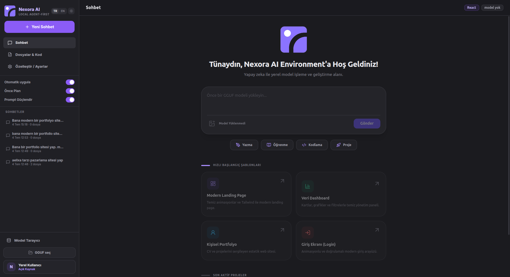
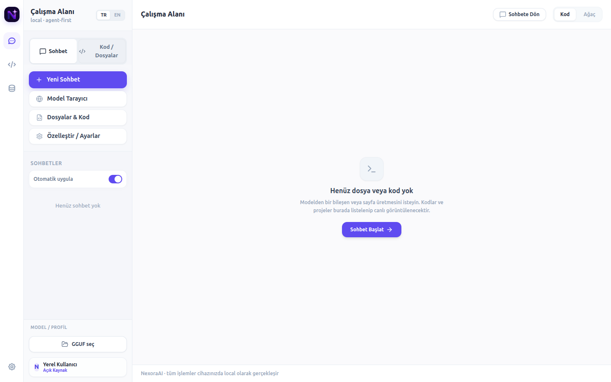
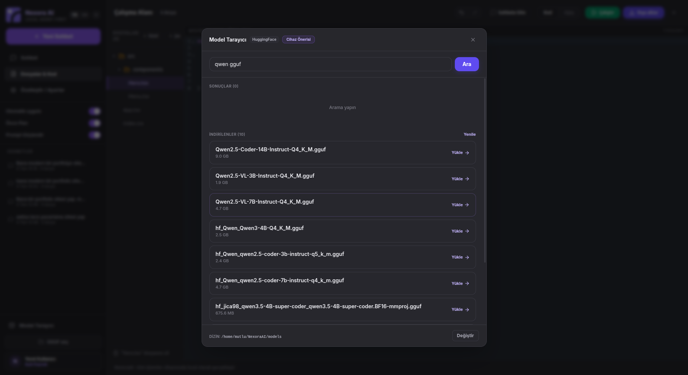
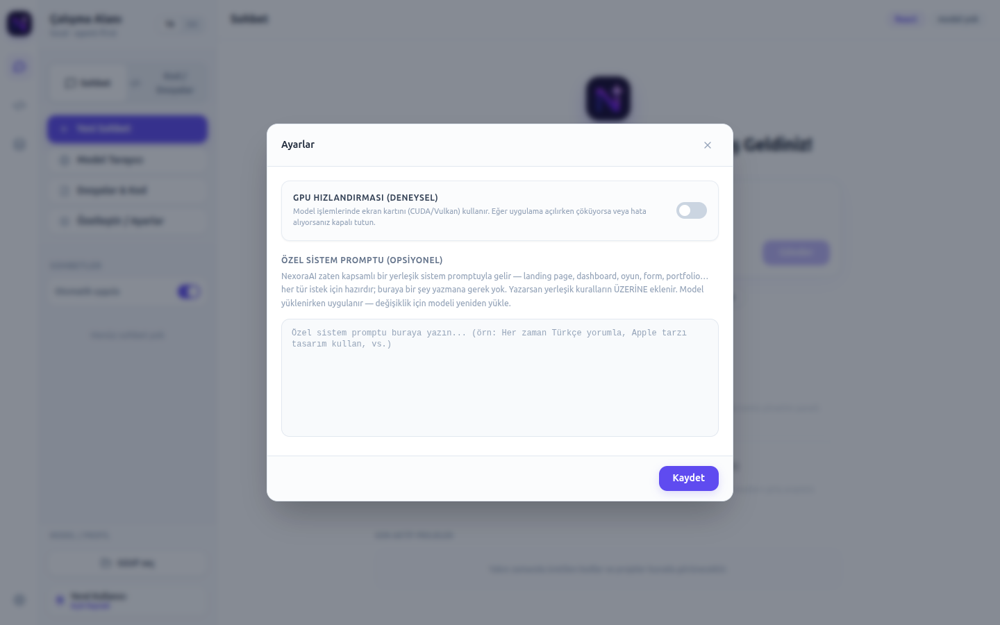
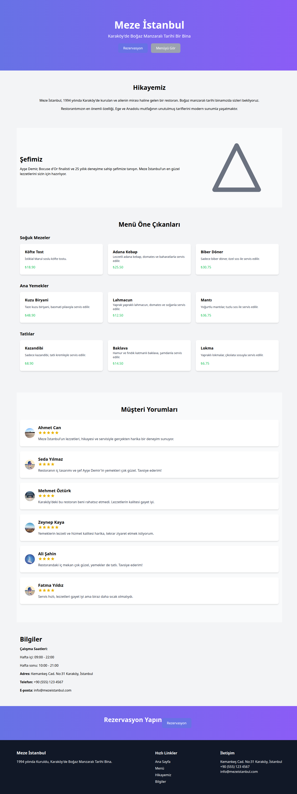
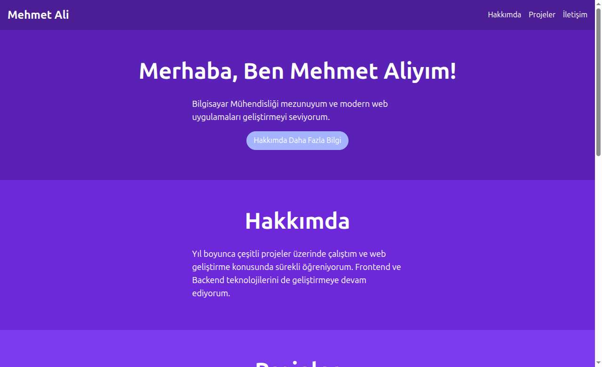

<div align="center">

# NexoraAI Environment

**A local-first, agent-powered AI development environment for the desktop.**

Build complete web projects by chatting with a GGUF model that runs entirely on your own machine — no cloud, no API keys, no subscription, no data ever leaving your computer.



</div>

---

## Table of Contents

1. [What is NexoraAI?](#what-is-nexoraai)
2. [Why does it exist?](#why-does-it-exist)
3. [Feature Overview](#feature-overview)
4. [Screenshots](#screenshots)
5. [Getting Started](#getting-started)
6. [Usage Guide](#usage-guide)
7. [Software Architecture](#software-architecture)
8. [Key Engineering Decisions](#key-engineering-decisions)
9. [Development Chronicle](#development-chronicle)
10. [Large-Model Verification](#large-model-verification)
11. [Project Structure](#project-structure)
12. [Tech Stack](#tech-stack)
13. [Roadmap](#roadmap)
14. [License](#license)

---

## What is NexoraAI?

**In plain words:** NexoraAI is a desktop app where you type *"build me a modern portfolio website"* and an AI model — running on **your own computer** — writes the project, shows you every file it creates, runs it on localhost in your browser, and lets you refine it by chatting ("make the About section longer", "add framer-motion", "download the Outfit font"). When you're happy, one click exports a complete, professional, ready-to-run project folder.

**In technical words:** NexoraAI is an Electron desktop application that hosts GGUF-format LLMs via `node-llama-cpp` in an isolated Node.js worker process, orchestrates them with model-size-adaptive system prompts, parses their streamed output into a virtual file workspace, applies Aider-style `SEARCH/REPLACE` surgical edits on iteration, exposes real side-effect tools to the model (shell, HTTP fetch, Google Fonts, npm, Vite dev server), and deterministically scaffolds the generated files into a complete Vite + React + TypeScript + Tailwind project on export.

Everything — inference, file generation, package installation, the dev server — happens locally. The status bar says it honestly: *"tüm işlemler cihazınızda local olarak gerçekleşir"* (all operations run locally on your device).

## Why does it exist?

Cloud AI builders (Bolt, Lovable, v0) are excellent, but they have three structural costs:

| Concern | Cloud builders | NexoraAI |
|---|---|---|
| **Privacy** | Your ideas and code live on someone's server | Nothing leaves your machine |
| **Cost** | Metered, subscription, rate limits | Free and unlimited once a model is downloaded |
| **Control** | One fixed model, one fixed pipeline | Any GGUF you want — swap models like cartridges |

NexoraAI is **model-agnostic by design**: on a modest laptop it drives a 3B/7B model with a strategy tuned for small models; plug a 32B+ model on a workstation and the *same app* automatically switches to full professional multi-file project generation. The tool's value grows every time the open-model ecosystem improves, with zero code changes.

## Feature Overview

- 🧠 **Local GGUF inference** — load any `.gguf` model (Qwen, Gemma, Llama…); CPU by default, GPU offload optional with automatic CPU fallback.
- 🛰️ **Crash-proof inference worker** — the model runs in a separate Node.js process; if inference dies, the app survives and tells you why.
- 📊 **Live progress in chat** — Bolt-style per-file progress cards (✓ created / ⟳ generating / ✎ updated) so you never have to leave the conversation.
- 🔪 **Surgical iteration** — changes are applied as `SEARCH/REPLACE` edit blocks: asking for a tweak edits *only* that section, in seconds, without risking the rest of the file.
- 🤖 **Real agent actions** — the model can (only when your request calls for it): add npm packages, download Google Fonts (woff2, wired into CSS), fetch any file from the internet into the project, run shell commands inside the project folder, and start the dev server.
- ▶️ **One-click Run** — syncs the workspace to disk, `npm install`s, boots Vite, and opens your browser at localhost. What you see is the real project, not a simulation.
- 🩺 **Say "düzelt" and it fixes itself** — after Run, the app compiles the project in the background; any build error is captured with its code frame, enriched with a *suspicious-line scan* (e.g. unclosed-quote detection), and posted to the chat. You type just **"düzelt"** (fix it) — the full diagnosis is attached to the model automatically, the resulting edit is applied, the build is re-verified, and the app auto-retries up to two more rounds if needed. No technical bug reports required from the user.
- 📦 **Professional export** — one click produces `<your-folder>/<project-name>/` with every missing standard file scaffolded (package.json with auto-detected dependencies, `index.html`, `src/main.tsx`, `vite.config.ts`, `tsconfig.json`, Tailwind/PostCSS configs, `.gitignore`, `README.md`) so `npm install && npm run dev` just works.
- 🎚️ **Model-size-adaptive prompting** — reads the model's true parameter count from GGUF metadata: <13B gets a compact single-file strategy it can actually execute; ≥13B gets the full professional multi-file architecture prompt.
- 🈲 **CJK drift protection** — Qwen-family models love sliding into Chinese mid-generation; NexoraAI scans the vocabulary at load time and bans ~30k CJK tokens from sampling (automatically lifted if *you* write in a CJK language).
- 🔎 **HuggingFace model browser** — search, download (with progress), and load GGUF models without leaving the app.
- 🌗 **Turkish / English UI**, custom system-prompt support, per-response accept/reject of changes.

## Screenshots

| Chat & templates | Code workspace |
|---|---|
|  |  |

| Model browser (HuggingFace) | Settings |
|---|---|
|  |  |

**Example output** — a complete restaurant site (17-file professional structure: section components, `ui/` primitives, a typed data layer, 9 priced menu items, 6 starred customer reviews) generated by a **real Qwen2.5-Coder-14B** running locally through NexoraAI from a detailed client-style brief, then refined through the app's own surgical-edit iteration loop — exactly as rendered:



And the same app on lighter hardware — a portfolio generated by a **7B** model with the compact single-file strategy:



Same application, two hardware classes — the prompt strategy adapts to the model automatically.

## Getting Started

### Platform Support

| Platform | How | Status |
|---|---|---|
| Ubuntu / Debian / Mint / Pop!_OS | install the `.deb` | ✅ fully supported |
| Any other Linux (Fedora, Arch…) | run from source (`npm run dev`) | ✅ fully supported — verified with a fresh clone |
| macOS | run from source | ✅ expected to work (POSIX shell, PATH node) |
| Windows | run from source | ⚙️ core + agent run via `cmd.exe` shell; not yet CI-tested |

Running from source gives the complete experience — inference worker, agent actions, dev server, export — because in dev mode the worker uses the Node.js already on your PATH (no bundled runtime needed).

### Requirements

- Linux x64 for the `.deb` (built and tested on Ubuntu)
- ~8 GB RAM minimum (16 GB recommended for 7B models)
- Node.js 20+ and npm (for the Run/dev-server feature; the app ships its own Node runtime for inference)
- A GGUF model file — good starters:
  - `Qwen2.5-Coder-7B-Instruct` Q4_K_M (~4.7 GB) — best quality/speed balance on 16 GB RAM
  - `Qwen2.5-Coder-3B-Instruct` Q5_K_M (~2.4 GB) — for lighter machines

### Install from the .deb (Debian / Ubuntu / Mint / Pop!_OS)

Download the latest `.deb` from the [**Releases page**](https://github.com/mutlukurt/NexoraAIEnvironment/releases/latest), then:

```bash
sudo dpkg -i nexora-ai_0.7.0_amd64.deb
```

Or as a single copy-paste:

```bash
wget https://github.com/mutlukurt/NexoraAIEnvironment/releases/latest/download/nexora-ai_0.7.0_amd64.deb
sudo dpkg -i nexora-ai_0.7.0_amd64.deb
```

### Build from source

```bash
git clone https://github.com/mutlukurt/NexoraAIEnvironment.git
cd NexoraAIEnvironment
npm install

# development
npm run dev

# production build + .deb package (place a Node binary for the bundled worker runtime first)
mkdir -p vendor/node-bin && cp "$(command -v node)" vendor/node-bin/node
npm run dist
```

> The packaged app bundles a standalone Node.js binary (`resources/node-bin/node`) used to run the inference worker outside Electron's V8 — see [Key Engineering Decisions](#key-engineering-decisions) for why this is not optional.

## Usage Guide

1. **Load a model** — sidebar → *GGUF seç* (or *Model Tarayıcı* to search & download from HuggingFace). Loading shows a live percentage; context size is chosen automatically based on free RAM.
2. **Describe your project** — e.g. *"Bana modern bir portfolio sitesi yap"*. Watch per-file progress right in the chat.
3. **Iterate** — *"Hakkımda kısmını daha detaylı yaz"*, *"projeler bölümüne 3 kart ekle"*. Small requests become surgical edits (marked *updated* in the file card).
4. **Run it** — the green **Çalıştır** button installs dependencies and opens the real site at `localhost` in your browser. Press again to stop.
5. **Use agent powers** (optional) — phrases like these trigger real actions, logged live in the chat:

   | You say | The agent does |
   |---|---|
   | "framer-motion kullan" | adds the package to `package.json` |
   | "Outfit fontunu ekle" | downloads the woff2 files from Google Fonts and wires them into the CSS |
   | "şu görseli indir …" | fetches any URL into the project tree |
   | "şu komutu çalıştır …" | runs it in the project folder (sandboxed cwd, denylist, 5-min timeout) |
   | "projeyi çalıştır" | full Run flow, browser opens automatically |

6. **Export** — **Dışa aktar** asks for a target directory and writes a complete professional project folder named after your project.

## Software Architecture

```
┌───────────────────────────── Electron ─────────────────────────────┐
│                                                                    │
│  Renderer (React 18 + TypeScript + Tailwind + Zustand)             │
│  ├── ChatPanel        streaming chat, per-file progress cards      │
│  ├── ArtifactsPanel   file tree + CodeMirror editor (Kod / Ağaç)   │
│  ├── ModelBrowser     HuggingFace search + downloads               │
│  └── stores           appStore / artifactsStore / settingsStore    │
│           │  contextBridge (typed, contextIsolation: true)         │
│  Main process                                                      │
│  ├── llamaService     worker lifecycle, IPC-RPC, prompt assembly   │
│  ├── agentService     workspace sync, shell, fetch, fonts,         │
│  │                    Vite dev server, scaffolding, export         │
│  └── hfService        HuggingFace API + GGUF downloads             │
└───────────────┬────────────────────────────────────────────────────┘
                │ child_process IPC (JSON messages)
┌───────────────▼───────────────┐      ┌──────────────────────────────┐
│  Inference worker             │      │  ~/NexoraAI/Projects/<slug>/ │
│  plain Node.js (bundled)      │      │  real on-disk workspace:     │
│  └── node-llama-cpp           │      │  npm install • vite dev      │
│      llama.cpp (CPU/GPU)      │      │  fonts • fetched assets      │
└───────────────────────────────┘      └──────────────────────────────┘
```

**Data flow of one generation:** user prompt → main process assembles the system prompt (profile-matched, size-adaptive) and the update-mode wrapper → worker streams tokens back over IPC → renderer parses the stream *live* (`parseStreaming`) into prose + fenced file blocks → complete files land in the artifacts store (visible immediately in the tree/editor); edit blocks are applied through `applySearchReplace`; agent directives (`[PKG]`, `[FONT]`, `[FETCH]`, `[RUN]`, `[DEV]`) execute sequentially after generation with a live action log in the chat.

## Key Engineering Decisions

Each decision below was forced by a real failure — see the [Development Chronicle](#development-chronicle) for the war stories.

### 1. Inference lives in a separate plain-Node process
Electron compiles V8 with the *memory cage* (pointer compression): any GGUF larger than 4 GB crashes the process with an uncatchable `SIGILL` — on every Electron version we tested (31 → 43). The same file loads in 1.7 s under plain Node. So NexoraAI ships its own Node binary and runs `node-llama-cpp` in a child process, talking to it over structured IPC. Bonus: a dying model can no longer take the app down with it.

*Plain-language version:* the AI engine runs in its own little program next to the app. Big models stopped crashing, and even if the engine chokes, the app keeps running and tells you what happened.

### 2. Context size is chosen by available RAM, never by the model's maximum
Modern models advertise 32k–131k token context windows. Actually allocating that KV cache on a 16 GB laptop sends the machine into swap and looks exactly like "the app froze forever". NexoraAI picks 16k/8k/4k based on free memory and steps down automatically if allocation fails.

### 3. Prompts adapt to the model's real size (from GGUF metadata)
Small models (<13B parameters) drown in long rule lists: they duplicate files, invent imports, echo instruction templates back as code. They get a compact, example-driven, **single-file** strategy. Models ≥13B get the full professional multi-file architecture prompt. The parameter count is read from GGUF metadata (`general.parameter_count` / `size_label`), not guessed from file size.

*Plain-language version:* we ask small brains for one great file and big brains for a whole professional project — and the app tells them apart automatically.

### 4. The professional structure is deterministic, not model-generated
`scaffoldProject()` completes whatever the model produced into a runnable project: entry HTML, `main.tsx`, Vite/TS/Tailwind configs, a `package.json` whose dependencies are *detected from the actual imports* in the code. Program logic — not a language model — guarantees `npm install && npm run dev` works.

### 5. Iteration = surgical `SEARCH/REPLACE` edits
Rewriting a whole file to change one paragraph is slow and risky. NexoraAI teaches the model Aider-style edit blocks; the applier requires an exact match (with a whitespace-tolerant fallback) and **never touches the file if the match fails**. Verified live: a 7B model changed one `<p>` in a 5 KB component, everything else byte-identical.

### 6. Model quirks are patched at the sampler, not with polite requests
Qwen models drift into Chinese mid-output. Asking nicely in the prompt doesn't stop it. Banning all ~31k CJK-containing vocabulary tokens via `TokenBias` at load time (~200 ms, once) *does* — mathematically. The ban lifts automatically for users who actually write in Chinese/Japanese/Korean.

### 7. Viewing = the real thing, not a sandbox
An earlier in-app preview (Babel-in-iframe) fought endless battles: TypeScript type-import syntax, CSP inheritance, sandboxed-frame process deaths under memory pressure, liveness false alarms. The verdict: **run the real project**. The Run button writes the workspace to disk, installs, boots Vite and opens the browser — pixel-perfect by definition.

### 8. Agent instructions are injected only when needed
Keeping tool-use instructions permanently in the system prompt made small models copy the templates verbatim into their output ("`[FETCH] <url> -> <relative/path>`" as a file!). The agent hint is now appended per-message, only when intent-detection sees words like *install / font / indir / çalıştır*, and uses real example values. Placeholder-looking values are refused at execution time as a second line of defense.

## Development Chronicle

An honest, chronological log of how this project actually happened — including the dead ends.

**Phase 1 — Foundation (v0.1.0 → v0.3.8).** Electron + React scaffold; chat UI with streaming; GGUF loading via node-llama-cpp in the main process; profile-matched system prompts (React SPA / Next.js / static HTML / FastAPI / Electron / Tauri / React Native); Bolt-style live file parsing with an in-app preview sandbox; HuggingFace browser; `.deb` packaging.

**Phase 2 — "The model won't load" (v0.4.0).** Two root causes found and fixed in one day: (1) default context allocation tried to fit the model's full 32k–131k training window into laptop RAM → swap death that looked like an infinite spinner — fixed with RAM-aware context sizing; (2) GGUFs > 4 GB hard-crashed Electron with `SIGILL` at the exact 4 GiB boundary (`r14 = 0x100000000`) — diagnosed as V8's memory cage, unfixable in-process even on Electron 43, solved by moving inference to a bundled plain-Node worker. Also added: load-progress events, GPU→CPU auto-fallback, chat-visible per-file progress, no more forced tab switching.

**Phase 3 — "It opens… doesn't it?" (v0.4.1).** After the Electron 43 upgrade the packaged app launched but never showed a window: legacy `use-gl=swiftshader + disable-software-rasterizer` switches (originally added to stop in-process Vulkan crashes — now obsolete) prevented the first paint on Wayland, and `ready-to-show` never fired. Removed the switches; added a 2.5 s fallback `win.show()` so the window can never silently stay hidden again.

**Phase 4 — Parser forensics (v0.4.2 → v0.4.3).** Small models put file paths *next to* fences, not on them — the parser turned those into empty files plus `App8.tsx`-style junk names; fixed by letting a bare-path line name the following fence. Then the preview engine: `import { clsx, type ClassValue }` generated syntactically invalid JS that killed the *entire* preview script — the infamous uniform-gray screen. Fixed type-import filtering, `export { X } / export * / export interface` handling, `@/` alias resolution, functional stubs for clsx/tailwind-merge/framer-motion, per-module script isolation.

**Phase 5 — The agent layer (v0.5.0).** Real workspace on disk (`~/NexoraAI/Projects/<slug>`), shell execution with denylist + timeout, internet fetch, Google Fonts pipeline (woff2 download + CSS rewrite), Vite dev-server orchestration with URL detection, professional export with dependency-detecting scaffold. All directive-driven from model output, with a live action log in chat.

**Phase 6 — Prompt archaeology (v0.5.1 → v0.5.4).** The always-on agent instructions made small models regurgitate template lines as files → made the hint conditional and placeholder-proof. "Professional multi-file tree" prompts made 3B/7B models duplicate files and import ghosts → introduced the compact single-file strategy (verified: a 3B produced exactly 2 valid files). Dev server: stale `node_modules` skipped installs of newly-added deps (`Failed to resolve import "lucide-react"`) → always reconcile installs; scaffold ordering bug left `index.css` unimported → all project CSS is now wired into `main.tsx`.

**Phase 7 — Killing the preview (v0.5.5 → v0.6.0).** The in-app preview intermittently rendered as a solid gray rectangle that survived every reproduction attempt (the exact same files rendered perfectly when injected via CDP into the very same installed app). A liveness beacon + self-healing iframe reduced the pain; a beacon placed at document-end then *caused* false "dead frame" alarms on slow machines (moved to document-head). Final call, made by the product owner: **delete the preview, view through the real dev server.** Same release brought surgical `SEARCH/REPLACE` iteration — tested against the owner's real project file and real request: one edit block, applied cleanly, rest of the file untouched.

**Phase 8 — Polish for everyone (v0.6.1 → v0.6.3).** CJK sampler ban (31k tokens, ~200 ms scan) ended Qwen's random Chinese; made conditional per-message so CJK-speaking users still get native answers; small/full prompt selection upgraded from file-size heuristic to true parameter count from GGUF metadata — a tightly-quantized 14B now correctly gets the professional multi-file treatment.

## Large-Model Verification

> **TL;DR:** The entire large-model pipeline — professional multi-file generation → parsing → real dev server → export → production build → deployable static output — has been verified end-to-end with a full-fidelity simulation. If your hardware can load a 32B/70B GGUF, NexoraAI is ready for it.

### The question

NexoraAI adapts to model size: models ≥13B parameters receive the **full professional prompt** (multi-file trees with `components/ui/`, `components/sections/`, a typed `lib/data.ts` content layer, design rules). But this project was developed on a laptop that can only run 3B/7B models — so how do we know the big-model path actually works?

### The insight that makes it testable

*Plain-language version:* the app never knows **who** wrote the text it processes. A 70B model, a 7B model, or a human producing the exact same characters are indistinguishable to the pipeline. So we can author a byte-realistic "70B-class output" and push it through the **real** production code — no mocks, no copies.

*Technical version:* the fixture is a ~600-line generation transcript that exercises every pattern the full professional prompt demands and every historically fragile parser path: 15 files across `ui/` + `sections/` + `lib/`, TypeScript **type imports** (`import { clsx, type ClassValue }`), `@/` **alias imports**, framer-motion, typed interfaces, a model-authored `package.json` that the scaffold must merge rather than overwrite.

### The methodology

The app's actual modules (`src/lib/parseCode.ts`, `electron/main/agentService.ts`) were bundled standalone with esbuild (only Electron's `shell.openExternal` stubbed — everything else is the shipping code), then driven stage by stage. Every stage was verified **from the outside** — by HTTP request, directory listing, or content search — never by trusting a return value.

### The results

| Stage | What actually ran | Independent verification | Result |
|---|---|---|---|
| 1. Parse | `parseStreaming()` over the transcript | 15/15 files extracted, all `complete`, correct paths | ✅ |
| 2. Scaffold | `scaffoldProject()` | Diff shows exactly the 6 missing standard files added (`vite.config.ts`, `tsconfig.json`, `index.html`, `src/main.tsx`, `postcss.config.js`, `.gitignore`); model's `package.json` merged, not clobbered | ✅ |
| 3. Run | `startDev()` → real `npm install` (142 packages) → real Vite | `GET localhost:5173/` serves the app; `GET /src/App.tsx` returns compiled output (HTTP 200); the `@/` alias import in `Projects.tsx` resolves to the real module in Vite's transformed source | ✅ |
| 4. Export | `exportProject()` | `aurora-digital/` folder exists with the complete professional tree | ✅ |
| 5. Production build | `npm install && npm run build` **inside the exported folder** — exactly what a downstream user or Vercel runs | Vite build succeeds in 1.69 s → `dist/` (282 KB JS, 11 KB CSS, gzipped 92/3 KB) | ✅ |
| 6. Deploy simulation | `dist/` served by a plain static file server (which is all Vercel/Netlify fundamentally do) | Root HTML served with correct title; site content found inside the compiled JS bundle | ✅ |

Additionally verified at the logic level: `buildSystemPrompt(…, smallModel=false)` emits the full professional rules (and none of the single-file constraints), and the loader classifies 32B/70B parameter counts (read from GGUF metadata, not guessed from file size) as full-prompt models — rebuilding the session with the correct prompt if the initial file-size guess disagreed.

### What this proves — and the one thing it can't

**Proven:** a large model's professional multi-file output flows through parsing, workspace, dev server, export, production build, and static deployment without a single manual fix. The output is genuinely *deployable* — stage 5–6 is byte-for-byte the Vercel workflow.

**Not simulatable:** physically loading a 40 GB file into RAM. That part is llama.cpp's most-traveled code path (identical for all model sizes), the >4 GB Electron crash class is already eliminated by the worker architecture, and memory pressure degrades gracefully (context-size step-down ladder, clean error instead of a hang). But honest is honest: run-a-real-70B remains hardware-gated, not verified here.

### Follow-up: verified with a REAL ≥13B model on real hardware

The simulation left one open question, so we closed it: **Qwen2.5-Coder-14B-Instruct Q4_K_M (9 GB)** — above the 13B professional-prompt threshold — was downloaded and run **on the same 16 GB development laptop, CPU-only**.

- The loader read `14B` from GGUF metadata and selected the **full professional prompt** — the size-adaptive logic worked live, not just in unit tests.
- Given a detailed client-style brief (brand history, chef bio, 3×3 priced menu, reviews, hours), the model wrote a **17-file professional project** in 41 minutes (~2 tok/s on CPU): eight section components, `ui/` primitives, a typed `lib/` data layer — the structure small models can't sustain.
- The output flowed through the same pipeline: parse → scaffold → `npm install` → `vite build` (<1 s) → static serve. The finished site, exactly as rendered:


The run was even more valuable for what went wrong. **Every real model mistake became either a deterministic auto-repair or a live test of the app's iteration loop:**

| Real 14B mistake | How it got fixed |
|---|---|
| CRA relics (`react-scripts@5`) in a Vite `package.json` → `ERESOLVE` install failure | Scaffold now **sanitizes model manifests** (bans CRA/webpack relics, pins build tools, forces vite scripts) |
| Used `cn()` without defining or importing it → blank page | Scaffold now **generates a dependency-free `cn()`** and injects the import |
| Used `<Button/>` and `menuCategories` without imports → `ReferenceError` | Scaffold now builds a project-wide **export map and auto-injects missing imports** (components *and* data) |
| Turkish apostrophes inside single-quoted strings (`'İstanbul'un…'`) → syntax error | Scaffold now **converts such string literals to double quotes** (key-value pairs are never touched) |
| A missing quote in one `className`, lazy `// Add items here` stubs, `Array(4.5)` star-rating crash | Fixed by the model itself through NexoraAI's **surgical-edit iteration loop** — the exact chat workflow a user follows ("build hatası var…", "menü bölümü boş, doldur…") |

*Plain-language version:* we rented nothing and faked nothing — a genuinely big model ran on the actual laptop, slowly but correctly. It made half a dozen real mistakes, and every one of them either taught the app to auto-fix that whole class of mistakes for everyone, or proved that the built-in chat iteration workflow repairs what's left.

### The "düzelt" flow — engineered and tested the hard way

Non-technical users can't write bug reports like *"line 20 has an unclosed className quote"*. So NexoraAI closes that gap — and the feature was **battle-tested against a real 14B before shipping**, failures included:

1. **First design** (error text auto-attached, user says "düzelt"): the model misdiagnosed an `Unexpected end of file` error **three rounds in a row** — it kept patching the file's end instead of finding the unclosed quote far above. Honest result: ❌.
2. **Fix #1 — suspicious-line scan:** for EOF-class errors the app now scans the failing file for lines with an odd number of quotes and appends them to the diagnosis (`Footer.tsx:20: <li><a … gray-500>Bilgiler…`). With the pinpoint, the model targeted the right line immediately — but its `SEARCH` block silently *auto-corrected* the broken code it was supposed to copy verbatim, so the edit didn't match. ❌ again, new lesson.
3. **Fix #2 — quote-insensitive matching:** the edit applier gained a third matching tier (quotes ignored, applied only on a unique match), tolerating exactly that model habit.

**Final verified run:** broken project → Run → error auto-captured → user types the single word **"düzelt"** → the 14B produces the correct one-line edit → applied through the tolerant matcher → automatic re-build passes. ✅ One round, zero technical input from the user. If a fix doesn't clear the build, the app re-attaches the fresh error and retries automatically (max 2 extra rounds) before asking the human for help.

## Project Structure

```
NexoraAIEnvironment/
├── electron/
│   ├── main/
│   │   ├── index.ts          # app lifecycle, window, IPC registry
│   │   ├── llamaService.ts   # inference-worker client (RPC over child-process IPC)
│   │   ├── llamaWorker.ts    # ⭐ plain-Node inference worker (runs OUTSIDE Electron)
│   │   ├── agentService.ts   # workspace, shell, fetch, fonts, dev server, scaffold, export
│   │   └── hfService.ts      # HuggingFace search + GGUF downloads
│   ├── preload/index.ts      # typed contextBridge API (window.nexora)
│   └── shared/
│       ├── ipc.ts            # channel names + shared types
│       └── prompts.ts        # profiles, compact/full prompts, agent hint, intent detection
├── src/
│   ├── components/           # ChatPanel, ArtifactsPanel, FileTree, CodeEditor, ModelBrowser…
│   ├── store/                # zustand stores (app / artifacts / settings / hf)
│   └── lib/
│       ├── parseCode.ts      # streaming fence parser + SEARCH/REPLACE applier
│       ├── agentActions.ts   # directive parsing + execution pipeline
│       └── codeFixer.ts      # post-generation code fixes
├── docs/screenshots/         # images used in this README
├── scripts/                  # vendor copy, icon generation
└── vendor/node-bin/          # bundled Node runtime for the worker (not in git)
```

## Tech Stack

| Layer | Technology |
|---|---|
| Shell | Electron 43, electron-vite, electron-builder (`.deb`) |
| UI | React 18, TypeScript, Tailwind CSS, Zustand, CodeMirror 6, lucide icons |
| Inference | node-llama-cpp 3 (llama.cpp), bundled Node 22 runtime, TokenBias sampling control |
| Generated projects | Vite 5, React 18, TypeScript, Tailwind (scaffolded deterministically) |

## Roadmap

- **Hybrid API mode** — optional OpenAI-compatible / Anthropic endpoint support, so weak hardware can opt into cloud quality while keeping the local pipeline as default.
- Session persistence (chat history + workspace across restarts).
- GPU offload UX (layer slider, VRAM telemetry).
- Windows/macOS packaging.
- Multi-project management with named workspaces.

## License

MIT © [Mutlu Kurt](https://github.com/mutlukurt)

---

<div align="center">
<sub>Built with stubbornness on a laptop that nvidia-smi refuses to acknowledge.</sub>
</div>
