<div align="center">

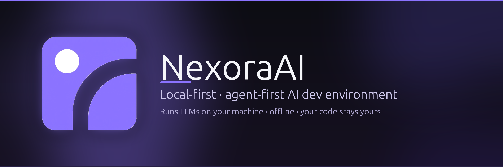

# NexoraAI Environment

**A local-first, agent-powered AI development environment for the desktop.**

Build complete web projects by chatting with a GGUF model that runs entirely on your own machine — by default no cloud, no API keys, no subscription, nothing leaving your computer. *(An optional, clearly-labelled BYO-key API mode is there if you ever want a frontier cloud model — 157 providers, keys in the OS keychain.)*

<a href="https://snapcraft.io/nexora-ai"></a>

<a href="https://github.com/mutlukurt/NexoraAIEnvironment/releases/latest"></a>
&nbsp;
<a href="https://snapcraft.io/nexora-ai"></a>
&nbsp;
<a href="LICENSE"></a>
&nbsp;


**🐧 Ubuntu (Linux)**

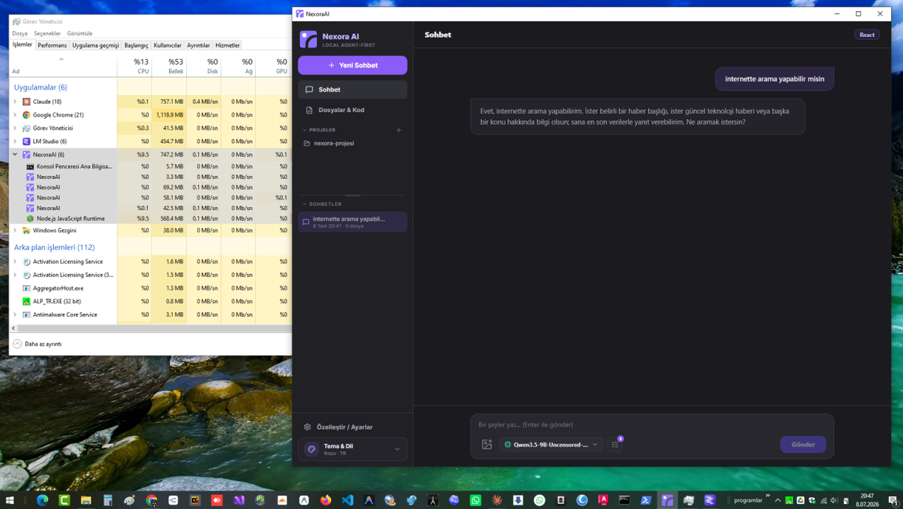

**🪟 The same app on Windows 11 — installed from the CI-built `.exe`**

</div>

---

## Table of Contents

1. [What is NexoraAI?](#what-is-nexoraai)
2. [Why does it exist?](#why-does-it-exist)
3. [Now on the Snap Store](#now-on-the-snap-store--one-command-on-ubuntu-and-beyond) · [Download & Install](#download--install) · [Release History](#release-history) · [Release Scorecards (newest → oldest)](#the-intent-brain--model-only-repair--the-v020-scorecard-phase-14) → [VOLTA output](#volta-output)
4. [Feature Overview](#feature-overview)
5. [Screenshots](#screenshots)
6. [Getting Started](#getting-started)
7. [Usage Guide](#usage-guide)
8. [Software Architecture](#software-architecture)
9. [Key Engineering Decisions](#key-engineering-decisions)
10. [Development Chronicle](#development-chronicle)
11. [Large-Model Verification](#large-model-verification)
12. [Project Structure](#project-structure)
13. [Tech Stack](#tech-stack)
14. [Roadmap](#roadmap)
15. [License](#license)

---

## What is NexoraAI?

**In plain words:** NexoraAI is a desktop app where you type *"build me a modern portfolio website"* and an AI model — running on **your own computer** — writes the project, shows you every file it creates, runs it on localhost in your browser, and lets you refine it by chatting ("make the About section longer", "add framer-motion", "download the Outfit font"). When you're happy, one click exports a complete, professional, ready-to-run project folder.

**In technical words:** NexoraAI is an Electron desktop application that hosts GGUF-format LLMs via `node-llama-cpp` in an isolated Node.js worker process (or an opt-in OpenAI-compatible API from 157 providers), orchestrates them with **capability-adaptive** system prompts — a sectioned, grammar-guarded pipeline for small models and a one-shot **frontier** path for capable ones (a strong API or a ≥ 13B GGUF) — parses their streamed output into a virtual file workspace, iterates by **complete-file rewrites** verified by a debug engine that **detects** issues deterministically (compiler diagnostics, scan, runtime capture) and hands **every fix to the model** (as of v0.20 — the old deterministic "tool" repair layer was removed), exposes real side-effect tools to the model (shell, HTTP fetch, Google Fonts, npm, Vite dev server, MCP), and deterministically scaffolds the generated files into a complete Vite + React + TypeScript + Tailwind project on export.

Everything — inference, file generation, package installation, the dev server — happens locally. The status bar says it honestly: *"tüm işlemler cihazınızda local olarak gerçekleşir"* (all operations run locally on your device).

## Why does it exist?

Cloud AI builders (Bolt, Lovable, v0) are excellent, but they have three structural costs:

| Concern | Cloud builders | NexoraAI |
|---|---|---|
| **Privacy** | Your ideas and code live on someone's server | Nothing leaves your machine |
| **Cost** | Metered, subscription, rate limits | Free and unlimited once a model is downloaded |
| **Control** | One fixed model, one fixed pipeline | Any GGUF you want — swap models like cartridges |

NexoraAI is **model-agnostic by design**: on a modest laptop it drives a 3B/7B model with a strategy tuned for small models (sectioned generation, format grammars, tight caps); plug a **≥ 13B GGUF** on a workstation — or opt into a frontier **API** — and the *same app* automatically switches to the **unleashed** path: one-shot, multi-file, elite-persona project generation with none of the small-model crutches. The tool's value grows every time the open-model ecosystem improves, with zero code changes. *(An optional BYO-key API mode — 157 providers, keys in the OS keychain — exists for those who want a frontier cloud model; the local, nothing-leaves-your-machine path stays the default.)*

## Now on the Snap Store — one command on Ubuntu and beyond

**NexoraAI is live on the [Snap Store](https://snapcraft.io/nexora-ai).** One command installs it on Ubuntu, Mint, Fedora, Pop!_OS — any distro with `snapd`:

```bash
sudo snap install nexora-ai --edge --devmode
```

> **The backstory.** We tried Flathub first — it rejected the app under its *generative-AI policy* (NexoraAI is built with AI) and for being a young project. The Snap Store has **no such gate**: its terms bar malware, IP infringement and impersonation — not *how an app was authored or how old it is*. So we shipped there instead: a working, installable store page with a real link, zero drama.

**🔧 The build fight (and how we won it).** electron-builder's snap target is **broken on Ubuntu 26.04 + snapcraft 9** — its template path fails to unpack the runtime it bundles (the app crashed on second launch with `libnspr4.so: cannot open shared object file`), and its fallback path calls a `snapcraft` subcommand that no longer exists. Rather than wait on upstream, we wrote **`scripts/fix-snap.sh`**: it repairs electron-builder's output — restores the missing **NSS/NSPR libraries** + desktop launcher scripts, and forces **X11 + software rendering** so the app launches from the applications menu, not just a terminal. NexoraAI's real GPU work runs in the **llama-server Vulkan sidecar** (a separate process), so disabling Electron's own GPU costs nothing. It's wired into `npm run dist:snap`, so every build — and CI — reproduces a working snap.

**🎯 Where it stands.** Live on the **edge** channel today with `devmode` confinement — the **full, working app**, verified launching from both a terminal and the applications menu. To reach the searchable **stable** channel (plain `snap install nexora-ai`, `snap find`, the desktop App Center), an agent that runs your project's toolchain against files at arbitrary paths needs **classic** confinement — the same category as VS Code — and that store review is in progress.

| The obstacle | What we shipped |
| --- | --- |
| Flathub rejected it (generative-AI policy, young project) | **Live on the Snap Store** — no such policy; real store page + link |
| electron-builder's snap build broken on Ubuntu 26.04 / snapcraft 9 (both paths) | **`fix-snap.sh`** repairs it — missing NSS libs + launcher restored, reproducible via `dist:snap` |
| App launched from a terminal but crashed from the menu (Wayland/GPU) | **X11 + software render** in the launcher — llama's Vulkan GPU path untouched |
| Searchable, flag-free install | **`classic` confinement review in progress** for the `stable` channel |

---

## Download & Install

Every release ships installers for **all three platforms**, built by CI and attached to the [latest GitHub release](https://github.com/mutlukurt/NexoraAIEnvironment/releases/latest).

| Platform | How to install |
| --- | --- |
| **🐧 Linux — Snap** | `sudo snap install nexora-ai --edge --devmode` |
| **🐧 Linux — .deb** | [Download the `.deb`](https://github.com/mutlukurt/NexoraAIEnvironment/releases/latest) → `sudo dpkg -i nexora-ai_*_amd64.deb` |
| **🪟 Windows — .exe** | [Download `NexoraAI-Setup-*.exe`](https://github.com/mutlukurt/NexoraAIEnvironment/releases/latest) and run the installer |
| **🍎 macOS — .dmg** | [Download `NexoraAI-*-arm64.dmg`](https://github.com/mutlukurt/NexoraAIEnvironment/releases/latest) — unsigned, so first launch: right-click → **Open** |

After installing, open the in-app **Model Browser** to download a GGUF model (or drop one in `~/NexoraAI/models`) and start building. Everything runs **locally on your device** — no cloud, no API keys required.

---

## Release History

Every version, newest first. Deep-dive scorecards for the recent milestones follow below; this is the complete list from the first public build to today.

<details open>
<summary><b>📜 Full release history — v0.6.4 → v0.24.1 (42 releases)</b></summary>

| Version | Date | What it brought |
| --- | --- | --- |
| [v0.24.1](https://github.com/mutlukurt/NexoraAIEnvironment/releases/tag/v0.24.1) | 2026-07-15 | **Full localization of the v0.24 features into all 10 languages** — fit pill, privacy indicator, storage/rename/zip UI + the MCP / Serve / Scheduled-Tasks Settings panels + the shield/dry-run reasons now render in every supported language |
| [v0.24.0](https://github.com/mutlukurt/NexoraAIEnvironment/releases/tag/v0.24.0) | 2026-07-15 | **Trust, Local-Runner Polish & Everyday Delight** (new roadmap Phases 21/25/26) — slopsquatting shield + destructive-action dry-run (21), model storage dashboard + fit pill (25), richer templates + privacy indicator + project `.zip` export + session/project rename (26) |
| [v0.23.1](https://github.com/mutlukurt/NexoraAIEnvironment/releases/tag/v0.23.1) | 2026-07-14 | Whisper dictation **auto-installs** on Linux & Windows (whisper.cpp v1.9.1 binary on demand) |
| [v0.23.0](https://github.com/mutlukurt/NexoraAIEnvironment/releases/tag/v0.23.0) | 2026-07-14 | **Context Economy** (Phase 17) + **conversation branching / DAG** (20.1) + **offline Whisper dictation** (20.3) + smooth streaming (20.4) — completes the Piebald roadmap |
| [v0.22.0](https://github.com/mutlukurt/NexoraAIEnvironment/releases/tag/v0.22.0) | 2026-07-14 | **Discipline, Self-Managing Memory & Hardening** — prompt discipline (18), knowledge "dream" consolidation + self-terminating tasks (19), security review (20.2) |
| [v0.21.0](https://github.com/mutlukurt/NexoraAIEnvironment/releases/tag/v0.21.0) | 2026-07-14 | **Session Integrity, Radical Transparency & Context Economy** — reboot-resilient approvals + config profiles (15), engine inspector + export (16), query-relevant memory (17.3) |
| [v0.20.2](https://github.com/mutlukurt/NexoraAIEnvironment/releases/tag/v0.20.2) | 2026-07-12 | Patch: the real fix for self-firing tasks on startup |
| [v0.20.1](https://github.com/mutlukurt/NexoraAIEnvironment/releases/tag/v0.20.1) | 2026-07-12 | Patch: no more self-firing tasks on startup |
| [v0.20.0](https://github.com/mutlukurt/NexoraAIEnvironment/releases/tag/v0.20.0) | 2026-07-12 | **The Intent Brain & Model-Only Repair** (Phase 14) — repo-map, semantic search, intent gate; deterministic repair removed → every fix goes to the model |
| [v0.19.0](https://github.com/mutlukurt/NexoraAIEnvironment/releases/tag/v0.19.0) | 2026-07-11 | **Offline Image Generation & the Intent-Based Agent** (Phase 13) — on-device Stable Diffusion, 10-language i18n |
| [v0.18.3](https://github.com/mutlukurt/NexoraAIEnvironment/releases/tag/v0.18.3) | 2026-07-10 | The Universal Agent & a 10-language interface |
| [v0.18.2](https://github.com/mutlukurt/NexoraAIEnvironment/releases/tag/v0.18.2) | 2026-07-10 | Settings UX hardening (appearance + Provider Hub master-detail) |
| [v0.18.1](https://github.com/mutlukurt/NexoraAIEnvironment/releases/tag/v0.18.1) | 2026-07-09 | Two-pane Settings + a vision model you can pick |
| [v0.18.0](https://github.com/mutlukurt/NexoraAIEnvironment/releases/tag/v0.18.0) | 2026-07-09 | Image generation + full file/shell access from chat |
| [v0.17.4](https://github.com/mutlukurt/NexoraAIEnvironment/releases/tag/v0.17.4) | 2026-07-09 | "New session" on a project lands you in Chat |
| [v0.17.3](https://github.com/mutlukurt/NexoraAIEnvironment/releases/tag/v0.17.3) | 2026-07-09 | Image → project is a two-stage flow (analyze, then build) |
| [v0.17.2](https://github.com/mutlukurt/NexoraAIEnvironment/releases/tag/v0.17.2) | 2026-07-09 | Non-vision API models stop hallucinating from an image |
| [v0.17.1](https://github.com/mutlukurt/NexoraAIEnvironment/releases/tag/v0.17.1) | 2026-07-09 | Vision routing follows the "API is independent" rule |
| [v0.17.0](https://github.com/mutlukurt/NexoraAIEnvironment/releases/tag/v0.17.0) | 2026-07-09 | **Ecosystem, Discoverability & the API Unleashed** (Phase 10) — MCP, serve endpoint, command palette, checkpoints, 157-provider hub |
| [v0.16.0](https://github.com/mutlukurt/NexoraAIEnvironment/releases/tag/v0.16.0) | 2026-07-08 | VRAM-aware Hardware Advisor (Windows .exe · macOS .dmg · Linux .deb) |
| [v0.15.2](https://github.com/mutlukurt/NexoraAIEnvironment/releases/tag/v0.15.2) | 2026-07-08 | Windows (.exe) + macOS (.dmg) + Linux (.deb) — 3-platform CI |
| [v0.15.1](https://github.com/mutlukurt/NexoraAIEnvironment/releases/tag/v0.15.1) | 2026-07-08 | Fidelity arms on the contract + the VOLTA live test |
| [v0.15.0](https://github.com/mutlukurt/NexoraAIEnvironment/releases/tag/v0.15.0) | 2026-07-08 | **Universal Prompt Fidelity** (Phase 9) — faithful reproduction of hyper-detailed specs |
| [v0.14.3](https://github.com/mutlukurt/NexoraAIEnvironment/releases/tag/v0.14.3) | 2026-07-08 | The 3B finally edits |
| [v0.14.2](https://github.com/mutlukurt/NexoraAIEnvironment/releases/tag/v0.14.2) | 2026-07-08 | A calmer surface (UI polish) |
| [v0.14.1](https://github.com/mutlukurt/NexoraAIEnvironment/releases/tag/v0.14.1) | 2026-07-08 | Iteration that lands |
| [v0.14.0](https://github.com/mutlukurt/NexoraAIEnvironment/releases/tag/v0.14.0) | 2026-07-07 | **Real-Time Hardening** (Phase 8) — the clock is the enemy: livenessguards, absolute Stop |
| [v0.13.0](https://github.com/mutlukurt/NexoraAIEnvironment/releases/tag/v0.13.0) | 2026-07-07 | **The Agent Layer** (Phase 7) — task list, diff review, comment-to-steer, trust tiers, process runner, task queue |
| [v0.12.0](https://github.com/mutlukurt/NexoraAIEnvironment/releases/tag/v0.12.0) | 2026-07-06 | **The Engine, 10×** (Phase 6) — the debug engine matures |
| [v0.11.1](https://github.com/mutlukurt/NexoraAIEnvironment/releases/tag/v0.11.1) | 2026-07-05 | The 14B Portfolio Proof |
| [v0.11.0](https://github.com/mutlukurt/NexoraAIEnvironment/releases/tag/v0.11.0) | 2026-07-05 | **The Debug Engine** (Phase 5) — deterministic detection, model-driven fixes |
| [v0.10.0](https://github.com/mutlukurt/NexoraAIEnvironment/releases/tag/v0.10.0) | 2026-07-04 | One Night, One League |
| [v0.8.4](https://github.com/mutlukurt/NexoraAIEnvironment/releases/tag/v0.8.4) | 2026-07-03 | Sharper eyes (vision improvements) |
| [v0.8.3](https://github.com/mutlukurt/NexoraAIEnvironment/releases/tag/v0.8.3) | 2026-07-03 | Maintenance & fixes |
| [v0.8.2](https://github.com/mutlukurt/NexoraAIEnvironment/releases/tag/v0.8.2) | 2026-07-03 | Maintenance & fixes |
| [v0.8.1](https://github.com/mutlukurt/NexoraAIEnvironment/releases/tag/v0.8.1) | 2026-07-03 | Maintenance & fixes |
| [v0.8.0](https://github.com/mutlukurt/NexoraAIEnvironment/releases/tag/v0.8.0) | 2026-07-03 | Sees your reference designs (vision → build) |
| [v0.7.1](https://github.com/mutlukurt/NexoraAIEnvironment/releases/tag/v0.7.1) | 2026-07-03 | Maintenance & fixes |
| [v0.7.0](https://github.com/mutlukurt/NexoraAIEnvironment/releases/tag/v0.7.0) | 2026-07-03 | Say "düzelt", it fixes itself (self-repair) |
| [v0.6.6](https://github.com/mutlukurt/NexoraAIEnvironment/releases/tag/v0.6.6) | 2026-07-03 | Early build |
| [v0.6.5](https://github.com/mutlukurt/NexoraAIEnvironment/releases/tag/v0.6.5) | 2026-07-03 | Early build |
| [v0.6.4](https://github.com/mutlukurt/NexoraAIEnvironment/releases/tag/v0.6.4) | 2026-07-03 | Early build |

</details>

---

## Trust, Local-Runner Polish & Everyday Delight — the v0.24 Scorecard (new roadmap, Phases 21 / 25 / 26)

The first release on the **new roadmap** (`ROADMAP-NEXT.md`). Eight features, every one **live-verified in the real running app** (Electron + Chrome DevTools Protocol) *before* it was committed — not just unit-tested. Local-first and intent-based throughout: the model still decides *what* you want; these only make the app safer, clearer, and nicer to live in.

**🛡️ Trust & Verify (Phase 21).** Two pre-execution guards no cloud tool offers offline. The **Offline Slopsquatting Shield** screens every `npm/yarn/pnpm/bun/pip` install against a bundled popular-package snapshot (Damerau-Levenshtein ≤ 1 + separator confusion) — a hallucinated/typosquatted name (`reactt`, `crossenv`, `reqeusts`) is caught and paused for your approval *with a reason*, instead of silently installing malware. The **Destructive-Action Dry Run** previews exactly what a `rm -rf dist` / `mv` / `>` will delete or overwrite ("🗑 Will delete: dist/ (3 files)"), matched against your real files, right in the approval dialog.

**🖥️ Local-AI Runner (Phase 25).** The **Model Storage Dashboard** shows total disk used by your local models and a per-model trash button with a two-step confirm (path-escape and non-model names are rejected — a real `../../../etc/passwd` attempt was refused in testing). The **Fit Pill** tags every model for *your* hardware — 🟢 fits / 🔵 spills · slow / 🔴 too big — so you see whether it will run well **before** you load it and hit an OOM crash (verified on a real RTX 2050 4 GB: 3B 🟢, 7B/14B 🔵).

**✨ Everyday Delight (Phase 26).** The one-click **starter templates** now send *detailed* prompts (colors, sections, elements) so a single click builds far more faithfully. A **privacy indicator** in the header reads 🔒 *fully on device* or ☁️ *to cloud · {provider}* — honest, at-a-glance data-egress labelling. A 📦 **`.zip` export** packs the whole runnable project (scaffold + assets) into a single dependency-free ZIP (proven by a real system-`unzip` round-trip) — drop it on Netlify or share it. And **session/project rename** (pencil or double-click) finally lets you fix auto-generated names — session titles persist without auto-reverting; project labels get a safe display alias (the folder is never moved).

**✅ Verified:** `test:engine` green (62 locked groups, incl. new `pkgshield` / `blast` / `modelstorage` / `starters` / `zip` + fit-classifier checks); `typecheck` + production build clean; all eight features driven and screenshotted over CDP in the live app.

---

## Context Economy, Branching & Offline Dictation — the v0.23 Scorecard (completes Phases 15–20)

The release that **finishes the Piebald roadmap**. Four more phases — every one local-first, adversarially verified, and live-tested on the real desktop app.

**🧠 Phase 17 — Context Economy for small local models.** The single biggest lever for on-device 4–8K-window models: a large `[SEARCH]`/`[SYMBOL]` result is now **deduped, ranked against the turn's query, per-block capped and budget-fitted** before it reaches the model (sub-budget results pass through untouched — zero regression). Optionally, a still-large block is **distilled in an isolated one-shot pass** (local or API) into a terse brief, so the raw scan never bloats the parent context. And a **byte-stability guard** locks the system-prompt prefix so `--cache-reuse` stays effective — a silent perf regression can no longer sneak in.

**🌿 Phase 20.1 — Conversation branching (DAG).** **Branch from any turn** into a new derived session — a cheap, non-destructive alternative to linear checkpoints. The conversation + file state up to that point seed a fresh session; the original is never touched. A sidebar 🌿 indicator and a chat banner show each branch's origin.

**🎙️ Phase 20.3 — Local Whisper dictation.** A mic button in the composer: speak, and **whisper.cpp transcribes on your device** — audio never leaves the machine. Staged binary resolution (bundled → system PATH → download) with graceful guidance when it isn't installed, plus on-demand ggml model download.

**✨ Phase 20.4 — Smooth streaming.** An optional eased, typewriter-like reveal for streamed replies (Settings → Engine).

| What was true (≤ v0.22) | What v0.23 brings |
| --- | --- |
| Raw retrieval dumps burned the small context window | **Cheap reduction** (dedup + query-rank + cap) → optional **isolated distillation** |
| System-prompt prefix could silently drift and bust the KV cache | **Byte-stability guard** keeps `--cache-reuse` effective |
| Checkpoints were linear (rewind mutates in place) | **Branch from any turn** into a new session — original untouched |
| Dictation meant a cloud speech API | **Offline whisper.cpp** dictation — audio stays on device |
| Streamed text appeared in raw bursts | Optional **smooth (eased) streaming** |
| Engine suites | **`test:engine` green** — 4 new suites (reduce · promptcache · branch · whisper); **9 adversarial findings fixed** |

> **Piebald roadmap complete** (Phases 15–20). Every phase shipped local-first, adversarially verified, and live-tested on the real Electron app.

---

## Discipline, Self-Managing Memory & Hardening — the v0.22 Scorecard (Phases 18–20.2)

More Piebald-study phases, all **local-first and verified by tests on the exact functions the app runs**.

**✍️ Phase 18 — Prompt-Engineering Discipline** *(claude-code-system-prompts wins)*. Chat now **leads with the outcome** — the direct answer in the first sentence, no "Great question! Let me…" preamble. The agent **narrates first, then acts** (one line of what + why before a multi-step action) and reasons from the **principle behind a rule, not a keyword recipe**. And the trust classifier is **stripped-context**: `decideCommand` judges the *command*, never the model's own justification — so it structurally cannot self-rationalize a dangerous action. (U-shaped attention + auditable-by-design already landed in v0.21.)

**🧠 Phase 19 — Scaling Memory & Self-Managing Automation.** The knowledge base gained a **"dream" consolidation cycle**: near-duplicate items ("Hero fix" ↔ "fix hero" ↔ "Hero-Fix!") are merged into one — hits summed, the richest body kept — *before* anything is dropped on overflow, so learning compounds instead of thrashing. And scheduled tasks can now **self-terminate**: a "run once" (or N-times) task increments a run counter and removes itself when spent — no orphaned recurring jobs.

**🔒 Phase 20.2 — Security review with a confidence filter.** After each build, a deterministic pass scans the touched code for embedded provider keys (`sk-`/`ghp_`/`AKIA`/`AIza`/`xox…`), key-like constants, `eval`/`new Function`/`dangerouslySetInnerHTML`, and insecure `http://`. The key is the **confidence filter** — only **high + medium** findings surface; low-confidence noise is suppressed, so you see real risks, not a wall of false positives.

| What was true (≤ v0.21) | What v0.22 brings |
| --- | --- |
| Chat could bury the answer under preamble | **Outcome-first** — the answer in the first sentence |
| Rules were procedural; trust could see the model's justification | **Principle-over-procedure** + **stripped-context** classifier (judges the command, not the excuse) |
| Knowledge dropped items on overflow | **"Dream" consolidation** — merge near-duplicates first, then drop only if still over |
| Recurring tasks ran forever | **Self-terminating** scheduled tasks ("run once / N times") |
| No security pass on generated code | **Security review** with a **confidence filter** (high+medium only) |
| Engine suites | **`test:engine` green** — 3 new suites (promptdiscipline · automation · security) |

> Phase 17's engine-level parts (subagent distillation, reduction, KV-slot) and Phase 20's large features (DAG conversation branching, local Whisper dictation) shipped in **v0.23** — see the scorecard above.

---

## Session Integrity, Radical Transparency & Context Economy — the v0.21 Scorecard (Phases 15–17.3)

Three phases distilled from a 7-agent study of Piebald AI + the `claude-code-system-prompts` corpus — every one **local-first, opt-in, and verified live in the real app** (real Electron + CDP).

**🔐 Phase 15 — Session Integrity & Config Profiles.** A `[RUN]`/git-push permission ask used to live only in memory — a crash mid-approval **lost it silently**. Now it serializes into the session (`pendingApprovals`) and the **PermissionModal comes back on relaunch**; approving re-runs the exact structured actions (live-proven: a staged session reopened with the `npm install` prompt intact). **Config Profiles** add a selectable work mode — `{trust tier + blocked directives + system-prompt nudge + sampling}` — with three presets (**Ideation** = read-only, no build; **Coding** = full; **Frontend build** = ask-first). And the sidebar grew **per-session status badges** (working / awaiting-approval / verified / needs-review / error) — live for the active session, persisted for the rest.

**🔎 Phase 16 — Radical Transparency.** Piebald's paywalled HTTP-inspector, reframed for local-first: an **opt-in Transparency Inspector** (Settings → Engine) captures each turn's **exact system prompt, the prompt sent to the model, sampling, and WHERE it ran** — **🔒 "Local — nothing left your machine"** vs **☁ "Sent to \<provider\>"**. Directive docs became **auditable-by-design** (prefer transparent `[SEARCH]`/`[MCP]` over an opaque shell one-liner), the hardest constraints are now **bookended** at the head *and* tail of the system prompt (U-shaped attention for small models), and a one-click **local export** writes the conversation + change summary to Markdown — the honest local answer to a cloud share-link.

**🧠 Phase 17.3 — Memory-attach precision.** The project knowledge base used to attach its top-hit items **regardless of what the turn was actually about** — burning precious context on a 4–8K-window model. Now knowledge is **scored against the turn's real query** and only relevant items attach; when nothing is relevant, that's a **valid ZERO-result** (attach nothing, not noise). Live-proven: a "hero" query returned only the Hero item, a "kubernetes" query returned **nothing**.

| What was true (≤ v0.20) | What v0.21 brings |
| --- | --- |
| A permission ask lived only in memory — a crash lost it silently | **Reboot-resilient `pendingApprovals`** — the modal returns on relaunch, approved actions re-run |
| One global trust/behavior config | **Config Profiles** — Ideation / Coding / Frontend build, selectable; profile overrides trust tier + blocks directives |
| No per-session status at a glance | **Sidebar status badges** — working / awaiting-approval / verified / needs-review / error |
| No proof of what the model saw or where it ran | **Transparency Inspector** — exact system prompt + sampling + route (🔒 local / ☁ provider), opt-in |
| Directives were opaque; long prompts drifted mid-context | **Auditable-by-design docs** + **U-shaped attention** bookend |
| No way to save/share a session locally | **Local Markdown export** — conversation + diff summary, nothing uploaded |
| Knowledge attached top-hit items regardless of the query | **Query-scored memory** + **valid ZERO-result** — relevant items only, or nothing |
| Engine test suites | **`test:engine` green** — 6 new suites (sessionstatus · approvalpersist · profiles · transparency · export · memory) |

---

## The Intent Brain & Model-Only Repair — the v0.20 Scorecard (Phase 14)

> **🩹 v0.20.1 → v0.20.2 patch:** fixed a startup bug where a leftover queued or scheduled task could auto-fire the moment the app opened — before any model was ready — producing a red *"no model loaded, API turn failed"* error even though the user did nothing. v0.20.1 guarded the queue and paused restored queues; **v0.20.2 closes the real root cause**: the send path swallowed the failure and painted the red banner before the queue's own handler could run, so an auto (queued/scheduled) turn that fails on a not-yet-ready engine now reverts the task, pauses the queue quietly, and shows a soft *"engine not ready — send a message to resume"* instead of a scary error (manual turns still show errors normally).

v0.19 made the app fully intent-based. **v0.20 gives it a brain to match** — Phase 14 "Intent Brain": it retrieves the *right* context instead of dumping whole files, it **asks before it spends minutes building the wrong thing**, and it exploits the engine it already runs (KV-slot resume, embeddings, triggered grammars). And one owner decision made mid-test reshaped the whole repair pipeline: **the deterministic "tool" repair layer (rung 0) was removed — every fix now goes to the model**, intent-based, and it's *more* reliable for it.

**🧭 A retrieval brain, not a file-dump (14.1–14.3).** A repo-map replaces the old whole-file dump: a TypeScript-AST **signature skeleton** with personalized-PageRank ranking, so the model sees *what exists and how to call it* within budget (`📎 …5 files summarized in the repo-map with their signatures`). When it needs more, it emits **`[SEARCH]`** / **`[SYMBOL]`** retrieval directives and the app feeds real results back (live-proven: *"find where CheckCircle is used, then change it"* → `🔎 Search: CheckCircle` → the model grounded its answer on the real result instead of guessing). An **opt-in offline semantic index** (GGUF embeddings on the engine's own `--embedding` server) is the third retrieval layer.

**❓ Ask before you build (14.5).** A calibrated **Intent Gate** runs before any write: a vague *"build me an app"* now gets a clarifying question or up to five clickable interpretation cards — *not* a wrong three-minute build. Net, detailed requests skip it entirely. Live-proven: *"bana bir uygulama yap"* → *"❓ What is the app's purpose?"* instead of a guess.

**📐 Fidelity, conventions & engine turbo (14.4/14.6/14.7).** A **triggered directive grammar** + one bounded repair turn keep directive payloads valid on small models; **AGENTS.md / CLAUDE.md** project conventions are read and obeyed (live-proven: a rule *"every component must start with `// NEXORA-RULE-OK`"* → the next generated component started with exactly that). The engine gained **KV-slot instant-resume** (`--slot-save-path`, always-on — verified live in the running llama-server) for ~93 % faster session resume.

**🩹 Repair is now 100 % model-based — and it's better for it.** The deterministic rung-0 "tool" repair (`autoRepair`) is **gone**. Every diagnosis — post-build, runtime, or scan — goes straight to the model, which fixes it **intent-based across every affected file in one turn**, with an identity-pinned regenerate that can't wander off-task. Live-proven on the exact build that used to fail: a multi-component landing page with duplicate React imports across files that previously **rolled back** now gets **fixed in one model round and verified** (`🩹 error fixed — output verified`, 8 clean files). Detection stays (the scanner still finds bugs and hands them over); only the tool-fix was removed.

**🖌 Edit the last image, in place (14.9).** A new **`[EDIT]`** directive re-renders the last generated image with on-device img2img — *"turn this into night mode"* keeps the **same subject** (an autoregressive-stickiness bug that turned a balloon into a green dragon was found live and fixed with an intent-first grant).

**🔎 "Renders" ≠ "works" (14.10) & history parity.** A static **behavior check** flags Potemkin UI after a build — dead buttons, dead links (`href="#"`, `href=""`), no-op handlers (live-proven catching a whole Navbar of dead links). And a subtle parity gap closed: on a model switch, a **strong local model now carries over as much conversation as the API would** (the seed budget scales to the model's context window instead of a flat 12 k) — the local and API history paths are the same builder, now proven byte-identical by test.

| What was true (≤ v0.19) | What v0.20 brings |
| --- | --- |
| Context = whole files dumped, with a silent ~400-file cliff | **Repo-map signature skeleton** (TS-AST + personalized PageRank) within budget; `[SEARCH]`/`[SYMBOL]` retrieval + opt-in semantic index |
| It guessed at vague requests and built for minutes | **Intent Gate** asks a clarifying question or offers interpretation cards *before* writing a byte |
| Project conventions ignored; directive payloads a 3B mangled | **AGENTS.md/CLAUDE.md obeyed**; triggered grammar + one repair turn keep directives valid |
| Session/project resume re-processed the whole prompt | **KV-slot instant-resume** (`--slot-save-path`, always-on) |
| **Fixes tried a deterministic "tool" first — which couldn't, then rolled back** | **Removed.** Every fix goes to the model — multi-file-aware, identity-pinned regenerate; the duplicate-import build that rolled back now fixes in one round |
| No way to edit a generated image | **`[EDIT]`** img2img — modify the last image on-device, subject preserved |
| "It renders" was treated as "it works" | **Behavior check** flags dead buttons/links/handlers after every build |
| A strong local model carried less history than the API on a switch | **History parity** — seed carryover scales to the model's context window (proven byte-identical to the API path) |
| Engine test suites | **`test:engine` — 57 suites green**; 8 new Phase-14 suites; repair suites repurposed to detection |

---

## Offline Image Generation & the Intent-Based Agent — the v0.19 Scorecard

v0.18 could generate images — **through a cloud API**. v0.19 closes the last local-first gap: **image generation now runs fully on-device** (stable-diffusion.cpp `sd-server`, its own out-of-process sidecar on port `8092`) — no API key, no internet, proven live on a 4 GB RTX 2050. And the whole app crossed a philosophical line in the same release: **behaviour is decided by the model's understanding of your intent, never by keyword patterns.**

**🖼️ Offline images, end to end.** Type *"bana turuncu bir sıcak hava balonu görseli üret"* to **any** model — the local 4B text model or a cloud API model — and it understands the intent, delegates via an `[IMG]` directive, and **Stable Diffusion generates it on your machine**. Turkish (or any language) prompts are translated **faithfully** to English on-device by the local LLM first (SD's CLIP encoder only understands English — and yes, *turuncu* now stays **orange**, not turquoise). Say *"bu görseli assets'e ekle"* and the `[ASSET]` directive drops it into `src/assets/` — then builds reference the **real file path** (a prompt-assembly bug that made models invent `picsum` placeholders was found and locked with a 55-check test suite).

**🧲 Models are yours to choose — like GGUF, but for images.** No hardcoded model: the chat-screen **Model Browser grew a Text / Image toggle** — a device-fit catalog (🟢 fits / 🔵 spills VRAM badges, one-click download) plus **free HuggingFace search** over every single-file `.gguf`/`.safetensors` image model in the world. The composer's model picker now switches freely between **local text ↔ API ↔ local image** — the selected image model is the one that generates.

**🧠 One conversation, shared memory.** Generate an image, switch to the local text model, ask *"what did I ask you to draw?"* — it knows. Switch to the API model — it knows too. Image turns are injected into the local engine's history, carried as `[image generated]` markers in the API history, and a **context digest** now summarizes old turns instead of silently dropping them. Switching models **no longer wipes the chat**; the new engine is seeded with the conversation.

**🎯 Intent-based, everywhere.** The keyword gates that used to decide behaviour were removed or demoted to *performance hints* with the model holding the final say in both directions: a chat-routed message that's really a build request → the model emits **`[BUILD]`** and the production pipeline runs (live-proven with *"…ne düşünüyorsun, bence artık şart, **hallet gitsin**"* — 3 seconds to `[BUILD]`); a build-routed question → `ANSWER:` drops back to chat. Mixed question+instruction messages follow the instruction — it can't be swallowed.

| What was true (≤ v0.18.3) | What v0.19 brings |
| --- | --- |
| Image generation required the cloud API | **Fully offline** on-device generation (`sd-server` / stable-diffusion.cpp sidecar, port 8092) — internet off, no key, real PNGs on a 4 GB GPU |
| Asking a *text* model for an image produced an essay (or SVG soup) | **Any model delegates to SD** via `[IMG]` — any provider, any wording, **any language**; faithful English translation happens on-device |
| Turkish prompts → CLIP garbage (brown blobs) | Local-LLM translation with a **fidelity contract**: colors/objects/count preserved exactly, no invented details |
| Only 3 curated image models | **Catalog + free HuggingFace search** in the chat-screen Model Browser (Text/Image toggle) — download any single-file SD/SDXL/Flux model, VRAM-fit badges |
| Image model lived in Settings; switching modes was rigid | **Composer picker switches local-text ↔ API ↔ local-image freely**; 🎨 label shows the active image model |
| Adding to assets = a UI button only | *"add this image to the project assets"* **in chat** → `[ASSET]` — add ≠ regenerate is locked; no unsolicited adds |
| Builds referenced invented `picsum` URLs instead of your asset | Asset paths reach **every** prompt unconditionally (`composeTurnPrompt`, 55-check contract) → builds use the **exact real path** |
| Switching local models wiped the conversation | Chat survives; the new engine is **seeded** with the conversation (works across restarts and sessions too) |
| Models forgot images ever existed after a switch | Shared memory: engine-history injection + `[image generated]` markers + **context digest** instead of silent truncation |
| Router keywords had the final say on chat-vs-build | **Intent bridges**: `[BUILD]` (chat→build) and `ANSWER:` (build→chat) — the model overrides the router in both directions |
| The new image UI was English-only | **28 new strings × 10 languages** (RTL Arabic verified live) — panel, catalog notes, badges, search |

<div align="center">
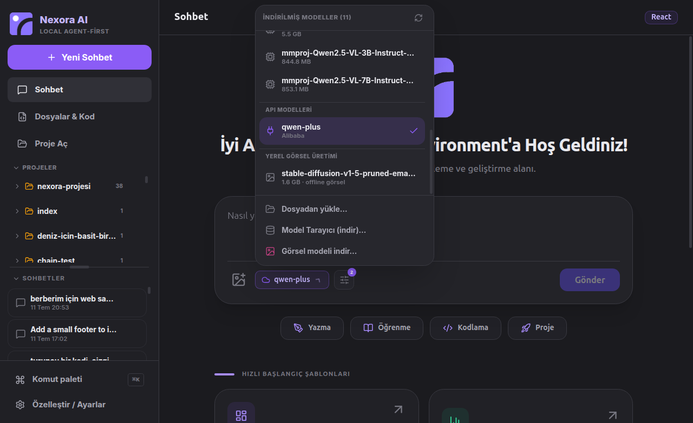

*One picker, three worlds: local GGUF text models, API models, and the offline image engine — switch freely mid-conversation.*

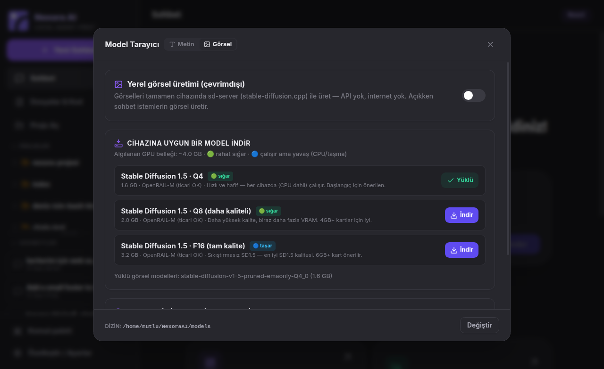

*The Model Browser's Image tab: device-fit catalog (🟢 fits / 🔵 spills) + free HuggingFace search — find any image model like you find GGUFs.*

<table><tr>
<td align="center"><br/><em>"yeşil bir ejderha logosu, minimal"</em></td>
<td align="center"><br/><em>"küçük mavi bir robot, düz vektör ikon"</em></td>
</tr></table>

*Generated **fully offline** on the 4 GB RTX 2050 — Turkish prompts, faithfully translated on-device, rendered by stable-diffusion.cpp.*
</div>

---

## Image Generation & Full File Access — the v0.18 Scorecard

v0.17 unleashed *building* — v0.18 makes the workspace **complete**. You can now **generate images inside the chat**, and give the agent **plain-language file & shell commands** (*"convert this to WebP with Pillow and put it in assets"*) that it runs with **full access to the project on disk**. The whole thing was proven end-to-end in a **single session**: build a skeleton with a local model → continue with a cloud API model → generate a logo with an image model → convert it and wire it into the page — no restarts, no copy-paste, everything persists.

> **v0.18.3 — The Universal Agent & a 10-language interface.** The biggest v0.18 patch: NexoraAI becomes *universal* on two fronts — it **does what you say on your computer**, and it **speaks your language**.
>
> **🖥️ From chat, the agent actually DOES things — it doesn't explain them.** Ask *"is the Vercel CLI installed?"* and it runs `command -v vercel` and tells you the real answer; *"open Chrome at localhost:3000"* and it launches Chrome. Any model (API **or** local, any provider), any wording, **any language** — the capability is driven by the model's understanding of your **intent**, not a keyword list. And it works by **Check → Understand → Do**: it's given your machine's real facts (your actual localized Desktop is `~/Masaüstü`, not `~/Desktop`), and when it isn't sure it runs a quick check first, reads the real result, then acts. No more "here's how *you* could do it" — it just does it and reports back.
>
> **🗣️ It replies in the language you wrote in.** Ask in German, get German; French → French; Turkish → Turkish — the reply language follows *your message*, not the app setting. Live-verified on `qwen-plus` across DE/FR/ES/EN.
>
> **🌍 The whole UI now speaks 10 languages — each in its natural direction.** **Settings → General → Appearance** has a 10-language picker; pick one and the entire interface re-renders in it: 🇹🇷 Türkçe · 🇬🇧 English · 🇪🇸 Español · 🇫🇷 Français · 🇩🇪 Deutsch · 🇵🇹 Português · 🇷🇺 Русский · 🇨🇳 中文 · 🇯🇵 日本語 · 🇸🇦 **العربية**. Arabic renders **right-to-left** — the *entire* layout mirrors. (~256 UI strings were translated by **8 parallel localizer subagents**, one per language, then wired through a source-keyed `tt()` layer.)
>
> | What was true (≤ v0.18.2) | What v0.18.3 brings |
> | --- | --- |
> | Chat *explained* how to check/install/run things | The agent **actually runs it** via the terminal and reports the real result — any model, any provider |
> | It only acted on certain keyword phrasings | **Intent-driven** — understands what you mean in any wording, any language (Turkish `\b`-boundary bug fixed) |
> | It guessed paths (`~/Desktop`) and failed | **Check → Understand → Do** with your machine's real facts (`~/Masaüstü`, locale, OS) injected each turn |
> | Replies were locked to the app's TR/EN setting | Replies **mirror the language of your message** — any language |
> | UI was Turkish/English only | **10-language UI** with a picker, each in its natural direction — **RTL for Arabic** (full layout mirror) |
>
> <div align="center">
> 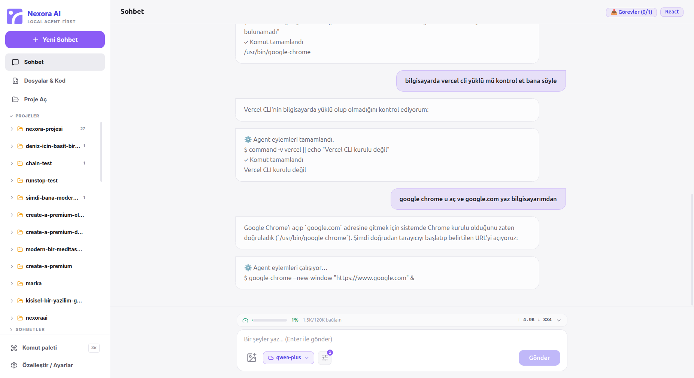
>
> *From chat: "is Vercel installed?" → runs the command → real answer. "open Chrome" → launches it. It does, not describes.*
>
> 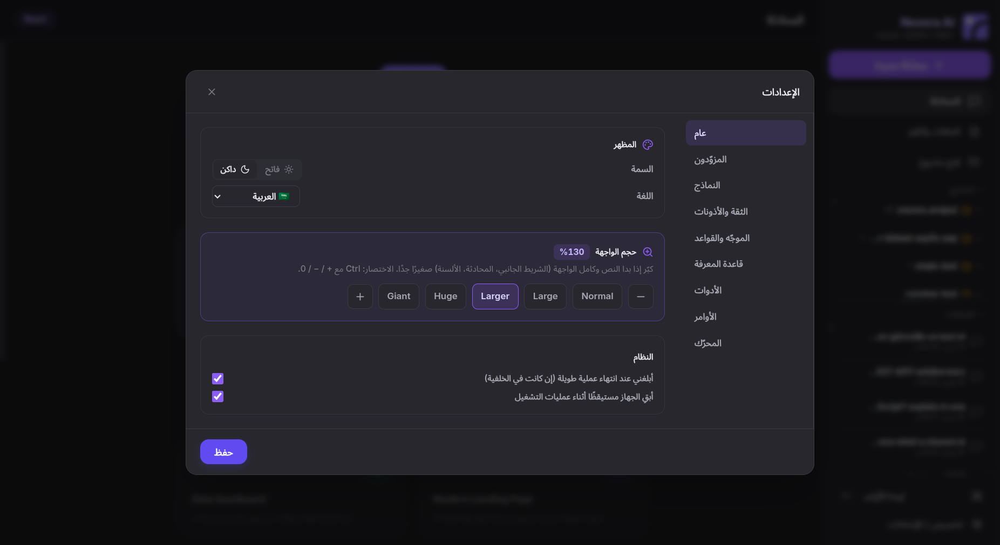
>
> *The 10-language UI — Arabic renders the entire interface right-to-left (`dir=rtl`); the whole Settings layout mirrors.*
>
> 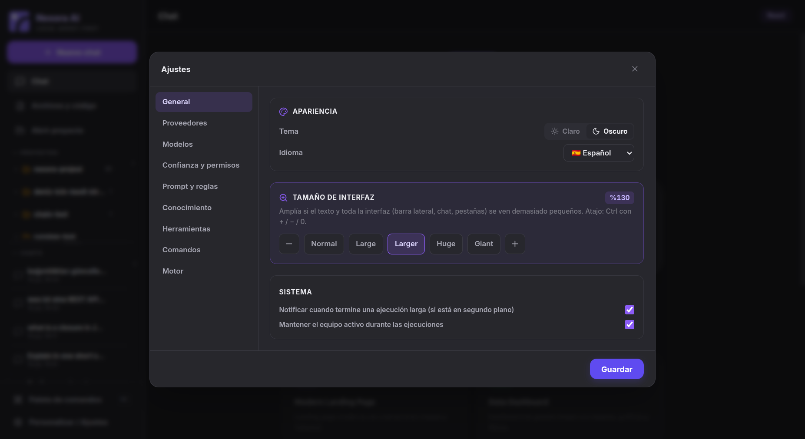
>
> *…and left-to-right for the rest — here in Spanish. One picker in Settings → General → Appearance.*
> </div>

> **v0.18.2 (patch) — Settings UX hardening: appearance moved in, Provider Hub goes master-detail.** Two navigation annoyances, fixed. **(1)** The sidebar had a bulky **"Theme & Language"** box eating vertical space at the bottom — it's gone; theme (Light/Dark) and language (TR/EN) now live in **Settings → General → Appearance**, a clean segmented control at the top of the section. **(2)** The **Provider Hub** listed 157 providers and expanded the selected provider's config as an accordion *at the very bottom of the list* — so configuring OpenRouter or Baseten meant scrolling all the way down. It's now **master-detail**: click a provider and its own focused pane opens **at the top** (with a `‹ All providers` back button) — API key, model id, fetch-models and the model enable/disable list, right there. No scrolling. Both live-verified on the real app.
>
> | Annoyance (≤ v0.18.1) | v0.18.2 |
> | --- | --- |
> | Sidebar "Theme & Language" box wasted vertical space | Removed → **Settings → General → Appearance** (Theme + Language segmented controls) |
> | Picking a provider expanded config **at the bottom** of the 157-item list → scroll to the floor | **Master-detail**: click → focused config pane opens **at the top**, `‹ All providers` to return |
> | List and detail stacked together (long, noisy) | Detail **replaces** the grid/search; active provider stays selected on return |
>
> <div align="center">
> 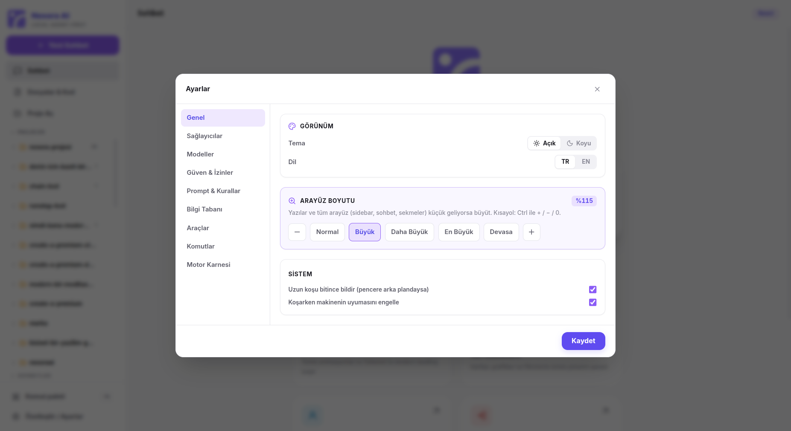
>
> *Theme & Language, moved from the sidebar into Settings → General → Appearance.*
>
> 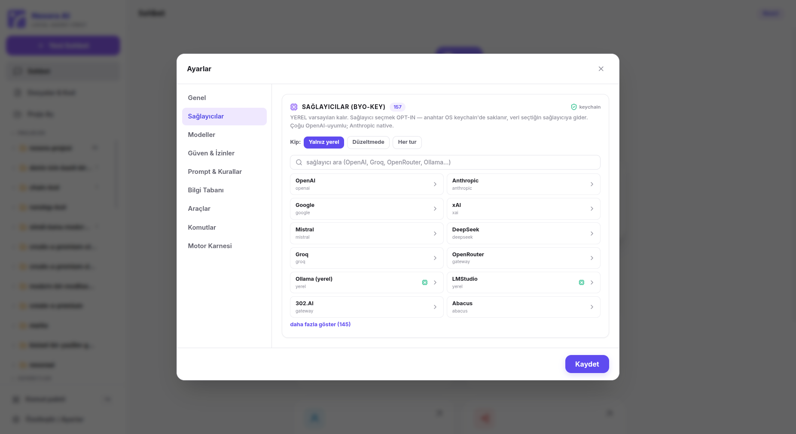
>
> *Provider Hub — the list: a searchable grid of all 157 providers, each with a `›` cue.*
>
> 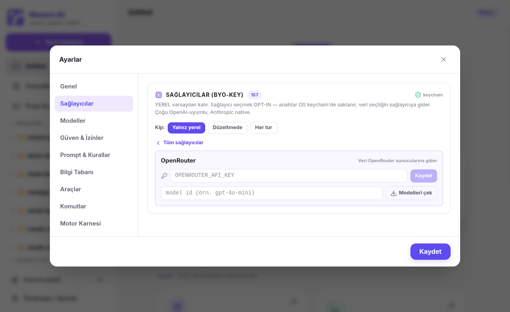
>
> *…click one → its config opens at the top (`‹ All providers` to go back). No scrolling.*
> </div>

> **v0.18.1 (patch) — Settings is now a two-pane workspace, and the local vision model is yours to pick.** Settings had grown into one long scroll with everything piled together. It's now a **two-pane layout** (like Claude/ChatGPT): a **left category nav** — General · Providers · Models · Trust & Permissions · Prompt & Rules · Knowledge · Tools · Commands · Engine — and a **right content pane** that shows only the selected category. Click between them; each opens clean, always starting on **General**. Alongside it, **local vision (VL) model selection was un-hardcoded**: the app no longer assumes Qwen — it **scans every installed VL GGUF** (any main-model + `mmproj` pair — Qwen3-VL, LLaVA, whatever you have) and lets you **pick which one** analyzes reference images from the new **Models** section, picking the largest that fits your RAM by default. *(Both live-verified on the real app; the local-first default is untouched.)*
>
> <div align="center">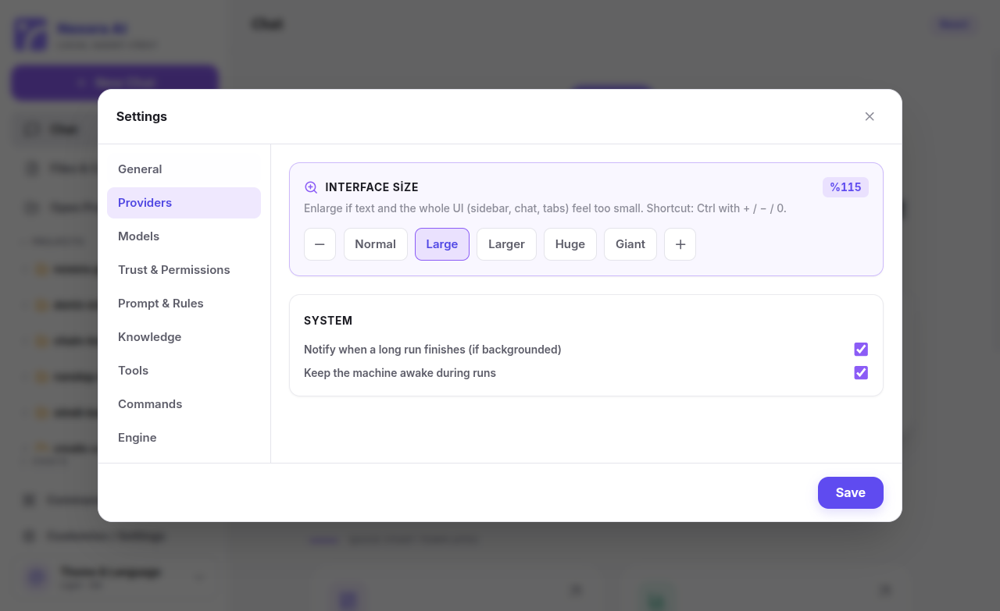</div>

### 🎨 Image generation — any image model, fully in the chat

Selecting an image-generation model used to fail silently: the app treated `qwen-image-2.0` like a text model, sent it to `/chat/completions`, and the turn died. Now the app **detects image models** (by an `image`-token heuristic + known families — so `z-image-turbo`, `qwen-image`, `dall-e`, `flux`, `gpt-image`, `imagen`, `seedream`… all work, whatever the exact name) and routes them to the right endpoint — an **OpenAI-compatible** `/images/generations` path *and* a **native DashScope adapter** for Qwen-Image (which is *not* OpenAI-shaped). The generated image renders **inline in chat**, self-contained, with **fullscreen · download · add-to-assets** on every image:

<div align="center">
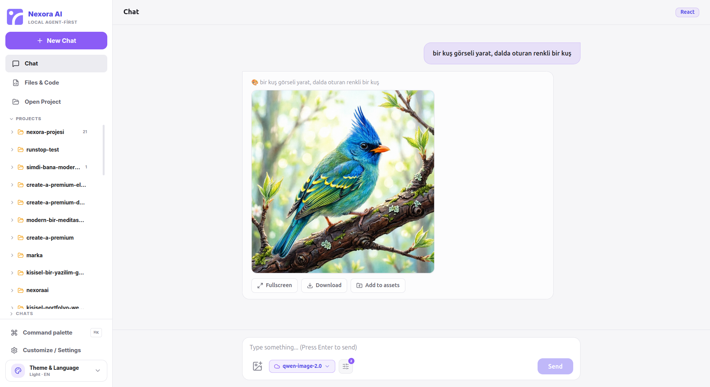

*Prompt → image, right in the chat. Every image has fullscreen, download and one-click "add to project assets."*

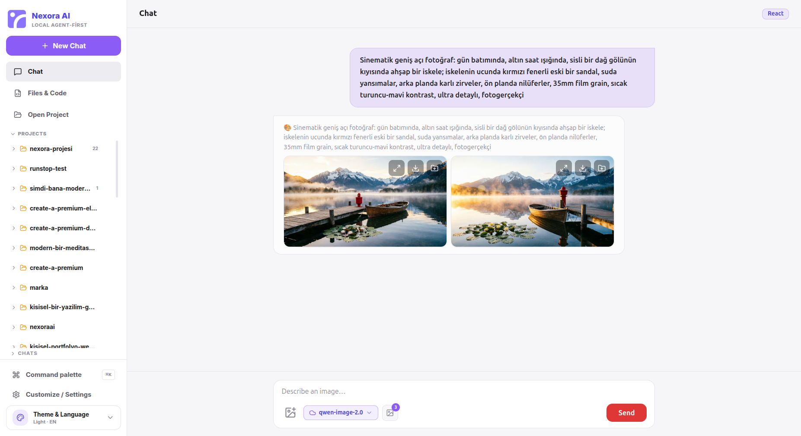

*Aspect ratio, multiple variations, negative prompt, and **exact-prompt fidelity** (long/detailed prompts are generated verbatim — the model isn't allowed to rewrite them). Here: 16:9 · 2 images · from an ultra-detailed cinematic prompt.*
</div>

Full feature set (all live-verified against `qwen-image-2.0` / `z-image-turbo`): **aspect ratio** (1:1 / 16:9 / 9:16 / 4:3 / 3:4), **1–4 variations** in a grid, **negative prompt**, **image-to-image** (attach a reference for edit models), a **"describe an image…" composer hint**, and **add-to-assets** that decodes the image to a **real binary** in `src/assets/` (and the Preview resolves the import to show it). *Nothing local is ever pulled in — the API path stays independent; on a text-only model you get a clear warning to pick a vision/image model.*

### 🖥️ Full file & shell access from chat — agent-first, for real

Being *agent-first* should mean the chat can touch the project like a developer does. It can now: type *"convert `src/assets/logo.png` to WebP with Pillow"*, *"delete the unused file"*, *"rename X to Y"*, *"copy this into assets"* — the model emits a shell command, it runs in the **project folder** through the existing **trust tiers** (Read-only / Auto / Full — `rm -rf /`, `sudo`, pipe-to-shell blocked at *every* tier, in the renderer **and** re-checked in main), and the result is **synced straight back into the editor**: the new `.webp` appears in assets, a deleted file disappears. Works identically on **local and API** models. Live-verified: `qwen-plus` took *"convert the logo to webp and use it in the Navbar"* → emitted the Pillow command → produced a real WebP → imported it into the component, in one ~10-second turn.

### 📜 Free scrolling while it works

While a project is generating or an image is rendering, you can now **scroll up freely to read** — the stream no longer yanks you back to the bottom. It only auto-follows when you're already at the bottom; scroll up and it stays put; scroll back down and it re-sticks.

| What was missing (≤ v0.17) | What v0.18 brings |
| --- | --- |
| Image models silently failed (routed to chat) | Detected + routed to the right image endpoint (OpenAI-compat **and** DashScope native) |
| No way to see a generated image | **Inline preview + fullscreen + download + add-to-assets**, per image |
| One fixed 1024² image, one at a time | **Aspect ratio, 1–4 variations, negative prompt, image-to-image, exact-prompt fidelity** |
| Chat couldn't touch real files | **Plain-language file/shell ops** (convert/delete/rename/copy) via trust-gated `[RUN]`, synced to the editor |
| Generating pinned the scroll to the bottom | **Free scrolling** — read while it works |
| Weak-local builds had no project identity → shared junk folder | Every new build gets a **`package.json` identity** → its own clean workspace dir |

## Ecosystem, Discoverability & the API Unleashed — the v0.17 Scorecard (Phase 10)

Phase 10 set out to close the one gap the engine/security/repair/fidelity work had left open — **ecosystem & discoverability**, the things that turn a tool into a platform. Live-testing the finished layer with a real cloud API model then exposed something deeper: the *entire pipeline was tuned for a weak 3B local model*, and those same crutches were **caging capable models** (a strong API, a 27B GGUF) — forcing sectioned builds, surgical `SEARCH/REPLACE` edits and 2 K-token caps on models that don't need any of it. One live edit request (*"make it mobile responsive"*) literally aborted the API turn.

**v0.17 does both:** it ships the whole ecosystem layer *and* cuts the cord between "capable model" and "3B training wheels." Everything below was live-verified on the real app — the local path on a real 3B, the API path against a real Qwen-Plus endpoint.

> **v0.17.1 (patch) — vision routing follows the same rule.** Attaching a reference image no longer forces the local Qwen-VL model: on an **API** model the image goes **straight to the API as multimodal input** (a vision-capable model like Qwen-VL or GPT-4o reads it natively — the local VL never downloads or runs), live-verified against `qwen-vl-plus` (it read the exact text off a test image in one ~10 s call). And when the local VL *is* used (on a local model), it now downloads a **device-appropriate** size — Qwen2.5-VL-3B / 7B / 32B by free RAM, matching what the Hardware Advisor already recommends — instead of being pinned at 3B. *Nothing local ever touches the API path.*

> **v0.17.2 (patch) — non-vision API models no longer silently hallucinate from an image.** A live case exposed the gap: attaching a screenshot on `deepseek-v4-pro` (a **text-only** model — it is not one of DeepSeek's models and has no vision) made the engine build the *wrong* project from history instead of the picture. A debug trace proved the image *was* sent correctly (`imageDataUrl` present, 4 KB) — the same code made `qwen-vl-max` reproduce the image **byte-for-byte** (dark `#0a0a2a` background + gold text + the on-image wording, 5 files in 30 s). The model simply couldn't see it. Now a conservative capability check (`isVisionCapableModel`) detects when the active API model isn't multimodal and **warns you to switch to a vision model** (Qwen-VL / GPT-4o / Claude / Gemini) instead of producing a confident wrong answer — the image is still sent in case the model supports it, and **nothing local is ever pulled in to compensate**. `test:visioncap` 46/46.

> **v0.17.3 (patch) — image → project is now a two-stage flow, entirely on the API.** Even a real vision model (`qwen-vl-max`) produced a shallow, off-target result — often **one file, cut off** — because it was asked to *understand the screenshot and write the whole app in a single response*. Now it's split: **stage 1 — the API analyzes the image** into a measurable spec (frame, per-region hex colors, typography, every section top-to-bottom with its real text); **stage 2 — the API builds the complete project from that spec** as a frontier multi-file generation. The local VL never runs on the API path — the API does *both* stages. Live-verified against a real reference screenshot: stage 1 nailed the palette (`#FFFFFF` frame, `#000000` navbar, `#FFD700` "Get a Quote" button, `#1A1A1A` "Strategy first." card), then stage 2 shipped **10 files / 6 components** (Navbar, Hero, Features, Stats, Logos, Footer) with framer-motion + the right Google font — faithful colors and text, behavior test passing. `test:frontier` 24/24.

> **v0.17.4 (patch) — "New session" on a project now lands you in Chat.** Clicking **New session** under a project loaded its files but dropped you on the **Files & Code** view — so there was no chat box in sight and it felt like nothing happened. It now opens the project into a fresh session and lands on **Chat**, showing "📂 Loaded … (N files)" with the composer ready — type a prompt and keep building. ("Open Project" still opens on the code view, since that's for inspecting.)

### Ecosystem & discoverability — all local-first, opt-in (10.1 – 10.9)

| Added | What it does |
| --- | --- |
| **MCP client** (10.1) | Connects to local **Model Context Protocol** stdio tool servers; the model calls them with an `[MCP] server tool {json}` directive. Every call is checked by the same trust tier as shell commands. No `mcp.json` → zero processes spawned. |
| **Local serve endpoint** (10.2) | Opt-in OpenAI-compatible **`/v1/chat/completions`** server on `127.0.0.1` — point Continue / Cline / any client at your local GGUF. NexoraAI used to only *consume* an API; now it can *be* one. Off by default. |
| **Command palette** (10.3) | **⌘/Ctrl-K** fuzzy access to every action — new chat, model, run, scan, settings, sessions. |
| **Checkpoints + inline rewind** (10.4) | Every user prompt snapshots code + chat position; rewind code, chat, or both from any turn — makes auto-apply safe. |
| **Native notifications, tray & keep-awake** (10.5) | A long run that finishes while the window is backgrounded pings you; `powerSaveBlocker` keeps the machine awake mid-run; system tray. |
| **Global search** (10.6) | One box over sessions, projects, the knowledge base and code. |
| **Scheduled local tasks** (10.7) | A local cron (with jitter) that drops recurring work onto the task queue — no server. |
| **Slash-command workflows + approved memory** (10.8) | Drop a `.md` file → it becomes a `/command`; `[REMEMBER]` writes to the knowledge base only on approval. |
| **Provider hub — the *complete* catalog** (10.9) | Opt-in BYO-key access to **157 providers** (the full [models.dev](https://models.dev) list — OpenAI, Anthropic, Google, OpenRouter, Groq, DeepSeek, Mistral, xAI, ZenMux … nothing curated out). Keys live in the OS keychain via `safeStorage`. Local stays the default; every provider is labelled *"data goes to this provider."* |

### Experience parity — OpenCode / Codex-grade (10.10 – 10.12)

| Added | What it does |
| --- | --- |
| **Unified model picker + inline switching** (10.10) | Enabled API models appear in the picker next to your local GGUF, grouped by provider. Switch local ↔ API **mid-session, in the same chat** — no new window. |
| **Per-file diff stats** (10.11.1) | Every edited file shows **`+X −Y`** (LCS line diff) inline in the chat card. |
| **Project vs chat sessions** (10.11.2) | Codex-style: dev sessions nest under their project, chat sessions are separate, each project has its own **+ New session**. |
| **Delete with confirmation** (10.11.3) | Session delete now asks *"emin misiniz?"* first. |
| **Persistent project context** (10.12.1) | A `proje-gecmisi.md` dev-log travels with the project so **any** model (local *or* API) stays context-aware across model switches — purpose, architecture, decisions, why-changed. |
| **Token / context meter** (10.12.2) | An expandable bottom strip shows real tokens ↑↓ and context fill (green/amber/red band) per turn, sourced from `include_usage`. |

### The API Unleashed — cutting the 3B cord (10.13 – 10.16)

| Fixed / freed | Before | After |
| --- | --- | --- |
| **Chat memory & depth** (10.13) | The API path was **stateless** — it sent only `[system, user]`, so the model forgot the previous message; the system prompt literally said *"answer briefly"* and temperature was pinned at `0.1`. Chat felt dumb. | Full conversation history is threaded (`[system, …history, user]`, bounded); the persona is depth-matching and context-aware; sampling (temp/tokens) is honoured. Live: turn 2 remembered "evolution" and expanded natural selection with three examples. |
| **Comprehensive builds** (10.14) | A strong model was force-fed the 3B pipeline (deterministic section plan, per-file turns, `SEARCH/REPLACE` grammar, `__SLOT__` tokenization, temp `0.1`, 2 K caps, COMPACT single-file persona — a subagent audit found **~32 constraints**), so it produced 3B-level output. | A **frontier build path**: one streaming turn, an elite multi-file persona, temp `0.6`, 16 K tokens, no grammar/sectioning. Live on Qwen-Plus: *"premium modern SaaS landing page"* → **10 files, 8 components**, real copy, framer-motion, rendered live. Iterations wire new components into `App.tsx` (no orphans). |
| **Surgical-edit machinery** (10.15) | Forced `SEARCH/REPLACE`, an oversized-SEARCH **stream cutter**, a >200-line whole-file-rewrite ban and edit grammar — a pure 3B crutch that helped *no* model (a weak one can't iterate anyway, a strong one iterates fine) and **aborted API turns** mid-edit. | Removed entirely, all models. Edits are **complete-file rewrites**; the debug engine (build + behaviour verification) stays as a safety net. Live: *"mobil responsive yap"* → clean `+12 −11` rewrite, **zero cutter, zero failure**. |
| **Frontier for strong local models** (10.16) | The frontier (full-power) path was API-only; a capable 27B GGUF was still stuck in the sectioned 3B pipeline. | `strongModel = API **or** local GGUF ≥ 9 GB (≈ 13B+)` gets the exact same unleashed build/edit. A 3B keeps the sectioned path (correct for it — a 16 K one-shot would overwhelm it). Per-turn `systemOverride` delivers the frontier persona to the local engine without touching the session. |

### Quality-of-life fixes

| Fixed | What changed |
| --- | --- |
| **Clean dev-server shutdown** | **Stop** now `SIGTERM → SIGKILL`s the process group, frees the port (lsof/fuser/netstat) and waits until it's actually released; **Run** cache-busts the URL. No more "Run shows the *previous* project." Live: Stop frees `:5173`, the next Run re-binds `:5173` (no drift), zero orphaned vite/esbuild. |
| **Adjustable UI size (accessibility)** | A prominent **Interface Size** control (Normal → Giant), `Ctrl +/−/0` shortcuts, and a bigger **1.3× default** — the whole UI (sidebar, chat, tabs, fonts) scales via `setZoomFactor`. |
| **"Open Project" entry** | A discoverable **Open Project** item under New Chat (replacing the easy-to-miss `+` on the Projects header) — open an existing project from disk and keep developing. |

## The advisor sizes by VRAM, not RAM — the v0.16 Scorecard

A user's friend (32 GB RAM, 8 GB VRAM) caught it: the Hardware Advisor recommended **Qwen2.5-Coder-32B (19.9 GB)** as the top pick — sized by *system RAM*, ignoring that on a discrete GPU a model has to fit **VRAM** to run fast. A 19.9 GB model on 8 GB VRAM spills to system RAM and crawls at 3–4 tok/s on the CPU. v0.16 makes the advisor VRAM-aware — the way LM Studio does it.

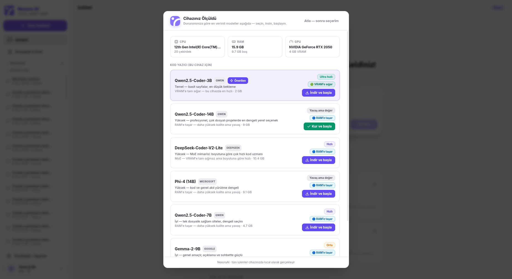

| | Before (≤ v0.15.x) | v0.16 |
| --- | --- | --- |
| **Recommendation basis** | system RAM | discrete GPU → **VRAM**; Apple Silicon / CPU → RAM |
| **Top pick on 8 GB VRAM** | a 32B that crawls on CPU | the largest model that **fully fits VRAM** (fast) |
| **Per-model badge** | speed only | **🟢 fits VRAM** / **🔵 spills to RAM** |
| **Unified memory** | (same RAM logic) | kept — Apple Silicon shares RAM with the GPU |

**Live-verified** on real hardware (RTX 2050, 4 GB VRAM): the recommended pick is now **Qwen2.5-Coder-3B** (🟢 fits VRAM · Ultra fast); the 7B/14B/DeepSeek/Phi-4 are shown as **🔵 spills to RAM** (slower), and MoE models get an honest *"spills but fast for its size"* note. The 32B is still offered on a GPU that can actually hold it. Locked by `test:advisor` (11 checks).

## Watch it work — the VOLTA live test (v0.15.1)

To pressure-test Phase 9 on something we didn't write, a fresh spec was generated by a candidate panel and picked by a judge: **VOLTA**, an electric-mobility (e-bike) brand on a deliberately different palette — graphite `#0F1115` with an electric-lime `#CCFF00` accent (not the portfolio's black + amber). One paste, on the **local 3B (GPU, no API)**, produced the whole page — five sections from the contract's own file list — and then **two chat iterations** finished it. The result below is a real `vite build` of the generated project, rendered headless:

<a id="volta-output"></a>

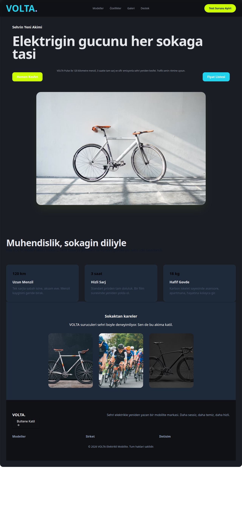

| Stage | What the 3B did | Outcome |
| --- | --- | --- |
| **One prompt → whole page** | contract-driven plan (Navbar · Hero · Ozellikler · Galeri · Footer), each component built in isolation with verbatim slotting | 5 sections, exact Turkish copy + spec numbers (`120 km` / `3 saat` / `18 kg`) + gallery URLs + palette, byte-for-byte; **`vite build` green, Tailwind v4** |
| **The bug this surfaced** | the spec *"Create a premium … website"* did **not** arm Fidelity Mode — `MAKE_RE`'s stem `creat\b` never matches "Create" (`creat`+`e`), so the request read as chat and the 3B dumped a monolith | **fixed**: Fidelity Mode now arms on the **Project Contract** (a high-specificity spec *is* a build), not the fragile phrasing heuristic; `MAKE_RE` stems widened to `\w*`. Locked by `test:section` (+4) |
| **Iteration 1** — *"make the cards dark"* | found `Ozellikler.tsx`, rewrote the whole small file | white feature cards → **dark panels** with borders |
| **Iteration 2** — *"add the hero image"* | found `Hero.tsx`, added the exact Unsplash `src` + `alt` | giant placeholder → **the real product photo** |

**The honest number.** VOLTA is a much harder target than the portfolio — **35** exact literals (28 of them arbitrary-value class strings like `bg-[#0F1115]/90`) vs 10 — and the first build scored **19/35**: every visible *text*, image URL and color landed, but the 3B dropped many exact class strings (its ceiling), and the deterministic className enforcer can only place one element per repeated tag. The two iterations closed the visible gaps. This is exactly the case the **verifier-gated escalation** exists for — reliable byte-perfect on the richest specs is one API key away.

## Any prompt, executed faithfully — the v0.15 Scorecard (Phase 9)

The next test wasn't ours to write. A user pasted a **Gemini-authored** brief — a dark portfolio in **Tailwind v4** with a named `Navbar/Hero/Projeler/Footer` architecture, ~10 **exact** Turkish strings, exact `className` strings on named elements, real Unsplash URLs, a pinned `#000000`/`#F59E0B` palette — and it failed on *every* local model. The honest post-mortem: **~80% self-inflicted.** The scaffold coerced every build into React+Vite+**Tailwind-v3**+one-file, the planner substituted a generic restaurant skeleton for the spec's real files, and the weak model paraphrased the exact literals. Phase 9 inverts the whole stance — straight from how Bolt/WebContainers get "any stack" right: **stop dictating the stack; treat the spec as ground truth.** Every row below was **live-verified on the real 3B** (`qwen2.5-coder-3b`, GPU 32/36, **no API**), over CDP.

| | Why an external spec failed (through v0.14.3) | What Phase 9 built (v0.15) |
| --- | --- | --- |
| **The stack was dictated** | `scaffoldProject` was hard-wired to Tailwind **v3** (`@tailwind` directives, `tailwind.config.js`, postcss) — a v4 spec was structurally impossible | a **Project Contract** (`electron/shared/projectContract.ts`) parses the prompt once into machine-readable ground truth (`tailwindVersion`, `slots`, `fileArchitecture`, `imageUrls`, `colorTokens`, specificity score); the scaffold now **branches v3/v4** — a v4 spec installs `tailwindcss ^4` + `@tailwindcss/vite`, **zero config files** |
| **The plan ignored the spec** | the deterministic planner ran generic section-templates → for a portfolio it hallucinated a restaurant (`Hizmetler`/`İletişim`), discarding the spec's own `Projeler` | in Fidelity Mode the plan comes **straight from `contract.fileArchitecture`** — the spec's real files, in order |
| **The model paraphrased** | a 3B "improves" exact copy and rewrites class strings | **verbatim slotting**: every exact literal becomes an opaque `__SLOT_N__` token, the model emits structure, a deterministic `rehydrate()` swaps the real bytes back on disk |
| **The 3B cloned the previous file** | the engine fed each generated file into the next turn's context → `Hero` came out a copy of `Navbar` | each component turn is now **history-isolated** (`options.isolate`, server + worker engines) and sees **only its own `[Component]` brief slice** |
| **The 3B rewrote the outermost class no matter what** | it kept a logo's class but always invented the root `<nav>`'s class | **deterministic tag-based enforcement** — a spec-given `<nav className="…">` is injected byte-exact after generation; the model's cooperation is no longer required (**9/10 → 10/10**) |
| **"Verified" meant "it compiled"** | grammar guarantees format, never *content* | a no-model **SpecVerifier** (`specVerify.ts`) asserts every literal present verbatim + the installed Tailwind version + every named file → a **fidelity score**; the authoritative verdict fires after enforcement, and `postGenVerify`'s heuristic repair (which reverted v4) is skipped for fidelity builds |
| **No way to climb** | on failure the same local model retried forever | **verifier-gated escalation** — a concrete fidelity fail-list (not a blind retry) routes the generation step to the wired frontier API, while verification stays cheap and local |

**The proof.** The exact Gemini spec, pasted into the real app against the local 3B: **SpecVerifier `10/10` birebir · Tailwind v4 · all named files.** Every one of the 11 exact literals present verbatim, no raw `__SLOT__`, esbuild `0` errors, **`vite build` succeeds with real Tailwind v4 CSS (13.96 kB)**, and the headless render shows the faithful dark portfolio — NexoraAI logo, exact nav links, "NexoraAI Portfolio" title + exact subtitle, grayscale Unsplash hero, amber accent. `test:contract` grew to 29 checks; `test:engine` stays green.

**The honest limit.** This is 100% *in a clean run*; a 3B still has run-to-run variance (one run sent the most complex component into a runaway before the anti-runaway cap + isolation tamed it). Reliable-every-run 100% is exactly what the **verifier-gated escalation** is for — it's built and waiting on an API key. Regression guard: a vague prompt keeps the byte-identical creative v3 scaffold — Fidelity Mode only arms on ≥2 hard signals.

## The 3B finally edits — the v0.14.3 Scorecard

v0.14.1 taught the app to *accept* a whole-file rewrite for small files (the reliable format for a weak model, per Aider's research) — but the instruction the model actually read on every edit still said the opposite. v0.14.3 is the honest fix: make the sign match the ramp. Proven **on a real 3B** — the exact "add an `id`" edit that used to silently do nothing now lands.

| | Why a small model's edits silently failed (through v0.14.2) | What v0.14.3 fixed |
|---|---|---|
| **The contradictory sign** | the update-turn prompt still ordered *"respond ONLY with surgical edit blocks; rewriting an existing file in full is automatically REJECTED"* — the exact opposite of the system prompt and the applier, both of which had accepted whole-file rewrites since v0.14.1. So a 3B kept attempting the byte-exact `SEARCH` it can't produce (empty block, wrong file) and the edit vanished | the update-turn wrapper is now a single shared **`UPDATE_MODE_RULES`** (`electron/shared/prompts.ts`), **size-aware and consistent** with everything else: *small file (≤200 lines) → rewrite the whole file* (the reliable path), *large file → surgical edit blocks*, plus *find the right file first* and *never leave `SEARCH` empty*. The grammar already allowed whole-file via its `newfile` branch — the only thing missing was telling the model. Locked by `test:iterprompt` (8 checks) |
| **"Önce Plan" ate small edits** | with plan-first ON, a tiny request like *"add an id to the hero title so the menu scrolls there"* tripped the build classifier (it contains *"menü"* + *"yap"*) and turned into a **12-file re-plan** — worse, a plan turn never sees file contents, so applying it would have *overwritten the whole project* | plan turns are now gated by **`planEligible(planFirst, isBuildScale, hasProject)`** — plan-first plans only a **new/empty session**; inside an existing project every request goes straight to a safe UPDATE (surgical/whole-file), never a destructive re-plan. Locked by `test:section` (added checks) |
| **The proof** | — | live-verified twice on the **real 3B** (`qwen2.5-coder-3b`, over CDP): *"add id to hero title"* → the model **rewrote the small `Hero.tsx` whole**, put `id="hero-title"` on the right `<h1>` with the className intact, and **left `App.tsx` untouched** — first with plan-first OFF, then again with **plan-first ON** (no re-plan, the edit still landed). `npm run test:engine` grew to **25 suites**, all green |

**The honest close of the 3B thread.** v0.14.1 removed the mechanical failures and (fairly) blamed the rest on 3B reasoning; v0.14.3 found that a chunk of "reasoning failure" was really *our own contradictory prompt* plus plan-first hijacking small edits. With both fixed, a 3B does the simple iteration the user always wanted — *"dediğimi yapmıyor" → "dediğimi yapıyor."*

## A calmer surface — the v0.14.2 Scorecard

The engine was doing serious work behind a **cluttered chrome**: the left rail had stacked a brand header with language + theme toggles, four nav items, a projects list, three always-on power toggles, chat history, a model-browser button, a model card, a benchmark button *and* a profile row — one long column where everything competed for the eye. v0.14.2 keeps the exact same theme and colors but re-organizes the layout to a **minimal, Codex/Antigravity-style shell** where each surface is reached by a transition instead of being pinned open. Nothing about the engine changed — every control kept its existing store action and IPC; the work was pure information architecture.

| | Where it was (v0.14.1) | Where it lives now (v0.14.2) |
|---|---|---|
| **Model selection** | a sidebar "GGUF seç" button + a separate "Model Tarayıcı", plus a model card at the bottom of the rail | a **model picker in the composer** (Antigravity-style): the chip shows the loaded model, and one click lists your **downloaded models** to switch instantly — with "load from file" and "model browser" as escapes, and unload / mini-benchmark folded in |
| **Power toggles** | *Otomatik uygula / Önce Plan / Prompt Güçlendir* always occupying three rows of the rail | a **⚙ popover on the composer** with a badge showing how many are active — reached when you want them, invisible when you don't |
| **Theme & language** | a TR/EN switch and a sun/moon button crammed into the brand header | a single **"Tema & Dil"** entry at the foot of the rail (shows the current *Koyu · TR* at a glance) that opens a small theme + language menu |
| **The left rail** | ~9 stacked sections, model card and toggles included | just the essentials: **New chat · Sohbet / Dosyalar & Kod · Projects (+import) · chat history · Settings · Tema & Dil** |
| **The rail's two lists** | Projects fixed at a cramped `max-h`, chat history took whatever was left | **Projects ↔ Chats are yours to arrange**: a drag handle between them resizes the split (persisted), and each header collapses with a chevron — hide Projects to give history the whole rail, or vice-versa |
| **Composer popovers** | opened straight up and clipped against the top when the model list was long | **portal-rendered, viewport-aware**: the model picker and ⚙ options open toward whichever side has room (down in the empty-state composer, up when docked at the bottom), height-capped and scrollable so a long model list never spills off-screen — the two open *consistently*, escaping the glass surface's transform that had trapped `position: fixed` |
| **Verification** | — | live-verified on the **real Electron app via CDP** (real preload, the user's real projects/chats and 8 downloaded models) *and* a browser-preview harness: model picked → loaded → chat enabled, ⚙ + model picker both open downward without clipping, the rail split dragged and collapsed, theme flipped dark↔light — zero console errors, `typecheck:web` clean |

v0.14.3 (above) returns to the engine — wiring the update-turn prompt to the whole-file policy so a small model finally gets the escape hatch v0.14.1 built for it.

## Iteration that actually lands — the v0.14.1 Scorecard

v0.14 hardened the app against *time*. The first full end-to-end run on real hardware afterwards — plan → scaffold → 8 files → *"add an id to the hero title"* — exposed the next class: **iteration that never touches disk.** A small local model would confidently emit an edit and nothing would change. This wasn't one bug; it was a chain of seven, from the scaffold that killed the dev server before iteration could even start, to the edit format weak models physically can't produce. v0.14.1 fixes the whole chain — and it began with **reading how the field already solved this** ([Aider](https://aider.chat)'s edit-format research on weak models), not guessing.

| | Why iteration silently failed (v0.14) | What we fixed (v0.14.1) |
|---|---|---|
| **Dead dev server before you start** | the model wrote a `package.json` inventing a package that doesn't exist (`@tailwindcss/aspect-ratio@^0.4.3`) → `npm install` died with ETARGET → Run never booted, so *nothing* could be iterated | scaffold now **rebuilds `dependencies` from what the code actually imports**, pinned to a known-good version table — model-invented packages are pruned, `tailwind.config` plugins stripped to `[]`. The generated project installs on the first try, every time |
| **The re-plan spiral** | a hidden reality-retry turn got misread as a fresh "build" under *Önce Plan* → instead of doing the one-line edit, the engine re-planned all 12 files | plan detection now **excludes hidden/retry turns** (`!hideUser`) — an internal retry does the surgical edit it was spawned for, never re-plans the world |
| **Editing blind** | context was dieted to ~8 K chars / 6 files even on a 16 K–32 K model — the file it was told to edit wasn't even in the window, so it "edited" from memory | context budget now **scales with the model's real context size** (files ≈ ctx/1200, chars ≈ ctx·1.5) — a 16 K model sees ~13 files, a 32 K model sees the whole small project, so the edit target is actually on screen |
| **A corrupt file with no undo** | a whole-file apply once dropped `export default function App` and left a broken build with no way back | a **pre-turn snapshot + violation rollback**: if a turn trips a guard mid-apply, the file reverts byte-for-byte to how it started the turn — a bad edit can no longer leave you worse than before |
| **The edit format weak models can't produce** | `SEARCH/REPLACE` requires the model to reproduce a file region *byte-exact*; a 3B paraphrases one token and the block matches nothing ("0 blok eşleşti") | two answers, straight from the research: for small files (≤200 lines) a **whole-file rewrite is now accepted and preferred** (no byte-exact burden), and `SEARCH/REPLACE` gained a **fuzzy tier** — a ≥2-line block that paraphrases is matched to its best dice-similarity window (≥0.82, with a safety margin so it never writes to the wrong place) |
| **Aiming at the wrong file** | asked to edit the hero title, a small model would edit `App.tsx` (the file it happened to remember) instead of `Hero.tsx` where the title lives | the iteration prompt was rewritten: **whole-file rewrite is the default format**, with an explicit *"find the right file first"* rule and a no-empty-`SEARCH` escape hatch |
| **Holding it to account** | 22 suites | **24 suites** (`npm run test:engine`) — added `test:scaffold` (13: dep-pruning + plugin-strip) and `test:context` (7: budget scales with ctx); `test:anchor` grew the fuzzy-tier + safety cases |

**The honest finding.** The mechanism is now correct — *proven*, not asserted: given the identical project and prompt, a **7B model performs the exact cross-file edit** (finds `Hero.tsx`, adds the `id`, one point fixed) where the **3B emits an empty `SEARCH` and aims at the wrong file**. So v0.14.1 makes iteration land reliably *when the model can reason about which file and region to touch* — the fuzzy matcher, whole-file default, scaled context and rollback remove every mechanical failure mode between a correct intent and disk. What it can't do is manufacture reasoning a 3B doesn't have. The honest path to rock-solid 3B iteration is **big-small collaboration** (a 7B editor pairing the 3B generator), and that's the next milestone — not a workaround pretending the 3B is something it isn't.

## Real-Time Hardening — the v0.14 Scorecard

Phase 7 was all-green in the browser harness — then the very first end-to-end run on the **real app with a real model** (the Zeytin Kafe live test) exposed a whole class the harness cannot see by design: **real-duration races and a busy inference server**. The packaging was never the suspect — the identical code stalls under a real clock and flows under a mock one. v0.14 makes the agent layer honest under real time, and makes the test surface able to *see* time. Every item was live-verified — in a timing-realistic browser preview, and the crown claim against a **real llama-server with a real 3B model**:

| | What broke in production (v0.13) | What we hardened (v0.14) |
|---|---|---|
| **The 36-minute zombie** | a penalty turn hung at 0 bytes for 36 minutes — abort never reached llama-server, and Durdur made it worse (a reality-retry opened a fresh hidden turn); restart was the only exit | a **stream-liveness sentinel on both sides** (renderer + main: N seconds of zero bytes = turn declared dead, engine unlocked), an **absolute Durdur** (a monotonic stop-epoch invalidates the post-abort done *and every* hidden-turn spawner — reality-retry, queue, postGenVerify, runtime-repair — in one press), and **real server cancellation** (`reader.cancel()` tears down the socket so llama-server stops decoding; the uncancellable pre-turn compaction gets a signal + hard cap). *Proven live: a real 3B generation cancelled mid-stream frees the slot in <1s — the next request's first token in 858 ms.* |
| **The frozen queue** | delegated tasks sat at "sırada" forever — the single-shot "sending-falling +1.2s" trigger raced the minutes-long verify/repair chain and never re-knocked | a **persistent heartbeat**: while anything is queued, the processor re-knocks until the engine is genuinely idle, and each card says **why it waits** ("motor meşgul: onarım turu koşuyor" / "önceki görev koşuyor" / "⏸ duraklatıldı") instead of a frozen chip |
| **The silent behavior walk** | the one-shot 12s post-Run walk landed on a running auto-repair turn and *silently never ran* | **schedule-until-done**: it waits through the busy engine (logging each wait), runs exactly once when free, and at the attempt cap reports honestly — never silent |
| **"verified" that wasn't** | a task that compiled but never added the requested line was stamped "verified" | **goal-met verdicts**: a deterministic check that the brief's literal tokens (quoted text, emails, urls, hex) actually landed downgrades to "⚠ incele: istek karşılanmadı" — "verified" now means *done*, not just *compiles* |
| **Default-folder pileup** | every package.json-less build pooled its knowledge/rules/history under one shared `nexora-projesi` folder, silently | planned builds **write a real package.json** (name derived from the brief) before the first file, and the identity fallback **warns loudly** instead of commingling |
| **Ledger smalls** | plans dropped a requested Gallery; walkthroughs stopped versioning after queue work; inbox timestamps went stale | gallery derives from the words users actually use (galeri/portfolyo/projeler/görsel); queue turns re-arm the walkthrough (delegation = apply); inbox shows live relative time ("sırada 2dk") |
| **A harness blind to time** | instant mock turns; abort was a no-op; every race-class bug was invisible in CI | a **timing-realistic browser mode** (`fast`/`slow`/`stall`/`busy-abort` scenarios, controllable verify hooks) so race bugs die in preview, plus a **real-engine `test:e2e`** driving a real fake-server over real sockets (stall→liveness+teardown, abort-against-busy-server, first-token-vs-idle budgets) |
| **Holding it to account** | 19 suites / 190+ checks | **22 suites** (`npm run test:engine`) — added real-socket `test:e2e` (15), goal-check (13) and section-plan (8); plus a gated real-model `test:e2e-real` that spawns a real llama-server and proves the cancellation |

## The Agent Layer — the v0.13 Scorecard

Phase 7 started from a comprehensive study of what actually makes OpenAI Codex and Google Antigravity *feel* the way they do — and from their documented failures (Antigravity's launch-week prompt-injection exfiltration and the Turbo-mode drive deletion are standing counterexamples in this codebase, one of them literally a permanent test fixture). Phases 5–6 had closed the *engine* gap; v0.13 closes the *experience* gap — the **delegate → observe → review evidence → steer** loop. Every item below was live-verified before its tick:

| | What was missing (v0.12) | What we built (v0.13) |
|---|---|---|
| **Watching a build** | a static "plan onaylandı" list, then chat scroll | a **live task card** pinned to the top of chat: every file pending → running → ✓/✗, honest "2. denemede" notes, Durdur closes it as "⏹ durduruldu" with never-started steps still honestly pending |
| **Evidence** | scattered chat bubbles | **Artifacts** on disk per session: the implementation plan, the task list (`.resolved.N` history) and a **living walkthrough** — build verdict, behavior-test defect rows, the screenshot strip and repro-seal verdicts all embedded in one readable document ("verify with artifacts, not logs") |
| **Reviewing changes** | a single-file diff modal at accept time | a **git-truth review pane**: scope chips (this turn / since last commit / since green / **this task's base**), collapsible multi-file diffs that include your manual edits, and revert per file *and per hunk* — revert one hunk, the others live |
| **Steering** | a new vague brief, or killing the turn | **comment-to-steer**: hover 💬 on a diff line, a doc section or a walkthrough screenshot; comments queue without touching the running turn and land in the next one as surgical instructions anchored to the file's REAL bytes (`← COMMENT TARGET`) |
| **Trust** | one permission modal + a regex denylist | **two layers**: a shared sandbox verdict (deny / ask / auto — root-path destruction structurally rejected, command chains judged per segment, the main process re-checks everything) under consent presets **Salt Okunur / Otomatik / Tam Erişim** — `rm -rf /` dies even when *you* type it, even in Full Access |
| **The agent's world** | a ~20 KB post-hoc output dump | a **visible terminal**: every `[RUN]`/`[DEV]` and every command you type is a live-streaming card (ajan / sen / dev) with exit code and duration — writing it caught a years-old bug where timed-out commands left orphan processes alive |
| **Delegation** | one synchronous chat turn at a time | a **task queue + inbox**: type while a turn runs and it queues instead of interrupting (Codex tab-to-queue), the single local model works tasks one at a time — honestly, no fake parallelism — and finished work lands as verified / ⚠ needs-review cards with one-click Review (against that task's own git base) and Walkthrough |
| **Memory** | per-error-class priors only; everything else died with the session | a **project knowledge base**: repair patterns, repro-verified fixes and your review comments become visible markdown items — learned deterministically from evidence (never model-distilled), retired by a single counter-example, summarized into every turn's context — plus hierarchical rules (global `~/NexoraAI/KURALLAR.md` → project wins conflicts) |
| **Holding it to account** | 11 suites / 75+ checks | **19 suites / 190+ checks** (`npm run test:engine`) — three of the new suites caught real bugs on their first run |

## The Engine, 10× — the v0.12 Scorecard

Phase 6 began with a brutal audit of the engine's own field telemetry and ended with every audited weakness dead. The honest before/after:

| | What was missing (v0.11) | What we built (v0.12) |
|---|---|---|
| **Measuring a crash** | file-patching string probes — 3/11 field hit rate, racing HMR, mutating user files to measure | a **real CDP debugger**: pause-on-exception, actual call frames and locals at the moment of death — `🔎 Hero.tsx:5 — List() · data = undefined`, zero file mutation |
| **Finding faulty code** | a regex scanner — every false-positive class cost a manual fix (`function List({ data })` was flagged as an undefined variable) | an **embedded TypeScript language service** over the in-memory project — compiler-grade diagnostics, offline, no node_modules: `TS2551: … Did you mean 'fiyat'?` at the exact line |
| **Line numbers** | vite-transformed lines, "±a few lines" honesty note | dependency-free **VLQ source-map decoding** — the exact source line, self-validated against esbuild's real maps |
| **Edits landing** | a 14B fabricated SEARCH blocks 3× in one night; "eşleşmedi" taught the model nothing | the **anchor ladder**: line-prefix stripping, a `key: 'value'` similarity anchor that refuses ties (no wrong repairs), and **reality feedback** — one auto-retry showing the file's REAL bytes; fabrication died the same day |
| **Interrupted turns** | an abort left a 254-nested-div spiral in the store | **turn transactions** — atomic rollback of modified files on abort (`↩️ geri alındı`); files newly created in the turn are deliberately kept |
| **"Verified"** | meant "compiled + not blank" | means **"works"**: the engine clicks every nav link, presses buttons, fills and submits the form, measures every image, watches the console, and hands back a per-section screenshot strip |
| **"Fixed"** | a claim — the error simply stopped being mentioned | **evidence**: the repro seal reloads the page and settles it — `✅ onarım kanıtla doğrulandı` or the honest `⚠️ HÂLÂ üretiliyor`; a stale signal that won't reproduce costs zero turns |
| **Telemetry** | a diary nobody read (57% of live errors missed rung 0) | **judgment**: per-class priors route the ladder (a 0✓/18✗ class skips rung 0 today), a single counter-example flips a prior back off, and Settings shows the real scorecard — 118 field events and counting |
| **Watching the engine** | tea leaves in chat | the **Motor tab**: a live timeline of every decision — Yakala → Tanıla → Ölç → Onar → Doğrula, each card with its layer, timestamp and detail |
| **Holding it to account** | 6 test suites / 51 checks | **11 suites / 75+ checks** (`npm run test:engine`), including whole-broken-project fixtures scored on find-rate, fix-rate and time-to-green |

| Fault localization + a value measured at the crash moment | The Motor tab — the engine, thinking in public |
|---|---|
| 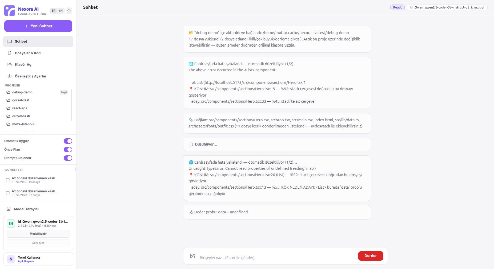 | 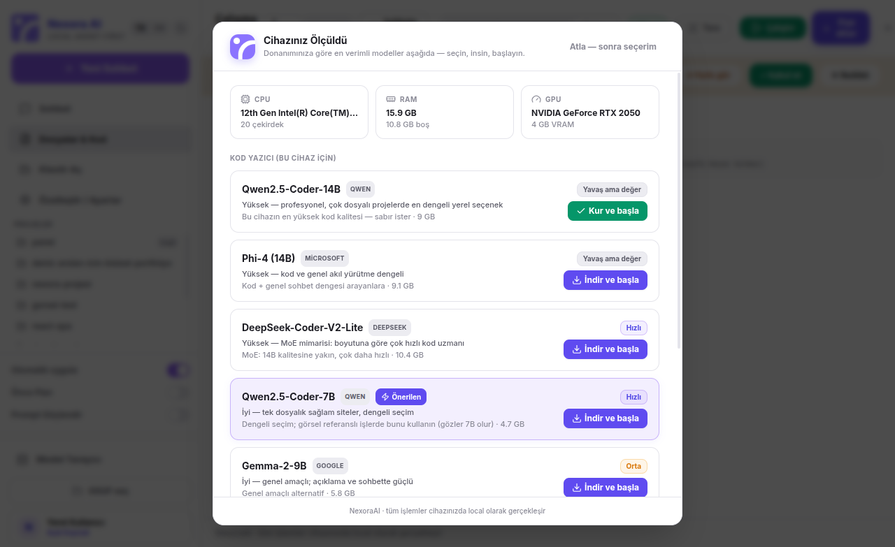 |

## Latest Build — a 14B Portfolio, Debugged by the Engine (v0.11)

The v0.11 closing test: **Qwen2.5-Coder-14B** (Q4_K_M, 9 GB, partial GPU offload on a 4 GB RTX 2050, 32k context) received one detailed Turkish brief — exact hex palette (`#0B0F14` page / `#C8F31D` electric-lime accent), named fonts (Space Grotesk + Inter via the `[FONT]` pipeline), eight ordered sections, and six **real Unsplash photo URLs** pinned in the brief so the model couldn't hallucinate images. The deterministic planner derived the section skeleton in seconds; the 14B filled it file by file — **9/9 files** — then the run continued the way this project believes it should: *the model made real mistakes and the app caught every one of them.* A surgical edit from the model's own iteration broke a file's closing syntax → the post-generation check caught it, two silent fix rounds weren't enough, and the ladder **escalated to full file regeneration, which verified green — zero human input**. Turkish negation typos in the copy ("geliştir**mi**yoruz") were then corrected through normal chat iterations. The owner's verdict after watching it live: *"the engine works — this project has proven itself."*

| The built portfolio (live at localhost) | Inside NexoraAI — 14B loaded, workspace after the build |
|---|---|
| 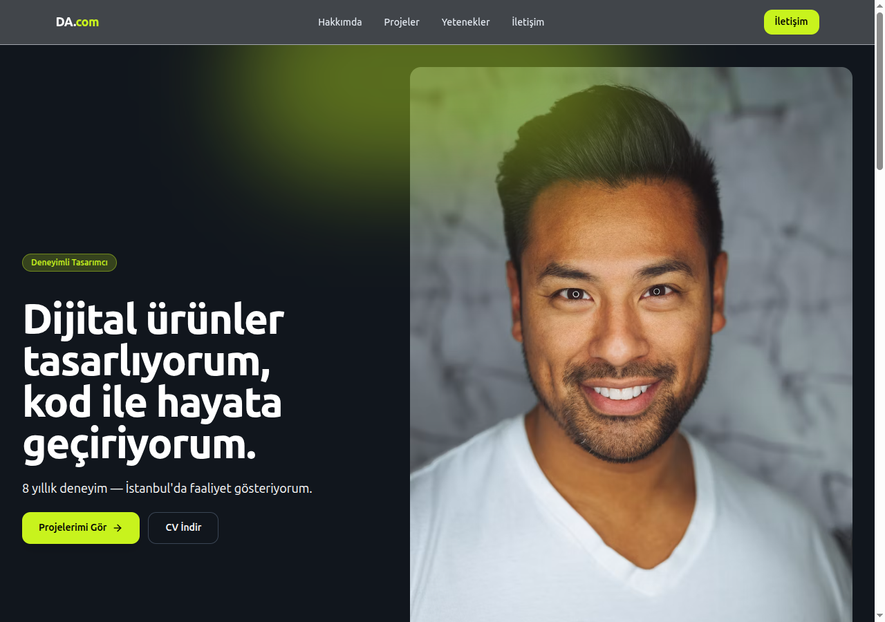 | 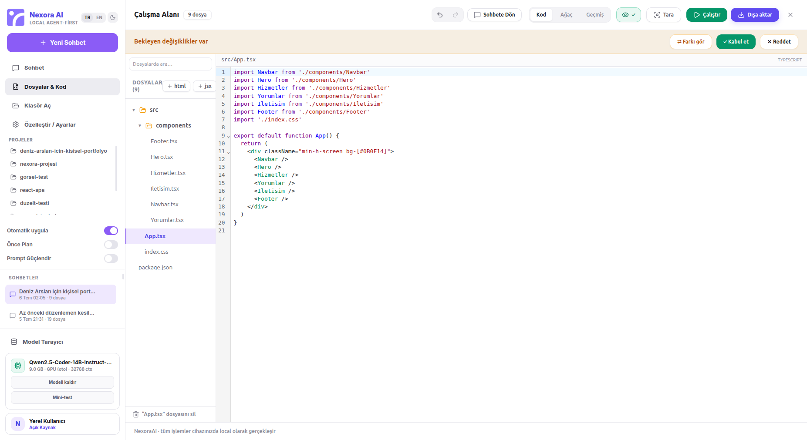 |

## One Night, One League — the v0.10 Live-Test Marathon

On 2026-07-04/05 the entire pipeline was rebuilt and then battle-tested **live, end to end, with zero human coaching**: a real Qwen2.5-Coder-**3B** received a casual Turkish request ("build a dark-themed promo site for the *Atlas Barber* barbershop…"), planned it, built it file by file, caught its own errors and repaired them. The full phased log lives in [ROADMAP.md](ROADMAP.md); the marathon surfaced **11 real bugs** (every one fixed the same night) and ended with an architecture shift. This is the honest scoreboard:

| | What was missing (v0.9.15) | What we built (v0.10) |
|---|---|---|
| **Inference engine** | node-llama-cpp session in a bundled Node worker | llama.cpp's official **`llama-server`** sidecar (prompt cache, parallel slots); the worker survives as an automatic fallback |
| **Iteration cost** | a 7.7k-token project prefix re-prefilled **every turn** (~23.5 s on CPU) | prompt cache + `--cache-reuse`: the same prefix re-processes in **0.14 s (~170×)** |
| **Context window** | 16k ceiling, 8k typical | **32k** in the same RAM (flash attention + Q8_0 KV cache) |
| **Small-VRAM GPUs** | all-or-nothing → 4 GB RTX 2050 fell back to CPU | partial offload with a step-down ladder: 7B at **+71%** (4.2 → 7.2 tok/s), 3B fully offloaded |
| **Edit format** | prompt rules + a streaming watchdog + retries | **GBNF grammar at the sampler** — a 13-line SEARCH block is *unsamplable*; edit targets enumerated from real project paths |
| **The plan** | model-generated (invented a "Technology" page for a barbershop) | **derived by code** from the request keywords — instant, canonical sections, cannot hallucinate |
| **Composition (App.tsx)** | model-written (monoliths, missing function headers) | **written by code** — imports + ordered render, error class extinct |
| **Section quality** | whatever the model improvised | **11 hand-crafted skeletons** with `{{MARKER}}` fill-ins — the model only supplies content, at 0.55 temp |
| **Multi-file builds** | single-file compact strategy only (small models) | plan → **file-by-file**, each turn grammar-locked to exactly one file; 12-file site in **3 minutes** on GPU |
| **Broken output reaching you** | discovered at Run, if ever | every generation instantly syntax-checked (Babel) + full build check when installed; silent auto-fix rounds; escalation **regenerates** a file that resists surgical fixes |
| **Runtime errors (white page)** | invisible to the app — a human had to notice | **zero-touch auto-heal**: a hook in the served page reports browser errors to the app, which starts a hidden fix turn by itself (verified: synthetic error → capture → automatic fix turn in 4 s) |
| **Context compaction** | history silently dropped at 75% | a model-written summary survives the reset; pre-flight estimate prevents mid-turn overflows |
| **Sampling** | one temperature for everything | per-phase presets: plan 0.7 · content-fill 0.55 · code 0.2 · fix 0.1 |
| **Hardening along the way** | — | profile locked during iterations (a build-error word once flipped the session to React Native), unconditional `package.json` sanitize, stray-directive stripper, missing React-hook import injector, spiral-proof plan grammar, grounded brief enhancement |

**The result, built by a 3B with no human help** — planned in 10 seconds, generated in 3 minutes, one compile error self-healed, one runtime error class closed forever the same night:

| Atlas Barber — hero | Full page |
|---|---|
| 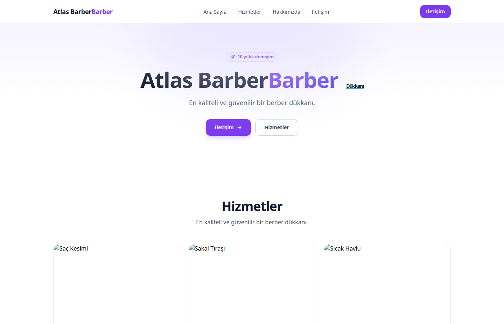 | 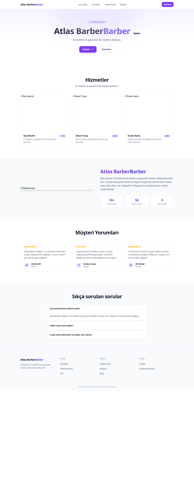 |

| Grammar-enforced plan | File-by-file build | Resulting workspace |
|---|---|---|
| 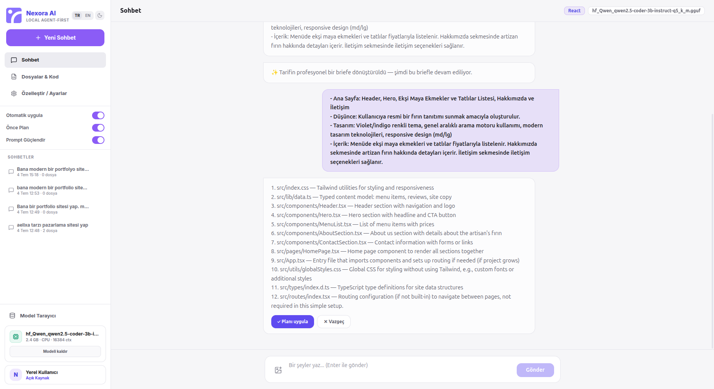 | 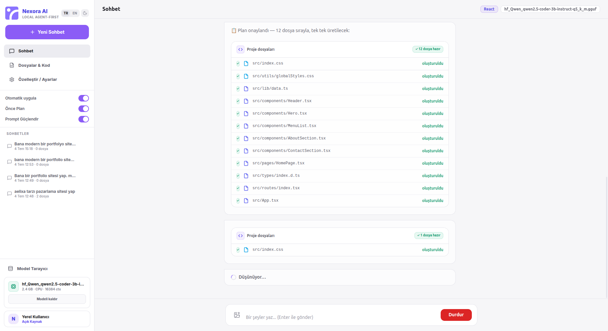 | 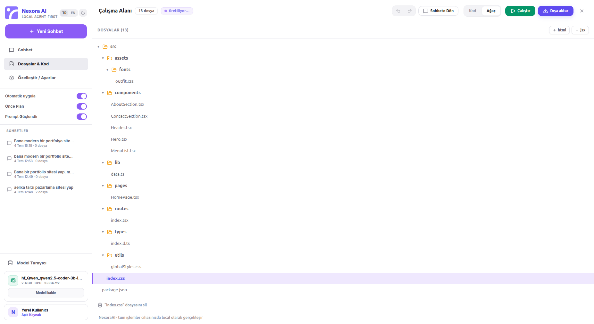 |

## The first builds — a 14B restaurant & a 7B portfolio

The earliest projects this app was ever tested on — newest first — each generated locally and refined through the app's own iteration loop. *(The current flagship build, **VOLTA**, leads the [v0.15.1 scorecard](#watch-it-work--the-volta-live-test-v0151) at the top.)*

A complete restaurant site (17-file professional structure: section components, `ui/` primitives, a typed data layer, 9 priced menu items, 6 starred customer reviews) generated by a **real Qwen2.5-Coder-14B** from a detailed client-style brief, then refined through the app's own surgical-edit iteration loop:


And the very first one — the same app on lighter hardware, a portfolio generated by a **7B** model with the compact single-file strategy:


Same application, three model classes (3B · 7B · 14B) — the prompt strategy adapts to the model automatically.

## Feature Overview

- 🧠 **Local GGUF inference** — load any `.gguf` model (Qwen, Gemma, Llama…); CPU by default, GPU offload optional with automatic CPU fallback.
- 🛰️ **Crash-proof inference worker** — the model runs in a separate Node.js process; if inference dies, the app survives and tells you why.
- 📊 **Live progress in chat** — Bolt-style per-file progress cards (✓ created / ⟳ generating / ✎ updated) so you never have to leave the conversation.
- 🔪 **Surgical iteration** — changes are applied as `SEARCH/REPLACE` edit blocks: asking for a tweak edits *only* that section, in seconds, without risking the rest of the file.
- 🤖 **Real agent actions** — the model can (only when your request calls for it): add npm packages, download Google Fonts (woff2, wired into CSS), fetch any file from the internet into the project, run shell commands inside the project folder, and start the dev server.
- ▶️ **One-click Run** — syncs the workspace to disk, `npm install`s, boots Vite, and opens your browser at localhost. What you see is the real project, not a simulation.
- 👁️ **Reference images & chat with images** — attach a screenshot or design mock; a small local vision model (Qwen2.5-VL, auto-downloaded on first use) extracts the design system (colors, typography, sections, component styles) and feeds it to your coding model — *"make me a site like this"* actually works. Attach an image with a question and the vision model answers directly in chat. Runs through llama.cpp's official multimodal server, fully local.
- 🩺 **Say "düzelt" and it fixes itself** — after Run, the app compiles the project in the background; any build error is captured with its code frame, enriched with a *suspicious-line scan* (e.g. unclosed-quote detection), and posted to the chat. You type just **"düzelt"** — or **"fix"**, **"repair"**, "arregla", "répare", "behebe", "napraw", "исправь"… any common fix-word in ~10 languages — the full diagnosis is attached to the model automatically, the resulting edit is applied, the build is re-verified, and the app auto-retries up to two more rounds if needed. No technical bug reports required from the user.
- 📦 **Professional export** — one click produces `<your-folder>/<project-name>/` with every missing standard file scaffolded (package.json with auto-detected dependencies, `index.html`, `src/main.tsx`, `vite.config.ts`, `tsconfig.json`, Tailwind/PostCSS configs, `.gitignore`, `README.md`) so `npm install && npm run dev` just works.
- 🎚️ **Model-size-adaptive prompting** — reads the model's true parameter count from GGUF metadata: <13B gets a compact single-file strategy it can actually execute; ≥13B gets the full professional multi-file architecture prompt.
- 🈲 **CJK drift protection** — Qwen-family models love sliding into Chinese mid-generation; NexoraAI bans ~30k CJK tokens from sampling — via TokenBias on the worker engine, or a cached per-request logit bias on the llama-server engine (automatically lifted if *you* write in a CJK language).
- 🔎 **HuggingFace model browser** — search, download (with progress), and load GGUF models without leaving the app.

### The assistant around the model *(new — v0.9 series)*

- 🩻 **Hardware Advisor** — at launch the app measures your CPU, RAM and GPU and shows which models will run *ultra fast / fast / slow* on **your** machine, across six model families (Qwen, DeepSeek, Mistral, Microsoft, Google, Meta — every download link verified). One click downloads, loads and drops you into chat. MoE models are graded by their *active* parameters, so DeepSeek-V2-Lite is honestly labeled "fast" despite its 10 GB size.
- 🗺️ **Plan-first mode** — flip *"Önce Plan"* and the model writes a short numbered plan (in your language) before touching code; you approve with one click, then generation starts. Cheap to produce, dramatically better structure from small models.
- ✨ **Prompt enhancement** — flip *"Prompt Güçlendir"* and casual descriptions (*"kafem için basit bir site olsun işte, menü falan"*) are first rewritten by the model into a professional design brief — sections, palette, typography — then that brief flows into planning and generation. Built for non-technical users; on by default.
- 🧭 **Smart context** — iterations no longer send the whole project into the model's tiny window: a deterministic selector ranks files by `@mentions` > filename-in-request > keyword hits > recency, sends only what fits a token budget (files are never truncated — the model needs a whole file to rewrite it correctly) and tells the model which other files *exist* so it never recreates them. Type `@` in the input for filename autocomplete.
- 🔍 **Diff approval** — before accepting a generation you can open a line-level diff of every pending change: red strikethrough for removed lines, green for added, unchanged runs folded. You finally *see* what you're accepting.
- ✂️ **No-rewrite iteration, enforced** — a streaming watchdog watches the model as it types: if it starts copying a whole section into a `SEARCH` block (i.e. rewriting instead of editing), generation is cut mid-stream, the model gets one corrective retry, and a second violation hard-stops the turn. Full-file rewrites of existing files are *never* applied. After every iteration a chat report says exactly which file got how many point-fixes.
- 💾 **Persistent sessions** — every chat (messages + project files) is auto-saved to `~/NexoraAI/Sessions/` and listed in the sidebar; close the app, come back tomorrow, click, continue. "New Chat" opens a genuinely clean page.
- ⏪ **Undo / Redo timeline** — step back and forth through the last 20 generation states of your workspace, far beyond the single accept/reject.
- 🔐 **Permission system** — before the model's `[RUN]` shell commands or `[FETCH]` downloads execute, a prompt lists exactly what wants to run; allow once, always for this project, or deny (safe actions still proceed).
- 📐 **Project rules** — write persistent preferences once (*"always dark theme, Turkish comments, primary #7c3aed"*) into a per-project `KURALLAR.md` (editable in-app or with any editor); they're attached to every request automatically.
- ⚡ **Custom quick commands** — save your frequent prompts as labeled buttons that appear next to the built-in template pills.
- 🎨 **Deterministic post-processing** — every generated/edited file is formatted with Prettier after generation (broken files are left untouched rather than corrupted), and references to *non-existent* local images (`/assets/hero.jpg`…) are automatically rewritten to seeded placeholder URLs — [FETCH]-downloaded and real files are respected.
- 🧹 **Context compaction** — when the model's context window passes 75 %, the session is silently refreshed with a summary note instead of degrading into overflow garbage.
- 🌗 **Dark & light themes** — a soft, VS Code-grade dark (not pitch black) and a clean light theme, switchable with one click, applied before first paint (no flash), with the entire palette running through CSS variables. Turkish / English UI, custom system prompt, and the user's own logo throughout — icons, splash screen and launcher included, all assets local (embedded Inter font, no CDN).

## Screenshots

Every screen ships in both themes — a soft, VS Code-grade dark and a clean light — switchable from the **Theme & Language** menu in one click. *(v0.17 UI, captured live on Ubuntu.)*

**Chat & composer** — the model picker, ⚙ turn options and quick-start templates all live in the composer; the left rail stays minimal — **New Chat · Chat / Files & Code / Open Project · Projects · Chats · Theme & Language** (the new **Open Project** entry opens an existing project straight into development)

| Dark | Light |
|---|---|
| 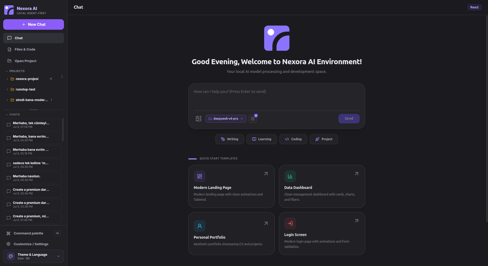 | 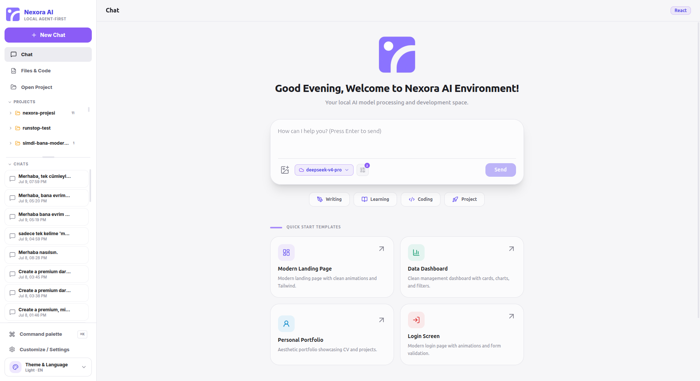 |

**Code workspace** — file tree, CodeMirror editor, and the Kod / Ağaç / Geçmiş / Motor / Belgeler / Terminal tabs, with Çalıştır / Dışa aktar

| Dark | Light |
|---|---|
| 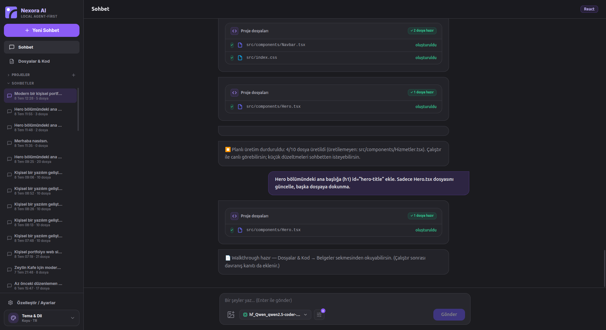 | 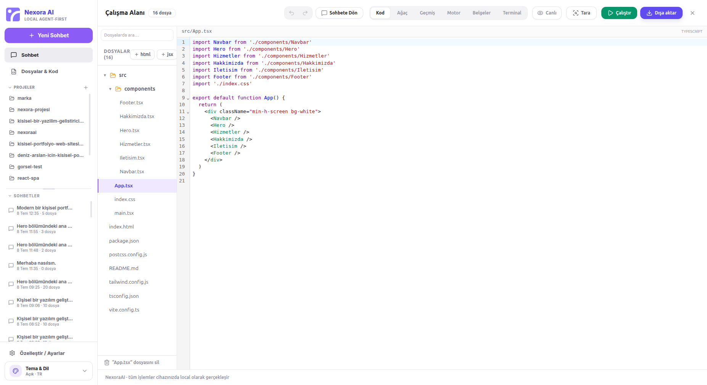 |

**Model picker in the composer** — one click lists your downloaded GGUF models *and* your enabled API models (grouped by provider); switch local ↔ API instantly, mid-session, in the same chat — or load from file / the HuggingFace model browser

| Dark | Light |
|---|---|
| 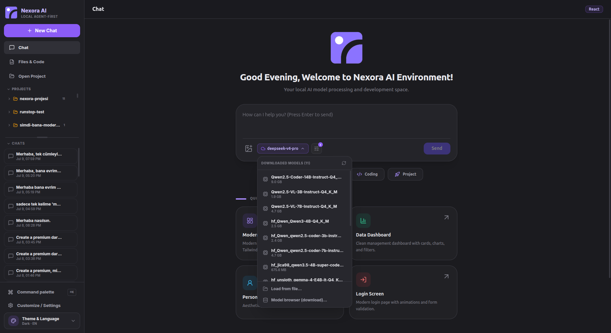 | 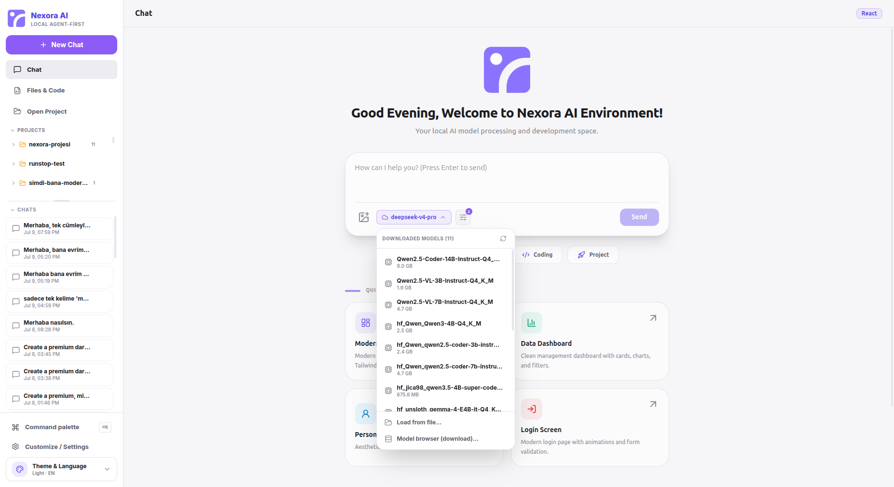 |

**Hardware Advisor** — your device measured; models graded for *your* machine, sized by **VRAM** on a discrete GPU (🟢 fits VRAM / 🔵 spills to RAM)

| Dark | Light |
|---|---|
| 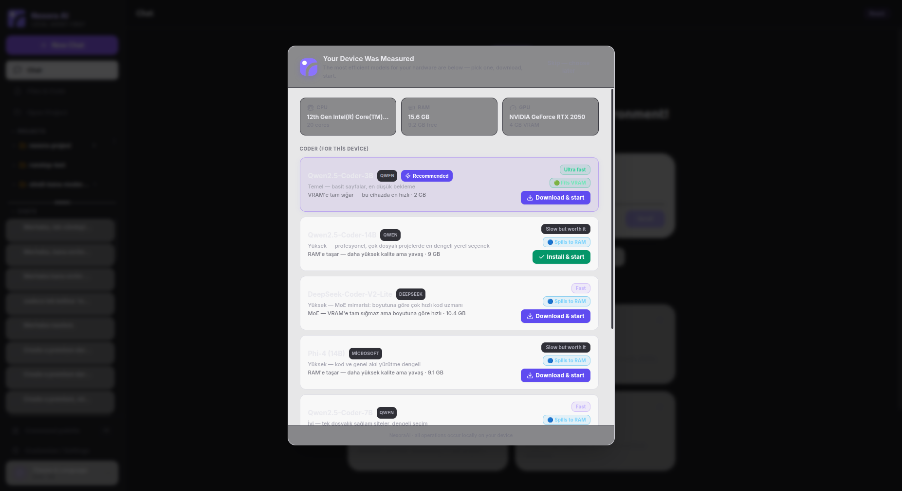 | 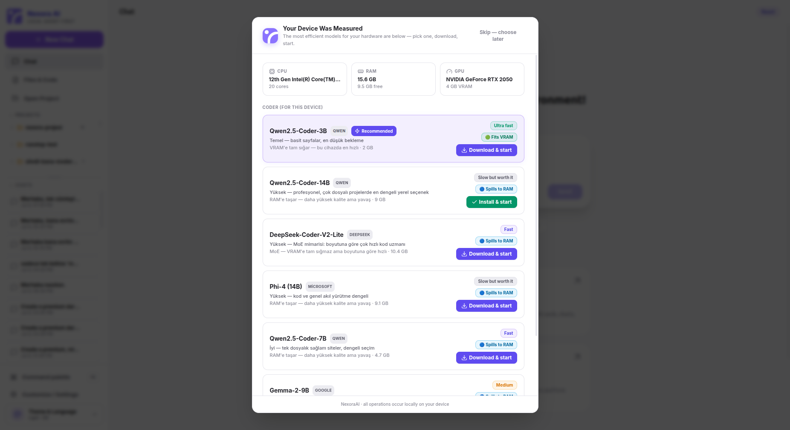 |

**Settings** — the accessibility **Interface Size** control (Normal → Giant, `Ctrl +/−/0`), the **157-provider BYO-key hub** (keys in the OS keychain), trust tiers & permissions, and the live engine scorecard

| Dark | Light |
|---|---|
| 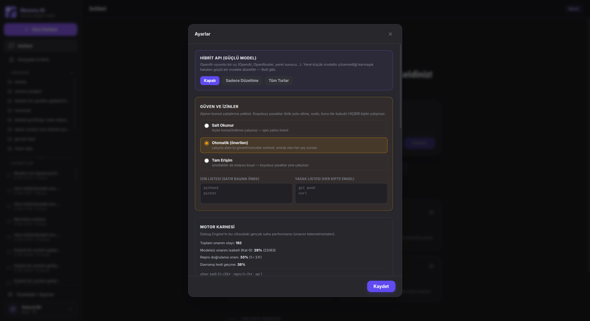 | 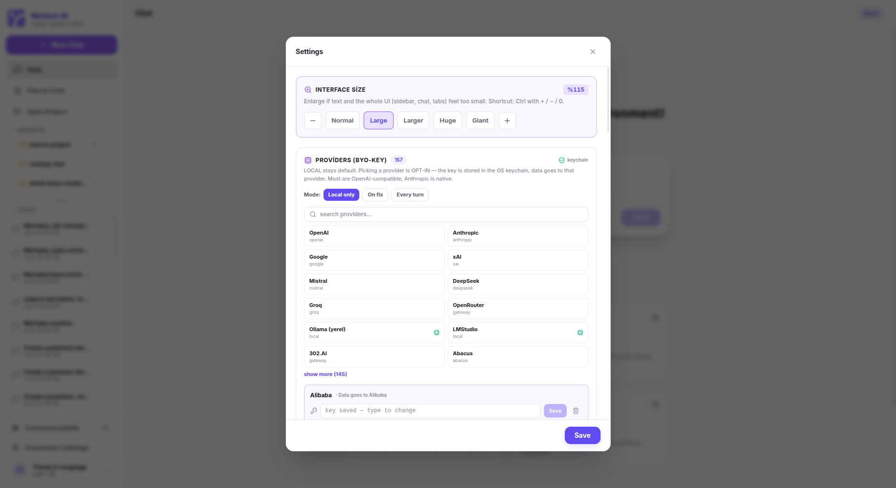 |

## Getting Started

### Platform Support

Installers for all three desktop platforms are built automatically on GitHub Actions and attached to every [release](https://github.com/mutlukurt/NexoraAIEnvironment/releases/latest).

| Platform | Download | Status |
|---|---|---|
| **Windows** 10/11 (x64) | `NexoraAI-Setup-<version>.exe` | ✅ CI-built NSIS installer |
| **macOS** (Apple Silicon) | `NexoraAI-<version>-arm64.dmg` | ✅ CI-built |
| **Ubuntu** / Debian / Mint / Pop!_OS | `nexora-ai_<version>_amd64.deb` | ✅ fully supported |
| Any other Linux (Fedora, Arch…) | run from source (`npm run dev`) | ✅ fully supported |

> The Windows and macOS installers are **unsigned** (no paid code-signing certificate), so the OS shows a one-time first-run warning you dismiss — see the per-platform notes below. Everything else is complete: local inference, agent actions, dev server and export all work. Running from source also gives the full experience (in dev mode the worker uses the Node.js on your PATH).

### Requirements

- Windows 10/11 x64, macOS Apple Silicon, or Linux x64 (Ubuntu for the `.deb`)
- ~8 GB RAM minimum (16 GB recommended for 7B models)
- Node.js 20+ and npm (for the Run/dev-server feature; the app ships its own Node runtime for inference)
- A GGUF model file — good starters:
  - `Qwen2.5-Coder-7B-Instruct` Q4_K_M (~4.7 GB) — best quality/speed balance on 16 GB RAM
  - `Qwen2.5-Coder-3B-Instruct` Q5_K_M (~2.4 GB) — for lighter machines

Grab the installer for your OS from the [**Releases page**](https://github.com/mutlukurt/NexoraAIEnvironment/releases/latest).

### Install — Windows (`.exe`)

Download **`NexoraAI-Setup-<version>.exe`** and run it (per-user install, no admin needed; you can choose the install folder).

> **First launch (unsigned build):** Windows SmartScreen shows *"Windows protected your PC."* Click **More info → Run anyway** — once. The installer is built in the open on GitHub Actions; the exact pipeline is in [`.github/workflows/build.yml`](.github/workflows/build.yml). On first use the app downloads the matching `llama-server.exe`.

### Install — macOS (`.dmg`, Apple Silicon)

Download **`NexoraAI-<version>-arm64.dmg`**, open it, and drag **NexoraAI** to Applications.

> **First launch (unsigned / un-notarized):** macOS Gatekeeper blocks it once. Either:
> - **Right-click** (Control-click) NexoraAI → **Open** → **Open** in the dialog, **or**
> - if macOS says the app is *"damaged and can't be opened"* (the download quarantine flag), clear it once in Terminal, then open normally:
>   ```bash
>   xattr -cr /Applications/NexoraAI.app
>   ```

### Install — Linux (`.deb`, Debian / Ubuntu / Mint / Pop!_OS)

Download **`nexora-ai_<version>_amd64.deb`**, then:

```bash
sudo dpkg -i ~/Downloads/nexora-ai_*_amd64.deb
```

### Install — Linux (Snap Store)

NexoraAI is also on the [**Snap Store**](https://snapcraft.io/nexora-ai):

```bash
sudo snap install nexora-ai --edge --devmode
```

> Currently on the **edge** channel with `devmode` confinement. As an agent that runs your project's toolchain (`npm`/`git`/…) against files at arbitrary paths, NexoraAI needs **classic** confinement (the same category as VS Code) to reach the `stable` channel — that store review is in progress. Until then, `--edge --devmode` gives you the full, working app.

### Build from source

```bash
git clone https://github.com/mutlukurt/NexoraAIEnvironment.git
cd NexoraAIEnvironment
npm install

# development
npm run dev

# production build + .deb package (place a Node binary for the bundled worker runtime first)
mkdir -p vendor/node-bin && cp "$(command -v node)" vendor/node-bin/node
npm run dist
```

> The packaged app bundles a standalone Node.js binary (`resources/node-bin/node`) used to run the inference worker outside Electron's V8 — see [Key Engineering Decisions](#key-engineering-decisions) for why this is not optional.

## Usage Guide

1. **Let the Hardware Advisor pick your model** — every launch opens with *"Cihazınız Ölçüldü"*: your CPU/RAM/GPU, and a catalog of models across six families with honest speed grades *for your machine*. One click downloads + loads + starts. (Skip it and use *GGUF seç* / *Model Tarayıcı* if you know what you want.)
2. **Describe your project** — e.g. *"Bana modern bir portfolio sitesi yap"*, or with **Prompt Güçlendir** on, describe it however you naturally speak — the model first turns it into a professional brief. With **Önce Plan** on, you get a numbered plan to approve before any code is written. Watch per-file progress right in the chat.
3. **Iterate** — *"Hakkımda kısmını daha detaylı yaz"*, *"@Hero.tsx başlığı büyüt"* (type `@` for filename autocomplete). A change rewrites the complete file(s) it touches; the chat card shows a **`+X −Y`** diff stat, **⇄ Farkı gör** opens a line-level diff before you accept, and ↶/↷ in the workspace steps through the last 20 generation states. On a small model the debug engine still catches and repairs the mistakes it makes.
4. **Run it** — the green **Çalıştır** button installs dependencies and opens the real site at `localhost` in your browser. Press again to stop.

   **When something breaks — the exact timeline:**
   - The *Accept/Reject* buttons after a generation are **not** a correctness check — they only decide whether the changes stay in your workspace (Reject rolls everything back instantly).
   - Error detection happens at **Run**: while Vite opens your browser, NexoraAI silently runs a *full* compile of the project in the background. (This matters because Vite compiles lazily — a broken project can still "start".)
   - If the compile fails, the error lands **in the chat** — with file, line, code frame, an error-class hint, and a *suspicious-line scan* (e.g. the app itself finds the line with an unclosed quote).
   - You type **"düzelt"** — nothing more. The diagnosis is attached to the model automatically; its edit is applied through a copy-tolerant matcher; the app **re-compiles to verify**; if the error persists it retries by itself (up to 2 extra rounds with escalating hints) before asking you for help. Success is announced in the chat: *"✅ Derleme hatası giderildi."*
   - **Scope note:** this catches *build/compile* errors (syntax, broken imports, unclosed quotes — the vast majority). Purely runtime glitches (e.g. a section rendering empty) are things you *see* on localhost and report in plain words — that's the normal iteration flow.
5. **Use agent powers** (optional) — phrases like these trigger real actions, logged live in the chat:

   | You say | The agent does |
   |---|---|
   | "framer-motion kullan" | adds the package to `package.json` |
   | "Outfit fontunu ekle" | downloads the woff2 files from Google Fonts and wires them into the CSS |
   | "şu görseli indir …" | fetches any URL into the project tree |
   | "şu komutu çalıştır …" | runs it in the project folder (sandboxed cwd, denylist, 5-min timeout) |
   | "projeyi çalıştır" | full Run flow, browser opens automatically |

6. **Use a reference image** — click the 🖼 button next to the input, pick a screenshot/mock, and describe what you want (*"buna benzer bir site yap"*). NexoraAI's local vision model analyzes the design (first use downloads it, ~2.8 GB) and passes a structured design brief to your coding model. Attach an image with a plain question instead, and the vision model answers it directly. *Honest expectations:* this pipeline captures a design's **spirit** (palette, sections, component styles) — not a pixel-perfect clone; analysis quality scales with the vision model size, and your explicit instructions always override the analysis. **Upgrading the eyes:** drop a bigger VL pair (e.g. `Qwen2.5-VL-7B-Instruct-Q4_K_M.gguf` + its `mmproj-…Q8_0.gguf` from the ggml-org HF repo) into `~/NexoraAI/models/` — the app automatically uses the best vision model that fits your free RAM at analysis time, and tells you which one it picked.
7. **Export** — **Dışa aktar** asks for a target directory and writes a complete professional project folder named after your project.

## Software Architecture

```
┌───────────────────────────── Electron ─────────────────────────────┐
│                                                                    │
│  Renderer (React 18 + TypeScript + Tailwind + Zustand)             │
│  ├── ChatPanel        streaming chat, per-file cards, plan/enhance │
│  │                    approval, @mention autocomplete              │
│  ├── ArtifactsPanel   file tree + CodeMirror editor, undo/redo     │
│  ├── ModelBrowser     HuggingFace search + downloads               │
│  ├── WelcomeSetup     hardware advisor (launch screen)             │
│  ├── DiffModal / PermissionModal / SettingsModal                   │
│  ├── stores           appStore / artifactsStore / settings / hf    │
│  └── lib              parseCode, contextSelect, diff, assetFix,    │
│                       formatCode (Prettier), agentActions          │
│           │  contextBridge (typed, contextIsolation: true)         │
│  Main process                                                      │
│  ├── llamaService     worker lifecycle, IPC-RPC, prompt assembly   │
│  ├── agentService     workspace sync, shell, fetch, fonts,         │
│  │                    Vite dev server, scaffolding, export         │
│  ├── sessionsService  persistent chats (~/NexoraAI/Sessions)       │
│  ├── rulesService     per-project KURALLAR.md                      │
│  ├── advisorService   CPU/RAM/GPU detection for the advisor        │
│  └── hfService        HuggingFace API + GGUF downloads             │
└───────────────┬────────────────────────────────────────────────────┘
                │ child_process IPC (JSON messages)
┌───────────────▼───────────────┐      ┌──────────────────────────────┐
│  Inference engine (v0.10)     │      │  ~/NexoraAI/Projects/<slug>/ │
│  llama.cpp llama-server       │      │  real on-disk workspace:     │
│  (prompt cache, GBNF, GPU)    │      │  npm install • vite dev      │
│  fallback: node-llama-cpp     │      │  fonts • fetched assets      │
│  worker on bundled Node       │      │  runtime-error hook → app    │
└───────────────────────────────┘      └──────────────────────────────┘
┌───────────────────────────────┐
│  Vision sidecar (on demand)   │  ← attached images: llama.cpp's
│  official llama-server+libmtmd│    llama-server + Qwen2.5-VL analyzes;
│  auto-downloaded on first use │    analysis feeds the coding model
└───────────────────────────────┘
```

**Data flow of one generation:** user prompt → main process assembles the system prompt (capability-adaptive — sectioned for small models, a one-shot frontier persona for a strong API or ≥ 13B GGUF) and, on iteration, the update-mode wrapper → the engine streams tokens back over IPC → renderer parses the stream *live* (`parseStreaming`) into prose + fenced file blocks → complete files (whole-file rewrites on iteration) land in the artifacts store, visible immediately in the tree/editor; agent directives (`[PKG]`, `[FONT]`, `[FETCH]`, `[RUN]`, `[DEV]`, `[MCP]`) execute sequentially after generation with a live action log in the chat.

## Key Engineering Decisions

Each decision below was forced by a real failure — see the [Development Chronicle](#development-chronicle) for the war stories.

### 1. Inference lives in a separate plain-Node process
Electron compiles V8 with the *memory cage* (pointer compression): any GGUF larger than 4 GB crashes the process with an uncatchable `SIGILL` — on every Electron version we tested (31 → 43). The same file loads in 1.7 s under plain Node. So NexoraAI ships its own Node binary and runs `node-llama-cpp` in a child process, talking to it over structured IPC. Bonus: a dying model can no longer take the app down with it.

*Plain-language version:* the AI engine runs in its own little program next to the app. Big models stopped crashing, and even if the engine chokes, the app keeps running and tells you what happened.

*v0.10 update:* inference now runs through llama.cpp's official `llama-server` sidecar (same isolation, plus prompt caching, GBNF grammars and server-side GPU fitting); the plain-Node worker remains as the automatic fallback engine.

### 2. Context size is chosen by available RAM, never by the model's maximum
Modern models advertise 32k–131k token context windows. Actually allocating that KV cache on a 16 GB laptop sends the machine into swap and looks exactly like "the app froze forever". NexoraAI picks 16k/8k/4k based on free memory and steps down automatically if allocation fails.

### 3. Prompts adapt to the model's real size (from GGUF metadata)
Small models (<13B parameters) drown in long rule lists: they duplicate files, invent imports, echo instruction templates back as code. They get a compact, example-driven, **single-file** strategy. Models ≥13B get the full professional multi-file architecture prompt. The parameter count is read from GGUF metadata (`general.parameter_count` / `size_label`), not guessed from file size.

*Plain-language version:* we ask small brains for one great file and big brains for a whole professional project — and the app tells them apart automatically.

### 4. The professional structure is deterministic, not model-generated
`scaffoldProject()` completes whatever the model produced into a runnable project: entry HTML, `main.tsx`, Vite/TS/Tailwind configs, a `package.json` whose dependencies are *detected from the actual imports* in the code. Program logic — not a language model — guarantees `npm install && npm run dev` works.

### 5. Iteration = surgical `SEARCH/REPLACE` edits
Rewriting a whole file to change one paragraph is slow and risky. NexoraAI teaches the model Aider-style edit blocks; the applier requires an exact match (with a whitespace-tolerant fallback) and **never touches the file if the match fails**. Verified live: a 7B model changed one `<p>` in a 5 KB component, everything else byte-identical.

### 6. Model quirks are patched at the sampler, not with polite requests
Qwen models drift into Chinese mid-output. Asking nicely in the prompt doesn't stop it. Banning all ~31k CJK-containing vocabulary tokens via `TokenBias` at load time (~200 ms, once) *does* — mathematically. The ban lifts automatically for users who actually write in Chinese/Japanese/Korean.

### 7. Viewing = the real thing, not a sandbox
An earlier in-app preview (Babel-in-iframe) fought endless battles: TypeScript type-import syntax, CSP inheritance, sandboxed-frame process deaths under memory pressure, liveness false alarms. The verdict: **run the real project**. The Run button writes the workspace to disk, installs, boots Vite and opens the browser — pixel-perfect by definition.

### 8. Agent instructions are injected only when needed
Keeping tool-use instructions permanently in the system prompt made small models copy the templates verbatim into their output ("`[FETCH] <url> -> <relative/path>`" as a file!). The agent hint is now appended per-message, only when intent-detection sees words like *install / font / indir / çalıştır*, and uses real example values. Placeholder-looking values are refused at execution time as a second line of defense.

### 9. Iteration is a complete-file rewrite — the surgical machinery was removed (v0.17)
For a long time iteration was governed by an Aider-style `SEARCH/REPLACE` regime: forced edit-block grammar, a streaming watchdog that aborted a turn the moment an open `SEARCH` block grew past 20 lines, and a ban on rewriting a >200-line file in full. It was built to keep a *weak 3B* from mangling files — but a live test with a strong API model showed the honest verdict: it **helped no model**. A weak model can't reliably iterate regardless; a strong one iterates fine on its own; and meanwhile the watchdog was **aborting API turns mid-edit** (*"make it mobile responsive"* → cut → *"API turn failed"*). v0.17 removes the whole apparatus for **all** models: the model outputs the **complete updated file(s)**, the app writes them, and correctness is caught after the fact by the debug engine (build + behaviour verification) — the safety net that stays.

*Plain-language version:* we stopped trying to physically stop the model from rewriting a file, because that was fighting the capable models and doing nothing for the weak ones. Now the model just writes the whole file, and the debug engine checks the result.

### 10. The context window is a budget, not a suggestion
An 8k-token window dies fast when every iteration re-sends every file. Three layers keep it alive: a deterministic **file selector** sends only request-relevant files (mention > filename > keyword > recency) with a hard char budget and a "these other files exist, don't recreate them" manifest; the **worker compacts** its own history when the window passes 75 % (fresh session + summary note); and files are **never truncated** — a half-file would silently break `SEARCH/REPLACE` matching, so a file either ships whole or ships as a name.

### 11. Determinism after the model, every time
Whatever the model produces gets post-processed by plain code: Prettier formats every touched file (parse failures leave the file untouched — formatting can never destroy work), broken references to non-existent local images are rewritten to seeded placeholders (while `[FETCH]`-downloaded assets are respected), and both steps run only after generation fully completes — running them mid-stream would corrupt the very text the model's next edit block needs to match.

### 12. The UI theme is a variable set, not two codebases
The redesign (from the owner's Stitch mock) runs every surface color through CSS custom properties exposed as Tailwind tokens (`ink-bg/panel/card/hi/line/text/mut/dim` as `rgb(var(--…) / <alpha-value>)`, so opacity modifiers keep working), with accent colors as `dark:` dual classes. Soft dark (#1b1b1f, VS Code-grade — deliberately not pitch black) and light are ~40 lines of variables apart; the theme applies in `<head>` before first paint, so there is no flash, and even the pre-React splash screen respects it. Everything ships local: the Inter font is embedded (latin + latin-ext for Turkish), no CDN anywhere.

## Development Chronicle

An honest, chronological log of how this project actually happened — including the dead ends.

**Phase 1 — Foundation (v0.1.0 → v0.3.8).** Electron + React scaffold; chat UI with streaming; GGUF loading via node-llama-cpp in the main process; profile-matched system prompts (React SPA / Next.js / static HTML / FastAPI / Electron / Tauri / React Native); Bolt-style live file parsing with an in-app preview sandbox; HuggingFace browser; `.deb` packaging.

**Phase 2 — "The model won't load" (v0.4.0).** Two root causes found and fixed in one day: (1) default context allocation tried to fit the model's full 32k–131k training window into laptop RAM → swap death that looked like an infinite spinner — fixed with RAM-aware context sizing; (2) GGUFs > 4 GB hard-crashed Electron with `SIGILL` at the exact 4 GiB boundary (`r14 = 0x100000000`) — diagnosed as V8's memory cage, unfixable in-process even on Electron 43, solved by moving inference to a bundled plain-Node worker. Also added: load-progress events, GPU→CPU auto-fallback, chat-visible per-file progress, no more forced tab switching.

**Phase 3 — "It opens… doesn't it?" (v0.4.1).** After the Electron 43 upgrade the packaged app launched but never showed a window: legacy `use-gl=swiftshader + disable-software-rasterizer` switches (originally added to stop in-process Vulkan crashes — now obsolete) prevented the first paint on Wayland, and `ready-to-show` never fired. Removed the switches; added a 2.5 s fallback `win.show()` so the window can never silently stay hidden again.

**Phase 4 — Parser forensics (v0.4.2 → v0.4.3).** Small models put file paths *next to* fences, not on them — the parser turned those into empty files plus `App8.tsx`-style junk names; fixed by letting a bare-path line name the following fence. Then the preview engine: `import { clsx, type ClassValue }` generated syntactically invalid JS that killed the *entire* preview script — the infamous uniform-gray screen. Fixed type-import filtering, `export { X } / export * / export interface` handling, `@/` alias resolution, functional stubs for clsx/tailwind-merge/framer-motion, per-module script isolation.

**Phase 5 — The agent layer (v0.5.0).** Real workspace on disk (`~/NexoraAI/Projects/<slug>`), shell execution with denylist + timeout, internet fetch, Google Fonts pipeline (woff2 download + CSS rewrite), Vite dev-server orchestration with URL detection, professional export with dependency-detecting scaffold. All directive-driven from model output, with a live action log in chat.

**Phase 6 — Prompt archaeology (v0.5.1 → v0.5.4).** The always-on agent instructions made small models regurgitate template lines as files → made the hint conditional and placeholder-proof. "Professional multi-file tree" prompts made 3B/7B models duplicate files and import ghosts → introduced the compact single-file strategy (verified: a 3B produced exactly 2 valid files). Dev server: stale `node_modules` skipped installs of newly-added deps (`Failed to resolve import "lucide-react"`) → always reconcile installs; scaffold ordering bug left `index.css` unimported → all project CSS is now wired into `main.tsx`.

**Phase 7 — Killing the preview (v0.5.5 → v0.6.0).** The in-app preview intermittently rendered as a solid gray rectangle that survived every reproduction attempt (the exact same files rendered perfectly when injected via CDP into the very same installed app). A liveness beacon + self-healing iframe reduced the pain; a beacon placed at document-end then *caused* false "dead frame" alarms on slow machines (moved to document-head). Final call, made by the product owner: **delete the preview, view through the real dev server.** Same release brought surgical `SEARCH/REPLACE` iteration — tested against the owner's real project file and real request: one edit block, applied cleanly, rest of the file untouched.

**Phase 8 — Polish for everyone (v0.6.1 → v0.6.3).** CJK sampler ban (31k tokens, ~200 ms scan) ended Qwen's random Chinese; made conditional per-message so CJK-speaking users still get native answers; small/full prompt selection upgraded from file-size heuristic to true parameter count from GGUF metadata — a tightly-quantized 14B now correctly gets the professional multi-file treatment.

**Phase 9 — Going public, cross-platform (v0.6.4).** Published to GitHub with this README, screenshots and `.deb` Releases; verified the full run-from-source experience with a fresh clone; replaced hardcoded `bash` with platform shells (`/bin/sh` / `cmd.exe`) and fixed `file://` URLs for Windows paths; declared the Node ≥20 engine requirement so old runtimes fail loudly instead of weirdly.

**Phase 10 — The real large-model campaign (v0.6.5 → v0.6.6).** Downloaded Qwen2.5-Coder-14B (9 GB) and ran it on the development laptop itself — metadata-based size detection picked the professional prompt live, and a detailed client-style brief yielded a 17-file restaurant site. Every real mistake the model made became product: `package.json` sanitization (CRA relics), dependency-free `cn()` injection, a project-wide export map that auto-imports forgotten components *and* data exports, and a Turkish-apostrophe string repair (whose own first version corrupted key-value pairs — caught and hardened with a negative guard). Remaining slip-ups (a missing quote, lazy `// Add items here` stubs, an `Array(4.5)` crash) were fixed by the model itself through the surgical-edit iteration loop.

**Phase 11 — The self-fixing app (v0.7.0 → v0.7.1).** Build errors from **Run** are now captured automatically (background full compile, code frame, error-class hints, suspicious-line scan) and posted to the chat; the user types one word — *"düzelt"* — and the app attaches the diagnosis, applies the model's edit through a new quote-insensitive matcher, re-verifies the build, and auto-retries up to two rounds. Engineered against real 14B failures (three consecutive misdiagnoses without the pinpoint scan; models auto-correcting broken code inside `SEARCH` blocks) and finally verified end-to-end: broken project → one word → clean build. v0.7.1 made the trigger multilingual — *fix, repair, onar, çöz, arregla, répare, behebe, napraw, исправь…*

**Phase 12 — Eyes for the agent (v0.8.0 → v0.8.2).** node-llama-cpp has no multimodal API, so vision runs through llama.cpp's official `llama-server` (libmtmd) as an on-demand sidecar: a small Qwen2.5-VL model (auto-downloaded with the platform server binary on first use) analyzes attached images. *"Make me a site like this"* extracts a structured design system and pipes it to the coding model; a plain question gets answered directly. Feasibility was proven live on the CPU-only dev laptop (35 s per analysis) — after two real lessons: large screenshots overflow the vision context (fixed with automatic 1024 px downscaling + 8 k context), and the first intent classifier mistook the Turkish question *"ne YAPıyor?"* for a build command because of the embedded stem *yap* (fixed with a noun+verb combination rule, verified by a 19-case battery). v0.8.2 added explicit-override priority: the user's *"…but make the hero fonts red"* always beats the extracted analysis.

**Phase 13 — Reality check: cloning a real design (v0.8.3 → v0.8.4).** The owner attached a sophisticated agency design (cream page inside a mustard frame, black hero card, stat badges) and asked the 14B to clone it — the result was a flat yellow page. The post-mortem exposed the whole chain: the coding model is *blind* (it only reads the vision model's text description), the 3B eyes had collapsed a layered design into "yellow background", the generic extraction prompt let it, and the agent log showed two real bugs (the model invented `https://example.com/logo.svg` → 404, and ran `npm run build` before any install → `vite: not found`). Every link got fixed: placeholder domains are rejected at execution, npm/vite commands auto-install dependencies first, the extraction prompt now demands region-by-region measurable detail, and v0.8.4 made the eyes upgradeable — the app automatically uses the best VL pair in the models folder that fits current free RAM. Verified live: 7B eyes produce frame/section/component breakdowns (162 s) where 3B saw one color (35 s).

**Phase 14 — The Hardware Advisor (v0.8.5 → v0.8.6).** "Which model should *I* download?" is the first question every non-technical user asks — so the app now answers it before they can ask. At launch, CPU/RAM/GPU are measured and a catalog is rendered with honest speed grades (*ultra fast / fast / medium / slow-but-worth-it*) computed for *that* machine; one click downloads, loads and starts chatting. v0.8.6 grew the catalog from Qwen-only to six families — DeepSeek-Coder-V2-Lite (MoE, speed-graded by its 2.4B *active* params, not its 10 GB file), Codestral-22B, Phi-4, Gemma-2-9B, Llama-3.1/3.2 — with every HuggingFace download URL live-verified before shipping, and honest notes ("general-purpose — not as strong at code as Qwen-Coder") instead of marketing.

**Phase 15 — Enforcing surgical edits (v0.8.7 → v0.8.9).** A live experiment (reference-image → site → "fix these 5 things") exposed an ugly truth: told to make surgical edits, the real 7B copied an *entire component* into one giant `SEARCH` block — a 17-minute full rewrite wearing an edit block's clothes. The owner's verdict was categorical: *in iteration, the model may only write the broken spot — never rewrite.* Three releases made that law: example-driven prompt rules (small models follow examples, not rules), a **streaming watchdog** that aborts generation the moment an open `SEARCH` passes 20 lines (one corrective auto-retry, then hard stop), an absolute never-apply rule for full-file rewrites of existing files, a live status line in the chat card (*"✂️ 2nd change — marking the spot"*) replacing the opaque "generating…", and a 🔧 per-file fix report. The report itself shipped a bug worth recording: edit blocks apply *live* during streaming, then the final pass re-applied them, found the text already changed, and reported "0 fixed" for a perfectly successful edit — fixed with an idempotency tier in the applier ("SEARCH not found but REPLACE already present = already applied"). Verified end-to-end: two 3-5-line surgical blocks, 16 changed lines in a 102-line file, ~90 seconds, correct report.

**Phase 16 — Learning from opencode, part 1: trust (v0.9.0 → v0.9.2).** The owner's insight: opencode (MIT) already solved several problems we had — adapt the *ideas*, rewrite the code for our stack. First batch, the trust layer: a **line-level diff approval screen** (dependency-free LCS with common prefix/suffix trimming and folded context) reachable from both the chat and the workspace's pending-changes bar; **persistent sessions** — every chat plus its project files auto-saved (debounced, atomic writes) to visible JSON under `~/NexoraAI/Sessions/`, restored from the sidebar across restarts, with "New Chat" finally meaning a clean page; and a **permission system** — `[RUN]` and `[FETCH]` directives now show exactly what wants to execute before it does (allow once / always for this project / deny), so a 7B's hallucinated shell command can never run itself.

**Phase 17 — Learning from opencode, part 2: quality (v0.9.3 → v0.9.5).** Three features aimed straight at the 8k-context reality of local models. **Smart context:** a deterministic selector (no model calls — CPU cycles are precious) ranks project files by @mention > filename-in-request > keyword hits > recency, ships only what fits an ~11k-char budget, never truncates a file (that would silently break edit matching), and hands the model a "these files exist, do not recreate them" manifest; the chat shows a 📎 line whenever trimming happened. **Plan-first mode:** a sidebar toggle that turns requests into a cheap numbered plan (file *list* only — no contents) with approve/dismiss buttons; the approved plan is auto-sent as the build brief. Confirmed working live by the owner on real hardware. **Prettier:** every touched file formatted after generation via `prettier/standalone` in a lazy-loaded chunk; parse-failing files are left untouched, and formatting deliberately never runs mid-stream (it would corrupt the text the next `SEARCH` block must match).

**Phase 18 — The redesign (v0.9.6 → v0.9.8, refined in v0.9.12/v0.9.14).** The owner designed a new identity in Stitch — dark, violet, glass — and the app was rebuilt to match it *without* betraying its principles: Google-hosted fonts and Material icons were replaced by an **embedded Inter** (latin + latin-ext with unicode-range, for Turkish) and the existing lucide set, because a local-first app doesn't phone a CDN for its own face. The icon rail + sidebar merged into one; the hero gained a time-of-day greeting and a glass input; "Recent projects" became real session shortcuts instead of a decorative box. v0.9.8 answered three pieces of direct feedback: full pill shapes were rejected ("Apple-oval like the cards" = soft rounded rectangles — now a design rule), pitch black was rejected (dark is now a soft VS Code-grade #1b1b1f), and a **light theme** arrived — the entire palette moved into CSS variables exposed as Tailwind `ink-*` tokens, switched by one button, applied pre-paint (no flash), with CodeMirror following along. The owner's logo (three iterations of it) was processed to transparency with PIL flood-fill and wired everywhere: sidebar, hero, splash screen, window and launcher icons — which uncovered that the renderer's `publicDir` had never been wired and the window icon had been silently broken since day one.

**Phase 19 — Learning from opencode, part 3: power (v0.9.9 → v0.9.11).** **Project rules:** persistent per-project preferences in a real `KURALLAR.md` file (editable in Settings or any editor; empty save deletes it) attached to every request — "always dark theme, Turkish comments" is now said once, ever. Testing it surfaced a lesson for the notebook: `contextBridge` objects are frozen, so renderer tests can't monkeypatch `window.nexora` — the app now exposes the last outgoing prompt through its debug hook instead. **Undo/redo timeline:** the workspace keeps the last 20 generation states (deduplicated; a rejected turn leaves no ghost step) with ↶/↷ buttons — far beyond the single accept/reject. **Custom quick commands:** user-defined labeled prompts managed in Settings, rendered as violet pills beside the built-in templates and above the mid-chat input.

**Phase 20 — The polish sweep (v0.9.13 → v0.9.15).** Everything left on the board, cleared in one day. **Prompt enhancement** (the owner's feature idea): with *"Prompt Güçlendir"* on — and it's on by default — a non-technical user's casual description is first rewritten by the model into a professional design brief, which then flows into plan mode and generation automatically; skipped for iterations, image flows and fixes where it would get in the way. **Plan language fixed:** "answer in the user's language" was ignored by the 7B; wrappers now state `LANGUAGE OF YOUR ANSWER: TURKISH (yanıtı TÜRKÇE yaz)` outright. **`@` autocomplete:** typing `@` in either input pops matching project filenames; Enter picks, Esc closes. **Context compaction:** past 75 % window usage the worker quietly rebuilds its session with a summary note instead of degrading. **Vision post-mortem:** the infamous "663-character analysis cap" turned out to be a *misdiagnosis* — only the chat preview was sliced at 600 chars, the model always received the full analysis (preview now 1500 chars and says so); the recurring hallucinated `#007BFF` accent got a hard extraction rule — *colors may only be read from the image, template colors are forbidden, write "belirsiz" if unsure.* And the final open wound closed: models referencing non-existent `/assets/…` images. Two layers: a prompt rule (photos = seeded picsum URLs, icons = lucide, logos = styled text — and the old rule that *encouraged* mock asset folders was removed), plus a deterministic post-pass that rewrites any remaining broken reference to a placeholder while respecting files that actually exist or arrive via `[FETCH]`.


**Phase 21 — The live-test marathon (v0.10).** One night, zero-intervention testing with a real 3B: 11 bugs surfaced and fixed (context-overflow pre-flight, unconditional manifest sanitize, stray-directive stripper, file-regeneration escalation, spiral-proof plan grammar, iteration profile lock, grounded brief enhancement, bare fix-word guard, GBNF trailing-newline EOS trap, plan-card rendering, missing hook-import injector), one architecture shift ("deterministic skeleton, model-only fill": code derives the plan and writes App.tsx; the model only fills template markers), and one new sense: runtime errors from the running page now reach the app and trigger an automatic fix — no human input. The Atlas Barber site at the top of this README is that night's closing artifact.

**Phase 22 — The Debug Engine (v0.11).** The owner set a new course: *all future development bends toward a first-class debugging engine* — the capability that defines Codex, Claude Code and Gemini CLI. Built in one continuous campaign as roadmap Phase 5, every piece live-verified in the real app before its tick. **Scan** (find the bug without running): a "Tara" button walks the whole project in milliseconds — syntax, import graph, undefined components/variables, unfilled markers — and every finding is emitted as a repair-ladder-compatible diagnosis, so scanned bugs and live crashes ride ONE pipeline; imported projects auto-scan report-only (never touching the user's folder without a click), and a silent pre-Run scan keeps broken classes from ever reaching localhost. **See** (four senses on the page hook): crashes, `console.error`, failed requests/resources, and vite's HMR overlay — the only signal that exists when a file is broken by hand. **Locate**: "📍 KONUM: Hero.tsx:19 (List) — %92" with symbol and confidence; on truncated stacks suspects are *ranked* (undeclared-identifier use, prop-vs-concrete receivers, recency), and cross-file root causes are named — "KÖK NEDEN ADAYI: `<List>` is called here without the `data` prop", the file the stack never shows. **Measure** (value probes): the suspect expression is temporarily wrapped (`data.map` → `__nxProbe('data', data).map`), the page force-rendered offscreen (React unmounts a crashed tree — HMR alone never re-runs the module), the crash-moment value streams back (🔬 `data = undefined`), the file is restored under guarantee, and the fix turn starts from data, not guesses. **Fix** (the dual-mode surgeon): deterministic rung 0 first, local model second, and the hybrid API only as an escalated last resort — optionally gated behind a "düzelt api" consent. **Watch**: a live-scan toggle that scans as you type (report-only — never edits under the cursor) and badges findings; in testing it even caught a junk file a model turn had created. All of it is held to account by a proving ground: `npm run test:engine` runs 6 suites / 51 checks — whole broken projects through the real pipeline, scored on find-rate (10/10), deterministic repair (8/8, applied *and* verified green), and time-to-green (avg ~23 ms). The proving ground earned its keep immediately: its first run exposed a real localization weakness, and staging this README's screenshots exposed a false-positive class — both fixed with their own regression fixtures, same discipline as ever.

**Phase 23 — The Engine, 10× (v0.12).** Phase 6 opened with a brutal audit of the engine's own field telemetry — rung 0 missing 57% of live errors, value probes hitting 3/11, a 14B fabricating SEARCH blocks three times in one night, an aborted turn leaving a 254-div spiral — and closed with every audited weakness dead, each fix live-verified before its tick. The string probes were retired for a **real CDP debugger** (pause-on-exception, actual locals, source-mapped lines — three hard-won lessons live in the code: an outer `Promise.race` because an inner await once hung past its own timer; `about:blank` must commit before debugger commands resolve; and pause on `'all'` because React rethrows render errors from `commitRootImpl` after the user frame is gone). A **TypeScript language service embedded over the in-memory project** gave the scanner compiler eyes ("Did you mean 'fiyat'?"), with TS2304 findings feeding the same deterministic repair rung. The applier grew an **anchor ladder** — line-prefix stripping, a tie-refusing `key:'value'` similarity anchor, and reality feedback that shows the model the file's real bytes after a miss. **Turn transactions** made interrupted turns rot-proof. **Behavioral verification** started clicking nav links, pressing buttons and filling forms — the artifact screenshots show the engine's own typing in the fields. The **repro seal** turned "fixed" into evidence and caught a real lie in its first hour (a "repaired" file that had never reached disk — a stale React closure in the Run handler). The **learning engine** turned the telemetry into ladder-routing priors with conservative, two-way thresholds, plus a Settings scorecard running on real field data. And the **Motor tab** made the whole pipeline visible — a live timeline fed by the same choke-point every decision already passes through. Six of the eight items surfaced at least one real bug during their own live verification; the suite grew to 11 chains.

**Phase 24 — The Agent Layer (v0.13).** Phase 7 was born from a deliberate study: three parallel deep-research passes over OpenAI Codex and Google Antigravity (their docs, engineering blogs, HN threads — and their security post-mortems), cross-referenced against a full inventory of this codebase. The verdict: the *engine* gap was already closed; what remained was the *experience* gap — the delegate → observe → review-evidence → steer loop those tools are loved for. Eight items shipped, each live-verified in the real renderer before its tick, each mapped to a documented best practice and dodging a documented failure. The **live task card** (7.1) turned plan-approval into a pinned checklist that updates as the agent works — and repairing the browser-mode test harness for it (the `window.nexora` mock had rotted since Phase 5) gave every later item a real test surface. **Artifacts** (7.2) made evidence a document instead of chat scroll: plan, task list and a living walkthrough with `.resolved.N` versioning — its first live run showed v0 honestly saying "davranış testi henüz koşmadı" and v1 embedding the defect rows and screenshot strip. The **review pane** (7.3) brought git-truth diffs with scope chips and hunk-level revert (pure math, zero-tolerance tested — revert one hunk, the others live), reading refs through a deliberately electron-free reader that refuses `HEAD; rm -rf /` by whitelist. **Comment-to-steer** (7.4) queued feedback on diff lines, doc sections and even screenshots without killing the running turn — the queue survives restarts inside the session file. **Two-layer trust** (7.5) separated capability from consent: a shared verdict core both processes run (the Antigravity drive-deletion command is a permanent fixture), presets from Salt Okunur to a Tam Erişim that still cannot run a hard deny. The **visible terminal** (7.6) streamed every execution live — and its test suite's first run caught a real, years-old bug: killing a `shell:true` wrapper never killed its children; timed-out commands had been leaving orphans all along (fixed with POSIX group-kill). The **task queue + inbox** (7.7) delivered honest delegation — sequential on 16 GB by design, tab-to-queue mid-turn, verdicts earned from the verify chain (whose late start the live test caught as an early-verdict race), and every task sealing its git base so ⇄ İncele reviews exactly what THAT task changed. Finally the **knowledge base** (7.8) made learning a core primitive the NexoraAI way: items distilled deterministically from evidence at the moment it lands — kat0 repairs, repro-verified fixes, user comments — never by a model pass that could hallucinate; one matching counter-example retires an item, and every turn opens with what the project has already proven. The suite grew from 11 to 19 chains (190+ checks); three of the new suites caught real bugs on their first run.

**Phase 25 — Real-Time Hardening (v0.14).** Phase 7 shipped all-green in the browser harness — then the very first end-to-end run on the *real* app with a *real* model (the Zeytin Kafe live test) exposed a whole class the harness cannot see by design: real-duration races and a busy inference server. The packaging was never the suspect — the identical queue that froze in production ran itself fine under mock timing. So Phase 8 hardened both the agent layer *and* the test surface, and every tick was earned against time it could actually see. The **hang chain** (8.1) was the heaviest wound: a penalty turn had hung at 0 bytes for 36 minutes because abort never reached llama-server, and Durdur made it *worse* (a reality-retry opened a fresh hidden turn). Three coupled fixes killed it — a stream-liveness sentinel on both sides (the comments claimed a "renderer streaming watchdog" that never actually existed), an absolute Durdur built on a monotonic stop-epoch that invalidates the post-abort `done` and every hidden-turn spawner in one press (internal edit-violation aborts deliberately *don't* bump it, so their retry survives), and real server cancellation via `reader.cancel()` socket teardown — proven against a *real 3B*: a mid-stream cancel frees the slot in under a second, the next request's first token in 858 ms. The **queue heartbeat** (8.2) replaced the single-shot "+1.2s" trigger that raced the minutes-long verify chain with a persistent re-knock, and gave each waiting card an honest reason. The **behavior walk** (8.3) became schedule-until-done — it waits through a busy engine and reports at the cap instead of silently dying. **Goal-met verdicts** (8.4) made "verified" mean the request actually happened: a conservative check that the brief's literal tokens landed, downgrading to "⚠ incele" otherwise. **Project identity** (8.5) writes a real brief-named package.json before the first file so knowledge/rules/history stop commingling under `nexora-projesi`, and warns loudly when it can't. The **ledger smalls** (8.6) fixed the dropped Gallery, the walkthrough that stopped versioning after queue work, and stale inbox timestamps. And the capstone (8.7) gave the harness a **timing-realistic browser mode** (`fast`/`slow`/`stall`/`busy-abort` scenarios) plus a **real-socket `test:e2e`** and a gated **real-model `test:e2e-real`** — so the race class that all-green Phase 7 missed now dies in CI. The suite grew from 19 to 22 chains; the crown claim was validated against a real llama-server, not a mock.

**Phase 26 — Iteration that lands (v0.14.1).** With time tamed, the next full run on real hardware — plan → scaffold → 8 files → *"give the hero title an id"* — surfaced the class *underneath* the races: a small model would confidently emit an edit and **disk wouldn't change**. It was never one bug. The chain started before iteration could even begin: the scaffolded `package.json` invented a package that doesn't exist (`@tailwindcss/aspect-ratio@^0.4.3`), `npm install` died with ETARGET, and Run never booted — so I made the scaffold **rebuild `dependencies` from what the code actually imports** against a pinned known-good table (model-invented deps pruned, tailwind plugins stripped to `[]`). Then the edit itself: a hidden reality-retry was misread as a fresh build and triggered a **12-file re-plan spiral** — fixed by excluding hidden/retry turns from plan detection (`!hideUser`). The model was also **editing blind** — context had been dieted to ~8 K chars / 6 files even on a 16 K–32 K model, so the file it was told to edit wasn't in the window; the budget now **scales with the model's real context size**. A whole-file apply had once dropped `export default function App` with no undo, so a **pre-turn snapshot + violation rollback** now reverts a bad turn byte-for-byte. But the deepest cut was the edit *format*: `SEARCH/REPLACE` demands a byte-exact region, and a 3B paraphrases one token and matches nothing — so, straight from **Aider's edit-format research on weak models**, small files (≤200 lines) now accept a **whole-file rewrite** (no byte-exact burden) and `SEARCH/REPLACE` gained a **fuzzy dice-similarity tier** (≥0.82 with a safety margin, so it never writes to the wrong place); the iteration prompt was rewritten to make whole-file the *default* with an explicit *find-the-right-file-first* rule. The suite grew from 22 to 24 chains (`test:scaffold` 13, `test:context` 7, fuzzy cases added to `test:anchor`). And the finding was kept honest: on the identical project, a **7B performs the exact cross-file edit** where the **3B emits an empty `SEARCH` and aims at the wrong file** — so v0.14.1 removes every *mechanical* failure between a correct intent and disk, and names **big-small collaboration** (a 7B editor beside the 3B generator) as the real path to rock-solid 3B iteration, rather than pretend the 3B is something it isn't.

**Phase 27 — A calmer surface (v0.14.2).** With the engine hardened, the app's own *chrome* was the next honest problem: the left rail had become a single tall column stacking a brand header (with language + theme toggles), four nav items, a projects list, three always-on power toggles, chat history, a model-browser button, a model card, a benchmark button and a profile row — the theme was liked, the *placement* was a soup. v0.14.2 is a pure information-architecture pass: same colors, same components, same store actions and IPC — only relocated into a **minimal Codex/Antigravity-style shell** where each surface is reached by a transition. Model selection moved off the rail and **into the composer** as an Antigravity-style picker that lists your *downloaded* models for one-click switching (with load-from-file, the model browser, unload and the mini-benchmark folded in); the three power toggles became a **⚙ composer popover** with an active-count badge; the TR/EN + sun/moon controls collapsed into a single **"Tema & Dil"** entry at the foot of the rail that shows the current *Koyu · TR* and opens a small menu. The rail is now just the essentials. It was built and verified through a new **browser-preview harness** — a plain Vite server (`vite.browser.config.mjs`) serving the real renderer, where `main.tsx`'s existing mock stands in for `window.nexora`, so the actual React tree and Zustand stores run in a browser and every interaction (pick a model → load → chat enabled, toggle the ⚙ options, flip the theme dark↔light, switch views) was screenshot-verified with zero console errors and a clean `typecheck:web`. A second pass then hardened the surface against the real thing: the rail's Projects and Chats lists became **resizable (a persisted drag handle) and collapsible**, and both composer popovers were made **portal-rendered and viewport-aware** — the very first run on the *real* app had exposed that the hero composer's `glass-surface` establishes a containing block that trapped `position: fixed`, so a long model list clipped off the top; rendering the menus into `document.body` and choosing up/down by available space fixed it, and the two now open consistently. This pass was verified **on the real Electron app driven over CDP** (real preload, the user's own projects/chats and eight downloaded models), not just in preview. No engine code was touched; the next release returns to it.

**Phase 28 — The 3B finally edits (v0.14.3).** Back to the engine, and to the most stubborn thread in the project: making a 3B do simple iteration. v0.14.1 had built the escape hatch — accept a whole-file rewrite for small files, the format a weak model can actually produce — but a code audit here found the hatch was *half-wired*: the update-turn user prompt (assembled in the main process, invisible to the renderer) still ordered *"respond ONLY with surgical edit blocks; rewriting an existing file is automatically REJECTED."* The system prompt and the applier said whole-file was fine; the wrapper said it was forbidden. So the 3B, reading the loudest instruction, kept attempting the byte-exact `SEARCH` it fumbles — and the edit silently vanished. The fix was to make the sign match the ramp: one shared, size-aware **`UPDATE_MODE_RULES`** (small → whole file, large → surgical, find-the-right-file, never-empty-`SEARCH`), locked by a new `test:iterprompt`. The live 3B run was the judge: seeded a two-file project with a plain `Hero.tsx`, loaded `qwen2.5-coder-3b` over CDP, asked it to *"add an id to the hero title"* — and it **rewrote the whole small file** with `id="hero-title"` on the right `<h1>`, className intact, `App.tsx` untouched. But that first run also exposed a second, scarier bug: with **"Önce Plan" ON**, the same tiny request (it contains *"menü"* and *"yap"*) tripped the build classifier and became a **12-file re-plan** — and a plan turn never sees file contents, so it would have *overwritten the entire project*. So plan turns were re-gated by a pure `planEligible(planFirst, isBuildScale, hasProject)`: plan-first plans only a **new/empty session**; inside an existing project everything routes to a safe UPDATE, never a destructive re-plan. Re-run on the real 3B with plan-first ON: no re-plan, the id still landed. The suite grew to **25 chains**, all green; both wins were proven on the user's own machine, not a mock. The 3B does the edit it was always asked to.

<p align="center">
  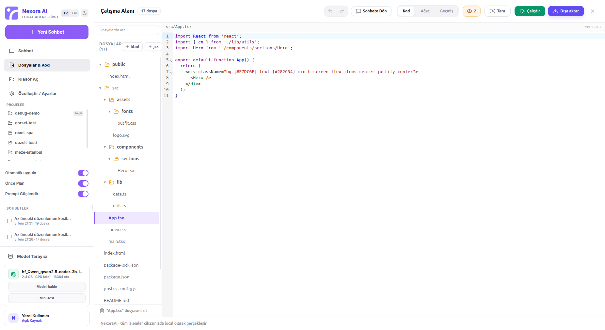
  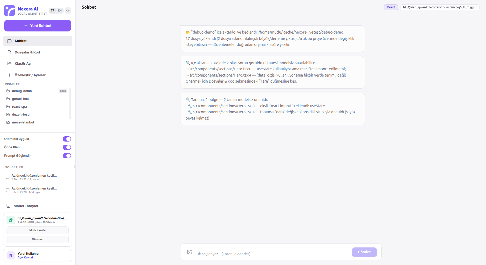
</p>
<p align="center">
  
</p>

## Large-Model Verification

> **TL;DR:** The entire large-model pipeline — professional multi-file generation → parsing → real dev server → export → production build → deployable static output — has been verified end-to-end with a full-fidelity simulation. If your hardware can load a 32B/70B GGUF, NexoraAI is ready for it.

### The question

NexoraAI adapts to model size: models ≥13B parameters receive the **full professional prompt** (multi-file trees with `components/ui/`, `components/sections/`, a typed `lib/data.ts` content layer, design rules). But this project was developed on a laptop that can only run 3B/7B models — so how do we know the big-model path actually works?

### The insight that makes it testable

*Plain-language version:* the app never knows **who** wrote the text it processes. A 70B model, a 7B model, or a human producing the exact same characters are indistinguishable to the pipeline. So we can author a byte-realistic "70B-class output" and push it through the **real** production code — no mocks, no copies.

*Technical version:* the fixture is a ~600-line generation transcript that exercises every pattern the full professional prompt demands and every historically fragile parser path: 15 files across `ui/` + `sections/` + `lib/`, TypeScript **type imports** (`import { clsx, type ClassValue }`), `@/` **alias imports**, framer-motion, typed interfaces, a model-authored `package.json` that the scaffold must merge rather than overwrite.

### The methodology

The app's actual modules (`src/lib/parseCode.ts`, `electron/main/agentService.ts`) were bundled standalone with esbuild (only Electron's `shell.openExternal` stubbed — everything else is the shipping code), then driven stage by stage. Every stage was verified **from the outside** — by HTTP request, directory listing, or content search — never by trusting a return value.

### The results

| Stage | What actually ran | Independent verification | Result |
|---|---|---|---|
| 1. Parse | `parseStreaming()` over the transcript | 15/15 files extracted, all `complete`, correct paths | ✅ |
| 2. Scaffold | `scaffoldProject()` | Diff shows exactly the 6 missing standard files added (`vite.config.ts`, `tsconfig.json`, `index.html`, `src/main.tsx`, `postcss.config.js`, `.gitignore`); model's `package.json` merged, not clobbered | ✅ |
| 3. Run | `startDev()` → real `npm install` (142 packages) → real Vite | `GET localhost:5173/` serves the app; `GET /src/App.tsx` returns compiled output (HTTP 200); the `@/` alias import in `Projects.tsx` resolves to the real module in Vite's transformed source | ✅ |
| 4. Export | `exportProject()` | `aurora-digital/` folder exists with the complete professional tree | ✅ |
| 5. Production build | `npm install && npm run build` **inside the exported folder** — exactly what a downstream user or Vercel runs | Vite build succeeds in 1.69 s → `dist/` (282 KB JS, 11 KB CSS, gzipped 92/3 KB) | ✅ |
| 6. Deploy simulation | `dist/` served by a plain static file server (which is all Vercel/Netlify fundamentally do) | Root HTML served with correct title; site content found inside the compiled JS bundle | ✅ |

Additionally verified at the logic level: `buildSystemPrompt(…, smallModel=false)` emits the full professional rules (and none of the single-file constraints), and the loader classifies 32B/70B parameter counts (read from GGUF metadata, not guessed from file size) as full-prompt models — rebuilding the session with the correct prompt if the initial file-size guess disagreed.

### What this proves — and the one thing it can't

**Proven:** a large model's professional multi-file output flows through parsing, workspace, dev server, export, production build, and static deployment without a single manual fix. The output is genuinely *deployable* — stage 5–6 is byte-for-byte the Vercel workflow.

**Not simulatable:** physically loading a 40 GB file into RAM. That part is llama.cpp's most-traveled code path (identical for all model sizes), the >4 GB Electron crash class is already eliminated by the worker architecture, and memory pressure degrades gracefully (context-size step-down ladder, clean error instead of a hang). But honest is honest: run-a-real-70B remains hardware-gated, not verified here.

### Follow-up: verified with a REAL ≥13B model on real hardware

The simulation left one open question, so we closed it: **Qwen2.5-Coder-14B-Instruct Q4_K_M (9 GB)** — above the 13B professional-prompt threshold — was downloaded and run **on the same 16 GB development laptop, CPU-only**.

- The loader read `14B` from GGUF metadata and selected the **full professional prompt** — the size-adaptive logic worked live, not just in unit tests.
- Given a detailed client-style brief (brand history, chef bio, 3×3 priced menu, reviews, hours), the model wrote a **17-file professional project** in 41 minutes (~2 tok/s on CPU): eight section components, `ui/` primitives, a typed `lib/` data layer — the structure small models can't sustain.
- The output flowed through the same pipeline: parse → scaffold → `npm install` → `vite build` (<1 s) → static serve. The finished site, exactly as rendered:


The run was even more valuable for what went wrong. **Every real model mistake became either a deterministic auto-repair or a live test of the app's iteration loop:**

| Real 14B mistake | How it got fixed |
|---|---|
| CRA relics (`react-scripts@5`) in a Vite `package.json` → `ERESOLVE` install failure | Scaffold now **sanitizes model manifests** (bans CRA/webpack relics, pins build tools, forces vite scripts) |
| Used `cn()` without defining or importing it → blank page | Scaffold now **generates a dependency-free `cn()`** and injects the import |
| Used `<Button/>` and `menuCategories` without imports → `ReferenceError` | Scaffold now builds a project-wide **export map and auto-injects missing imports** (components *and* data) |
| Turkish apostrophes inside single-quoted strings (`'İstanbul'un…'`) → syntax error | Scaffold now **converts such string literals to double quotes** (key-value pairs are never touched) |
| A missing quote in one `className`, lazy `// Add items here` stubs, `Array(4.5)` star-rating crash | Fixed by the model itself through NexoraAI's **surgical-edit iteration loop** — the exact chat workflow a user follows ("build hatası var…", "menü bölümü boş, doldur…") |

*Plain-language version:* we rented nothing and faked nothing — a genuinely big model ran on the actual laptop, slowly but correctly. It made half a dozen real mistakes, and every one of them either taught the app to auto-fix that whole class of mistakes for everyone, or proved that the built-in chat iteration workflow repairs what's left.

### The "düzelt" flow — engineered and tested the hard way

Non-technical users can't write bug reports like *"line 20 has an unclosed className quote"*. So NexoraAI closes that gap — and the feature was **battle-tested against a real 14B before shipping**, failures included:

1. **First design** (error text auto-attached, user says "düzelt"): the model misdiagnosed an `Unexpected end of file` error **three rounds in a row** — it kept patching the file's end instead of finding the unclosed quote far above. Honest result: ❌.
2. **Fix #1 — suspicious-line scan:** for EOF-class errors the app now scans the failing file for lines with an odd number of quotes and appends them to the diagnosis (`Footer.tsx:20: <li><a … gray-500>Bilgiler…`). With the pinpoint, the model targeted the right line immediately — but its `SEARCH` block silently *auto-corrected* the broken code it was supposed to copy verbatim, so the edit didn't match. ❌ again, new lesson.
3. **Fix #2 — quote-insensitive matching:** the edit applier gained a third matching tier (quotes ignored, applied only on a unique match), tolerating exactly that model habit.

**Final verified run:** broken project → Run → error auto-captured → user types the single word **"düzelt"** → the 14B produces the correct one-line edit → applied through the tolerant matcher → automatic re-build passes. ✅ One round, zero technical input from the user. If a fix doesn't clear the build, the app re-attaches the fresh error and retries automatically (max 2 extra rounds) before asking the human for help.

### The reference-clone reality check

*Plain-language version:* we attached a genuinely sophisticated design and said "clone this." The first result was embarrassing — a flat yellow page — and that failure taught us more than any success.

*What actually happens when you attach an image:* your coding model never sees it. A separate small **vision** model looks at the picture and writes a text description; your coder builds from that text. The chain is only as strong as the description — and a 3B vision model reduced a layered cream-and-black design to "yellow background". Garbage brief in, garbage site out; the 14B coder was never the bottleneck.

**What the failure fixed (all shipped):**

| Broken link in the chain | Fix |
|---|---|
| 3B eyes flattened the design; the generic prompt let them | Extraction prompt demands region-by-region, measurable detail (page frame, per-section columns/colors, component specs) |
| Model invented `https://example.com/logo.svg` (404) | Placeholder domains rejected at execution time |
| `npm run build` before any install → `vite: not found` | npm/npx/vite commands auto-install dependencies when `node_modules` is missing |
| Eyes were hardcoded to 3B | **Auto-eyes:** the app picks the best VL pair in `~/NexoraAI/models` that fits current free RAM, and says which one it chose |

**The hardware recipe on a 16 GB laptop** (RAM is a budget shared by both models):

| Task | Load this coder | Eyes picked automatically |
|---|---|---|
| Image-driven work ("make it like this") | Qwen2.5-Coder-**7B** | Qwen2.5-VL-**7B** — region-by-region analysis (~160 s) |
| Pure coding, no images | Qwen2.5-Coder-**14B** | (3B fallback if ever needed) |

**Honest ceiling, stated plainly:** this pipeline reproduces a design's *spirit* — palette, structure, component styles — not a pixel-perfect clone. Hue precision is approximate even with 7B eyes. The winning workflow is reference image + a **rich written brief** (your explicit instructions override the analysis) + two or three surgical iterations.

## Project Structure

```
NexoraAIEnvironment/
├── electron/
│   ├── main/
│   │   ├── index.ts          # app lifecycle, window, IPC registry
│   │   ├── llamaService.ts   # inference-worker client (RPC over child-process IPC)
│   │   ├── llamaWorker.ts    # ⭐ plain-Node inference worker (runs OUTSIDE Electron)
│   │   │                     #    + context compaction at 75% window usage
│   │   ├── agentService.ts   # workspace, shell, fetch, fonts, dev server, scaffold, export
│   │   ├── visionService.ts  # vision sidecar: llama-server lifecycle, image analysis
│   │   ├── sessionsService.ts# persistent chats (~/NexoraAI/Sessions/<id>.json)
│   │   ├── rulesService.ts   # per-project KURALLAR.md read/write
│   │   ├── advisorService.ts # CPU/RAM/GPU detection for the Hardware Advisor
│   │   └── hfService.ts      # HuggingFace search + GGUF downloads
│   ├── preload/index.ts      # typed contextBridge API (window.nexora)
│   └── shared/
│       ├── ipc.ts            # channel names + shared types
│       ├── prompts.ts        # profiles, compact/full prompts, agent hint, intent detection
│       └── advisor.ts        # model catalog + RAM-tiered recommendation logic
├── src/
│   ├── components/           # ChatPanel, ArtifactsPanel, Sidebar, FileTree, CodeEditor,
│   │                         # ModelBrowser, WelcomeSetup (advisor), DiffModal,
│   │                         # PermissionModal, SettingsModal
│   ├── store/                # zustand stores (app / artifacts / settings / hf)
│   ├── assets/appfont/       # embedded Inter (woff2, latin + latin-ext) — no CDN
│   └── lib/
│       ├── parseCode.ts      # streaming fence parser + SEARCH/REPLACE applier
│       │                     #    + oversized-SEARCH watchdog + idempotent re-apply
│       ├── contextSelect.ts  # smart-context file selector (mention/keyword/recency)
│       ├── diff.ts           # dependency-free LCS line diff for the approval screen
│       ├── assetFix.ts       # broken /assets reference → placeholder repair
│       ├── formatCode.ts     # Prettier post-pass (lazy chunk)
│       ├── agentActions.ts   # directive parsing + execution pipeline
│       ├── visionIntent.ts   # build-vs-question classifier for attached images
│       └── codeFixer.ts      # post-generation code fixes
├── docs/screenshots/         # images used in this README
├── scripts/                  # vendor copy, icon generation
└── vendor/node-bin/          # bundled Node runtime for the worker (not in git)
```

## Tech Stack

| Layer | Technology |
|---|---|
| Shell | Electron 43, electron-vite, electron-builder (`.deb`) |
| UI | React 18, TypeScript, Tailwind CSS (CSS-variable theme tokens, dark/light), Zustand, CodeMirror 6, lucide icons, embedded Inter font |
| Inference | llama.cpp `llama-server` (OpenAI-compatible sidecar: prompt cache/`--cache-reuse`, flash attention + Q8_0 KV, `-ngl auto` GPU fit, per-request CJK logit_bias, context compaction with model-written summary); node-llama-cpp 3 worker on the bundled Node 22 runtime as automatic fallback |
| Vision | llama.cpp `llama-server` + libmtmd sidecar, Qwen2.5-VL (auto-downloaded GGUF + mmproj, RAM-aware auto-upgrade) |
| Post-processing | Prettier 3 (standalone, lazy-loaded), deterministic scaffold & asset repair |
| Generated projects | Vite 5, React 18, TypeScript, Tailwind (scaffolded deterministically) |

## Roadmap

Recently shipped (see the [Development Chronicle](#development-chronicle) for the full stories): hardware advisor · plan-first mode · prompt enhancement · smart context + `@` autocomplete · diff approval · permission system · persistent sessions · undo/redo timeline · project rules · custom commands · Prettier & asset repair post-passes · context compaction · dark/light theme system.

The full phased plan lives in **[ROADMAP.md](ROADMAP.md)**. Status in one breath:

1. **Engine** — ✅ complete: flash attention + Q8_0 KV cache, partial GPU offload with a layer ladder + slider, per-phase sampler presets, compaction summaries, and inference migrated to `llama-server` (prompt caching, worker fallback).
2. **Making small models masters** — ✅ complete: grammar-enforced edit blocks, plan → file-by-file generation, silent auto-verify after every generation, the section template bank, model-family prompt profiles.
3. **An agent with eyes** — ✅ complete: import existing projects (open folder), zero-touch runtime error capture + the autonomous repair ladder, pixel + vision self-review, git-based generation history.
4. **Productization** (v1.0) — ✅ mostly complete: hybrid API mode, multi-project workspaces + in-project search, remote model-catalog manifest, local mini-benchmark with real on-device scores. **Not completed (deferred):** 4.2 Windows/macOS packaging (needs per-platform Node vendoring + real hardware/CI to verify) and 4.6 local image generation via stable-diffusion.cpp (a separate infrastructure effort competing for the same RAM) — both parked until after Phase 5.
5. **The Debug Engine** (v0.11) — ✅ **complete.** One engine that finds faulty code by scanning ("Tara" + auto-scan on import + silent pre-Run scan), sees localhost with four senses (crashes, console.error, network/resource failures, vite's HMR overlay), pinpoints the root cause ("📍 KONUM … %92", ranked suspects on truncated stacks, cross-file "KÖK NEDEN ADAYI"), *measures* instead of guessing (🔬 value probes read the crash-moment value and restore the file under guarantee), and fixes dual-mode — deterministic first, local model second, hybrid API only as consented last resort — with a watch mode scanning as you type. Held to account by `npm run test:engine`: 6 suites, 51 checks, whole broken projects scored on find-rate, fix-rate and time-to-green. Story in Phase 22 of the chronicle; detail in [ROADMAP.md](ROADMAP.md).
6. **The Engine, 10×** (v1.2) — ✅ **complete: from debugger to colleague.** Born from an honest audit of Phase 5's field telemetry (rung 0 misses 57% of live errors; probes hit 3/11; a 14B fabricated SEARCH blocks three times in one night) and of what defines the Codex / Claude Code / Antigravity class: a **real runtime debugger** (CDP pause-on-exception reading actual call frames and locals — no file mutation), **compiler-grade diagnostics** (an embedded TypeScript language service over the in-memory project), an **anchor ladder** so edits cannot miss (line contracts, AST anchors, reality feedback on mismatch), **turn transactions** (atomic rollback — nothing half-applied, ever), **behavioral verification** that clicks through the site like a tester and hands back artifact screenshots, **reproduction-first repair** (write the failing test, then fix until it passes), a **learning engine** that turns telemetry into ladder-routing judgment, and a **Debug Panel** that shows the engine thinking. Full plan in [ROADMAP.md](ROADMAP.md).
7. **The Agent Layer** (v1.3) — ✅ **complete: from engine to colleague.** *(see item 8 for what its first real-world run taught us)* Phases 5–6 closed the *engine* gap with the Codex / Antigravity class; Phase 7 closes the *experience* gap — the delegate → observe → review-evidence → steer workflow those tools are actually loved for. Eight items, each mapped to a documented best practice (and each avoiding a documented failure — Antigravity's launch-week prompt-injection exfiltration and Turbo-mode drive deletion are treated as standing counterexamples): a **live task list** the agent updates while it works (Codex `update_plan` parity), **Artifacts** — implementation plan, task list and a post-completion **walkthrough** document embedding the behavior walk's screenshots, repro-seal verdicts and build results ("verify with artifacts, not logs"), a **git-truth review pane** (multi-file, hunk-level stage/revert), **comment-to-steer** (inline comments on diffs and artifacts become surgical instructions without restarting the task), **two-layer trust** (workspace sandbox with path validation, separate from Salt Okunur / Otomatik / Tam Erişim consent presets), a **visible terminal** streaming every agent command live, a **task queue + inbox** (delegate-then-review, honestly sequential on local hardware), and a **project knowledge base** (per-project Knowledge Items + hierarchical KURALLAR.md per the AGENTS.md standard). Full plan in [ROADMAP.md](ROADMAP.md).
8. **Real-Time Hardening** (v1.4) — ✅ **complete: the clock is the enemy.** Phase 7's very first end-to-end run on the real app with a real model (the Zeytin Kafe live test) exposed the class the browser harness cannot see by design: **real-duration races and a busy inference server** — the same code that froze in production ran itself under mock timing. Seven items, each pinned to a live-test failure and each live-verified before its tick: a **stream-liveness sentinel + absolute Durdur + real llama-server cancellation** (the 36-minute 0-byte zombie is now structurally impossible — proven against a real 3B: a mid-stream cancel frees the slot in <1s), a **queue heartbeat** (delegated tasks re-knock until the engine is idle and the card says *why* it waits), a **behavior walk that retries** (schedule-until-done, never silent), **goal-met verdicts** ("verified" now means the request happened, not just that it compiled), **project identity** (planned builds write a real package.json so knowledge/rules/history stop piling under the default folder), the small honest fixes from the ledger, and a **test surface that can see time** (timing-realistic browser mode + a real-socket `test:e2e` and a gated real-model `test:e2e-real`). Story in Phase 25 of the chronicle; full plan in [ROADMAP.md](ROADMAP.md).
9. **Universal Prompt Fidelity** (v0.15) — ✅ **complete: stop dictating the stack.** A user pasted a Gemini-authored spec — a dark portfolio in **Tailwind v4** with a named file architecture, ~10 exact strings, exact `className`s, a pinned palette — and it failed on every local model, ~80% self-inflicted. Phase 9 inverts the stance the way Bolt/WebContainers do: a **Project Contract** parses the prompt once into machine-readable ground truth (stack version, slots, file architecture, image URLs, color tokens, specificity), the scaffold **branches v3/v4**, literals are **tokenized → rehydrated** so a weak model can't paraphrase them, a **SpecVerifier** grades the output against the contract, and only a measured miss escalates. Live-verified **10/10 on a real 3B** (GPU, no API). Story in the v0.15 scorecard; detail in [ROADMAP.md](ROADMAP.md).
10. **Ecosystem, Discoverability & the API Unleashed** (v0.17) — ✅ **complete: a platform, and every model at full strength.** The last gap wasn't the engine — it was **ecosystem & discoverability**. Phase 10 ships an **MCP client**, a local OpenAI-compatible **serve endpoint**, a **⌘K command palette**, per-prompt **checkpoints + rewind**, native **notifications/tray/keep-awake**, **global search**, **scheduled local tasks**, **slash-command workflows + approved memory**, a **157-provider hub** (the complete models.dev catalog, keys in the OS keychain), a **unified model picker with mid-session local↔API switching**, **diff stats**, **project/chat sessions**, a **persistent `proje-gecmisi.md` context** and a **token/context meter**. Then live-testing with a real API model exposed the deeper truth — the pipeline was **caging capable models** with 3B crutches — so Phase 10 also **cut the cord**: full **conversation history + depth** on the API path, a one-shot **frontier build/edit path** (elite persona, no sectioning) for a **strong model — API *or* a ≥ 13B GGUF**, and the **complete removal of the surgical-edit machinery** (forced `SEARCH/REPLACE`, the oversized-SEARCH stream cutter, the whole-file-rewrite ban) that helped no model and aborted API turns. Plus a clean dev-server shutdown, an accessibility UI-scale control and an **Open Project** entry. Every item live-verified — the local path on a real 3B, the API path against a real Qwen-Plus. Story in the v0.17 scorecard; full plan in [ROADMAP.md](ROADMAP.md).

## License

MIT © [Mutlu Kurt](https://github.com/mutlukurt)

---

<div align="center">
<sub>Built with stubbornness on a laptop that nvidia-smi refuses to acknowledge.</sub>
</div>
